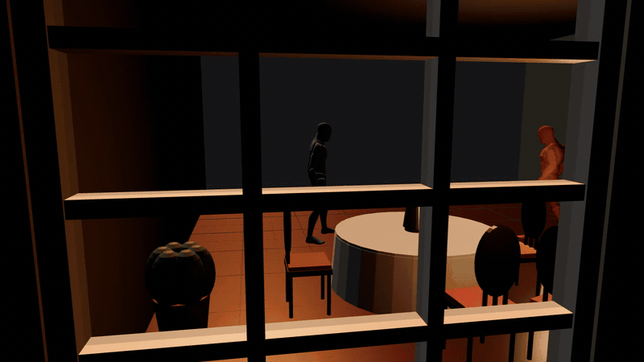
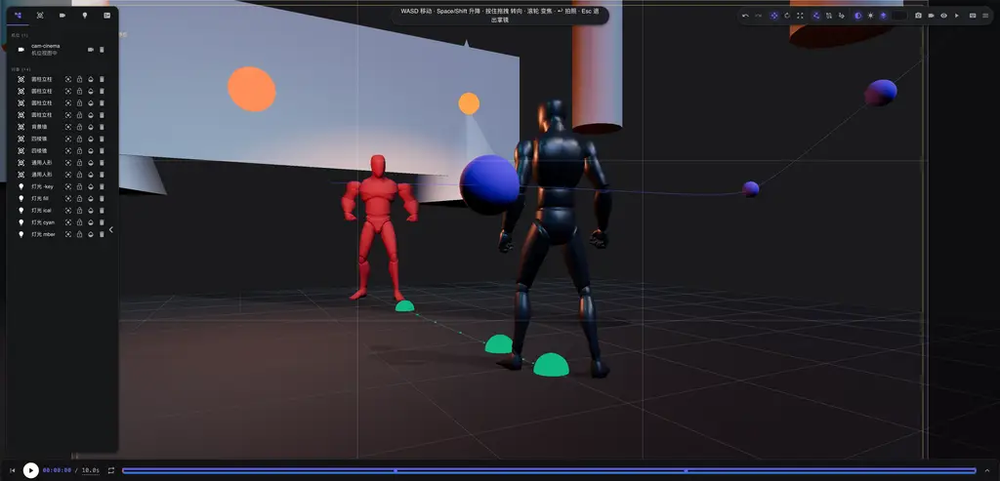
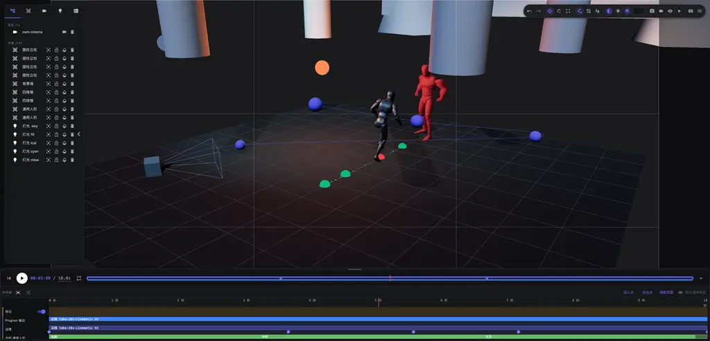
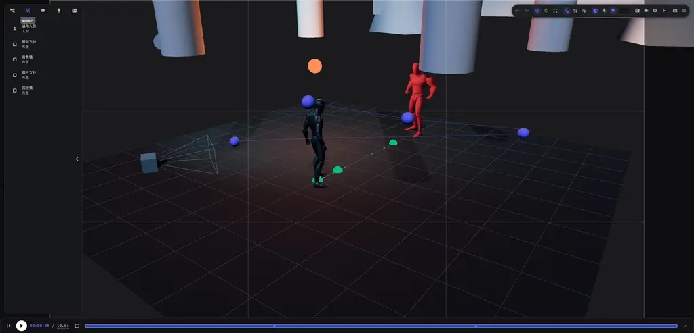
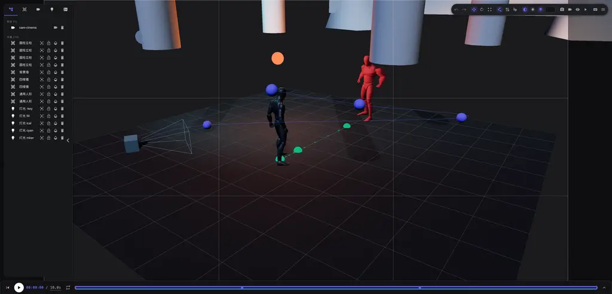

# 3D Director Desk(3D 导演台)

中文 | [English](README.md)

可嵌入的 React 3D 导演台 —— 一个**可被 AI 代理直接驱动的 3D 场景编辑器**:摆放游戏模型、挂载动作、编排机位与运镜、布光,并导出静帧与 MP4 视频。一切写操作都收敛为可序列化的命令经统一分发,UI 交互、宿主消息与 **LLM 代理**共用同一组动词;内置本地 HTTP + WebSocket 桥(`scripts/bridge.mjs`),任何 agent 或脚本免 SDK 直接接入。



▶ [全画质演示视频(MP4,10 秒)](docs/media/director-desk-demo.mp4)

**在线体验(GitHub Pages):** https://amwyygyuge.github.io/3d-director-desk/
线上页面为独立模式(不连桥),场景经 `localStorage` 持久化;项目菜单支持工程文档的导出/导入。

**可直接导入的示例工程:** [`examples/cinematic-scene.json`](examples/cinematic-scene.json) —— 即上方演示场景(14 个实体:两具人形演员、布景、五盏灯;一条机位、自定义灯光、10 秒时间轴)。下载后打开在线 demo,点项目菜单 → **导入工程…** 选择该文件即可。文档有严格版本门:只接受与当前 `DESK_DOCUMENT_VERSION` 完全一致的文档,其余以结构化错误拒绝。

## 界面速览

| 机位取景(镜头光学参数 + 九宫格构图) | 时间线(多轨关键帧,走位/动作/运镜分段) |
| --- | --- |
|  |  |
| 资产目录(内置人形/布景 + 本地模型导入) | 总览(资源大纲、演播室灯光、gizmo 布景) |
|  |  |

## 功能

- **场景布景** —— 内置资产目录(带骨骼人形 + 基础布景)、本地模型导入(GLB/GLTF/FBX/OBJ)、gizmo 变换带贴面吸附、拖点摆放与走位起草。
- **演员与动作** —— 28 段动作库按演员挂载、姿势预设、形象/体型定制、循环模式与时间轴排期分段。
- **机位与运镜** —— 机位管理、镜头光学参数(光圈/对焦距离)、关键帧运镜、视角中心落面落位。
- **时间轴** —— 多轨关键帧、走位轨、循环播放、标记与播放区间。
- **灯光** —— 演播室档位(含实心地面开关)或全自定义灯光实体。
- **输出** —— 静帧抓取与 MP4 视频导出(WebCodecs),异步产物按幂等键对账。
- **工程文档** —— JSON 导出/导入、版本门控与引用校验、原子替换可撤销;所有命令支持完整撤销/重做历史。

## AI 接入:本地桥接

导演台从不让 AI 直触内部状态。一切状态变更都是经 `CommandDispatcher` 分发的 `DirectorCommand`;**Director Bridge**(`scripts/bridge.mjs`)只是这个命令层的 HTTP + WebSocket 出口——调度器强制执行的能力清单,就是 AI 看到的工具清单。

### 启动

```sh
bun install
bun run dev        # playground 起在 :4002,桥自动随 dev 起在 :4005
```

打开 http://127.0.0.1:4002,页面自动连桥(dev server 钉死 IPv4 回环,与桥一致)。要独立起桥(例如对接 Pages 线上 demo)用 `bun run bridge`,页面侧显式指定桥地址:`?bridge=ws://127.0.0.1:4005`。

没有浏览器自动化工具的 headless AI:让一个一次性 profile 的无头 Chrome 常驻页面即可自动连桥,`GET /status` 应看到客户端上线:
`"/Applications/Google Chrome.app/Contents/MacOS/Google Chrome" --headless=new --remote-debugging-port=0 --user-data-dir=$(mktemp -d) http://127.0.0.1:4002/`

### MCP 客户端(推荐)

支持 MCP 的客户端(Claude Code、Cursor、Codex)经 `scripts/mcp-server.mjs` 把导演台当原生工具面用——它只是薄适配层,工具 schema 从已连页面的能力契约现取,永不与校验漂移。仓库根自带 `.mcp.json` 模板:

```json
{
    "mcpServers": {
        "3d-director-desk": { "command": "bun", "args": ["run", "mcp"] }
    }
}
```

行为约定:命令 type 的点映射为下划线(`assets.place` → `assets_place`);页面未连桥时只暴露 `desk_status` / `desk_refresh_tools` 两个元工具,页面连上后调一次 refresh,全量动词表随 `list_changed` 通知到达。全量面实测约 128 个工具、54KB schema(一次装载,非每轮重复)。

### 端点(`http://127.0.0.1:4005`)

| 端点              | 作用                                                                                                       |
| ----------------- | ---------------------------------------------------------------------------------------------------------- |
| `GET /status`     | 当前在线的展示端列表(`clientId`、UA、视口、readyState)与功能开关。                                          |
| `GET /skill`      | 把完整 AI 操作手册([`skills/director-desk/SKILL.md`](skills/director-desk/SKILL.md))经 HTTP 吐给 AI——AI 先读它,无需访问本地文件。 |
| `POST /rpc`       | `dispatch` 写命令(默认广播全部端,`targetClientId` 可单播)/ `query` 结构化读。                              |
| `POST /save-file` | 把浏览器端抓帧/录像产物(base64)落盘到 `bridge-output/`——只收纯文件名,路径穿越直接拒。                      |

### 最小调用

```bash
curl http://127.0.0.1:4005/status

curl -X POST http://127.0.0.1:4005/rpc \
    -H 'Content-Type: application/json' \
    -d '{"method":"dispatch","action":{"type":"transport.play","payload":{}}}'
```

```ts
async function deskRpc(method: string, action: unknown) {
    const res = await fetch("http://127.0.0.1:4005/rpc", {
        method: "POST",
        headers: { "Content-Type": "application/json" },
        body: JSON.stringify({ method, action }),
    });
    return res.json();
}

await deskRpc("dispatch", { type: "assets.place", payload: { id: "hero", assetId: "builtin.humanoid-generic" } });
```

命令 payload 是纯数据且可序列化,在命令边界做有限性/范围校验(坐标、fov 等的空间幻觉围栏)——AI 的畸形输出拿到的是带下一步可选项的结构化失败,而不是原始运行时异常。运行时发现当前动词表:`GET /skill`,或在页面 console 里 `window.__directorDesk.dispatcher.listCapabilities()`。

### 安全模型

**桥本身没有任何鉴权。** 它只在默认绑定 `127.0.0.1` 且拒绝白名单外浏览器 Origin 的前提下是安全的。`--host=0.0.0.0` 会把导演台的完整控制权暴露给内网——只在可信网络这么做;公网必须由带鉴权的 TLS 反代终结。本地调试之外绝不开 `--allow-eval`。

### 哪类 AI 走哪个口

命令层(`CommandDispatcher` + 能力契约)是唯一真相源;下面每个适配器都很薄、零漂移:

| 接口 | 受众 |
| --- | --- |
| MCP server(`bun run mcp`) | 外部 AI 客户端:Claude Code、Cursor、Codex |
| 裸桥 RPC(`POST /rpc`) | 脚本、CI、自定义自动化 |
| `AgentBridge`(进程内) | 嵌入导演台并自接 LLM 的宿主 App |
| `skills/director-desk/SKILL.md` | 所有接口共用的操作手册(`GET /skill` 分发) |

## 作为 npm 包嵌入

> 包发布在内部 registry。若 `bun add @dm/3d-director-desk` 无法解析,请直接克隆本仓跑 playground——下面的包接口是 registry 内宿主的集成契约。

### 环境要求

- Node.js `^20.19.0 || >=22.12.0`(Vite/Storybook 工具链要求)。
- Bun `>=1.3.14`,以及下表所列 peer 依赖。
- 有确定尺寸的父容器:`DirectorDesk` 填满容器。

| Peer                                   | 支持范围   |
| -------------------------------------- | ---------- |
| `react`, `react-dom`                   | `^18.2.0`  |
| `three`                                | `>=0.184.0`|
| `@react-three/fiber`                   | `^8.18.0`  |
| `@react-three/drei`                    | `^9.122.0` |
| `mobx`                                 | `^7.0.0`   |
| `mobx-react-lite`                      | `^5.0.0`   |
| `@mui/material`, `@mui/icons-material` | `^9.3.1`   |
| `@emotion/react`, `@emotion/styled`    | `^11.14.0` |

### 安装与渲染

```sh
bun add @dm/3d-director-desk
```

从唯一受支持的子路径引入包样式,然后把导演台渲染进有真实高度的容器。

```tsx
import "@dm/3d-director-desk/style.css";
import { DirectorDesk } from "@dm/3d-director-desk";

export function DirectorNode(): JSX.Element {
    return (
        <div style={{ height: "720px" }}>
            <DirectorDesk />
        </div>
    );
}
```

`DirectorDesk` 接受 `theme`、`onReady`,以及一种宿主集成机制:

- `host?: HostAdapter` 注入进程内适配器,供直接嵌入的宿主使用。
- `hostBridge?: HostBridgeConfiguration` 配置受信 `postMessage` 桥,供 iframe 集成。
- 两者都不给时导演台使用惰性适配器:不装消息监听、不向通配 origin 发消息。

### 宿主工具栏扩展

`presentation` 在 `DirectorDesk` 创建时定死。宿主窗口控制用 `rightmostExtensions`:它的动作渲染在全部内置控件(含项目菜单)之后,最后一个扩展即工具栏最右动作。

```tsx
import CloseIcon from "@mui/icons-material/Close";
import RemoveIcon from "@mui/icons-material/Remove";

<DirectorDesk
    presentation={{
        rightmostExtensions: [
            { key: "minimize", icon: <RemoveIcon />, tooltip: "最小化", onClick: minimizeWindow },
            { key: "close", icon: <CloseIcon />, tooltip: "关闭", onClick: closeWindow },
        ],
    }}
/>;
```

`toolbarExtensions` 仍在抓取动作旁;`trailingExtensions` 仍在全屏预览与内置帮助/项目控件之间。两者继续供不需要最右位置的宿主动作使用。

### 宿主桥契约

指定具体宿主窗口、具体 URL origin 和每导演台会话。目标 origin 传 `"*"` 会被拒绝。

```tsx
import { DirectorDesk, HostBridgeConfiguration, HostBridgeSession } from "@dm/3d-director-desk";

const hostBridge = new HostBridgeConfiguration(
    window.parent,
    "https://canvas.example.com",
    new HostBridgeSession("director-node-42"),
);

export function EmbeddedDirectorNode(): JSX.Element {
    return <DirectorDesk hostBridge={hostBridge} />;
}
```

`HostAdapter` 是直接嵌入契约:`onImportModel(handler)` 返回取消订阅函数;`reportCapture({ blobUrl, width, height, requestId })` 接收抓取产物(`requestId` 回显抓取命令的幂等键,宿主与代理借此对账异步产物);`reportReady(protocolVersion)` 接收就绪握手;`dispose?()` 在导演台拆除时执行。

桥导出 `HostBridge`、`HostBridgeConfiguration`、`HostBridgeSession`、`HostAdapter`、`PostMessageAdapter`、`PROTOCOL_VERSION`、`HOST_INBOUND_MESSAGE_TYPE`、`HOST_OUTBOUND_MESSAGE_TYPE`、`HOST_BRIDGE_FAILURE_CODE`、`isDirectorDeskMessage`、`HostInboundMessage`、`HostOutboundRequest`、`HostOutboundMessage` 与 `HostBridgeFailureCode`。

所有桥接消息在适用处携带配置的 `sessionId`:

- 入向导入:`{ type: "director-desk:import-model", sessionId, payload: { url, name } }`。
- 出向就绪:`{ type: "director-desk:ready", sessionId, payload: { protocolVersion } }`。
- 出向抓取:`{ type: "director-desk:capture-produced", sessionId, payload: { blobUrl, width, height, requestId } }`。
- 结构化失败:`{ type: "director-desk:command-failed", sessionId, payload: { code: "invalid-message", message } }`。

桥只在消息的 origin、来源窗口、会话、消息类型与完整 payload 全部合法时接受入向消息。origin/来源/会话不符的消息直接忽略;来自受信来源的畸形消息回 `invalid-message`。被拒绝的导入经 `UiStore.setApplicationNotice(...)` 上报,不作为出向桥事件。

### 进程内 AI 接口

对直接嵌入导演台的宿主,`AgentBridge`(`src/ai/`)是本地桥的进程内等价物:零网络跳转地把导演台实例变成面向代理的工具面,功能模块始终感知不到代理存在。从 `onReady` 拿到的 stores 起,每个导演台实例构造一个:

```ts
import { AgentBridge } from "@dm/3d-director-desk";

const bridge = new AgentBridge(stores); // stores 来自 DirectorDesk onReady
const tools = bridge.listToolSchemas(); // { name, description, kind, permissions, inputSchema }[]
```

- 工具 schema 派生自调度器强制执行的同一份能力契约,工具定义永不与校验漂移;缺描述的能力在 dev 抛错(production 下 fail-closed 告警并跳过)。
- 工具调用经 `dispatcher.dispatch({ type, payload }, stores, { permissions })` 转发;只有同进程 UI 路径可省略 `permissions`。`bridge.fullPermissions` 是全量授权集。
- `capture.frame` / `capture.video` 是 fire-and-forget;搭配 `await bridge.awaitFrameCapture(requestId)` / `awaitVideoCapture(requestId)` 按幂等键对账异步产物(超时返回 `null`)。

### 工程文档兼容

`desk.export-document` 产出当前 `DESK_DOCUMENT_VERSION`;导入只接受该精确版本,并在原子替换当前工程前校验实体、引用、时间轴、运镜与 Program 链接。首个正式发布前没有遗留迁移路径。不要硬编码版本号,读常量:`import { DESK_DOCUMENT_VERSION } from "@dm/3d-director-desk"`。

文档装的是场景数据与资源 URL,不含模型或动作二进制。导入方必须仍能访问每个被引用的 URL。特别是本地选择文件产生的浏览器 `blob:` URL 是会话级的,刷新后无法还原;playground 会识别并清掉这类瞬时快照,而不是呈现一个坏工程。

### 内置资产托管

包的内置模型与动作库随 `dist/builtin-assets/` 发布。导演台运行时经 `fetch` 加载,宿主必须把这个目录 serve 出去并告知其位置:

```tsx
<DirectorDesk builtinAssetBaseUrl="/my-vendor-path/builtin-assets" />
```

`builtinAssetBaseUrl` 缺省站点根路径 `/builtin-assets`,只在导演台自身就是站点根时正确(本仓的 playground 与 Storybook)。嵌入宿主的站点根属于宿主,沿用缺省会让 catalog 请求打到宿主根上,资产面板空白。catalog 条目 URL 会按配置基址改写,catalog 文件本身无需按宿主修改。

把 `dist/builtin-assets/` 拷贝或同步到宿主 serve 的任意路径;不要软链到源码检出——干净克隆或 CI 构建会断。catalog 加载失败时,导演台经 `UiStore.setApplicationNotice(...)` 报告失败 URL,不静默。

### 公共 API

根入口导出上述 UI 与集成面,外加:

- `DirectorDesk` 与 `DirectorDeskProps` 可嵌入组件。
- `createDirectorDeskStores`、`DirectorDeskProvider`、`useDirectorDeskStores`、`DirectorDeskStores` 受控组合。
- 场景、机位、抓取、资产、动画、快捷键、时间与 store 类,供命令驱动集成。
- `CommandDispatcher`、`CommandHistory`、`DirectorCommand`、内建命令类、命令注册辅助及其契约类型。

只用根具名导出;`@dm/3d-director-desk/style.css` 是唯一公共子路径。深导入、Storybook stories、playground 代码、fixture 与测试资产都不是包 API。

## 开发

| 命令                       | 作用                                                   |
| -------------------------- | ------------------------------------------------------ |
| `bun run dev`              | playground :4002,桥自动挂 :4005。                       |
| `bun run bridge`           | 独立桥 :4005。                                          |
| `bun run storybook`        | 人工验收 stories :6087(阶段一的验证闸门)。              |
| `bun run build`            | 库构建(vite lib ESM + `tsc` 声明)。                     |
| `bun run build:playground` | 静态 playground 构建到 `dist-playground/`(Pages 产物)。 |
| `bun run typecheck` / `bun run lint` / `bun run format` | 静态检查。                       |

### Storybook 人工验收

阶段一没有单测命令。用 Storybook 人工验证包表面:

```sh
bun run storybook
```

在 `http://localhost:6087` 打开 **验收** stories,确认模型导入、对象选择与变换、动作挂载/播放、机位与抓取输出。iframe 宿主集成另发一条会话正确的 `director-desk:import-model` 消息,确认匹配的导演台导入它,而错误会话或 origin 不生效。

### 发布闸门

```sh
bun run release-check
bun publish
```

`release-check` 跑静态类型检查、lint、production Storybook 构建、库/声明构建、产物净化与 `bun pm pack --dry-run`。`prepublishOnly` 会跑同一道闸门,`prepack` 对直接 pack 流程重复产物净化,正常发布无法跳过。禁用生命周期脚本发布或打包是禁止的。

发布目标的 scoped registry 由**本地未入库的 `.npmrc`** 解析(刻意不进版本库);新克隆的机器要先备好该文件,`bun run pa` / `mi` / `ma` 才能到达内部 registry。

发布白名单只含 `dist`(以及 npm 必需的包元数据与本 README)。`artifact:clean` 在打包前移除生成的 fixture 与 Storybook 声明路径。源码、Storybook 支撑声明、playground 代码、fixture 资产与 Storybook 构建产物一律排除。
