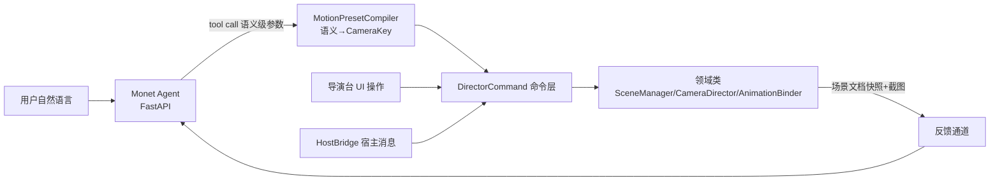
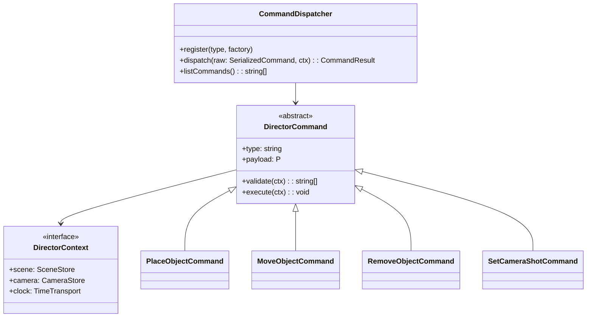
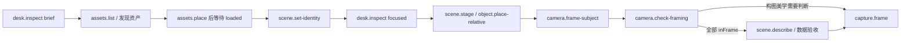

# AI 语言控制导演台 — 方案设计

> 状态:命令/查询均携带 payload 契约；`AgentBridge` 已从能力清单派生工具 schema，并以 `invoke({ invocationId, toolName, payload })` 经 `CommandDispatcher` 执行。`desk.inspect` 提供 brief/focused/full 三档结构化感知；`scene.set-identity` 持久化主角、反派、配角、道具、布景等叙事身份。截图只用于美学终审。

## 场景分级

| 级            | 场景                                    | 依赖                                      |
| ------------- | --------------------------------------- | ----------------------------------------- |
| S1 资产       | 「把刚生成的怪物模型放进场景」          | 资产目录可查 + 放置命令                   |
| S2 摆位       | 「两个角色面对面,相距两米」             | 语义→坐标编译(已落地 `PlacementCompiler`) |
| S3 动作       | 「给主角挂跑步动作」                    | 动作库 + 骨骼匹配                         |
| S4 机位       | 「来个过肩镜头」「换特写」              | 电影语言库(景别/机位模板)                 |
| S5 输出       | 「截图喂给视频模型」                    | CaptureService(已有)                      |
| S6 复合编排   | 「主角从门口走到沙发坐下,镜头跟着推近」 | 时间轴命令族(已提前落地)                  |
| S7 视觉反馈环 | 「看看现在的画面,再调亮一点」           | 截图回传多模态 + 灯光(阶段二)             |

## 架构:三方调用方收敛于命令层

**核心决策**:UI、HostBridge、AI 是命令层的三个平级调用方。AI 接入不做新 API,只做 tool schema 生成 + 语义编译；`listCapabilities()` 的每条 `CommandCapability` 携带 `payload` 契约(JSON Schema 子集),tool input schema 由此直接派生,与 `dispatch` 外层契约检查共用同一定义——手写 schema 不复存在。权限经 `dispatch/query` 的 `permissions` 选项强制(缺省放行=UI 同进程路径)。

## 命令层(已落地 `src/command/`)

- `validate()` 先于 `execute()`:非法输入产出结构化 issues 供 AI 重试,不静默失败。
- payload 纯数据可序列化 → 兑现可序列化纪律,天然支持操作日志回放/撤销。
- 幻觉围栏在 validate:坐标有限性、fov 范围、id 存在性(`finiteVec3` 等)。

### 跟拍命令清单

| 命令                       | payload                                                                                   | 语义                                             |
| -------------------------- | ----------------------------------------------------------------------------------------- | ------------------------------------------------ |
| `motion.replace-clip`      | `{ clip }`                                                                                | 整片段覆盖写入（片段须已存在）                   |
| `motion.bind-follow`       | `{ id, objectId, anchorOffset, frame: "world"\|"heading", lagSeconds, smoothingSeconds }` | 绑定跟拍，关键帧改为相对主体坐标；绑定时画面不跳 |
| `motion.unbind-follow`     | `{ id }`                                                                                  | 解除跟拍，烘回世界坐标；解绑时画面不跳           |
| `motion.set-follow-params` | `{ id, objectId, anchorOffset, frame: "world"\|"heading", lagSeconds, smoothingSeconds }` | 只改参数，不重算关键帧                           |

## 语义编译（运镜已落地）

LLM 不擅长数值、擅长语义。禁止 LLM 直接输出世界坐标。运镜已由 `MotionPresetCompiler` 编译为标准 `CameraKey` 序列，再通过 `motion.author` 落地；UI 预设按钮与 AI 共用同一命令，产物可继续按 key 编辑。

| 语义                       | 编译产物                                                                              |
| -------------------------- | ------------------------------------------------------------------------------------- |
| 「推近」「环绕」「横移」   | `MotionPresetCompiler` → `motion.author` → 可编辑 `CameraKey` 序列(已落地)            |
| 「特写」「大远景」等景别   | `camera.frame-subject` → `ShotSizePresets` 按被摄体包围球定距(已落地)                 |
| 「A 的左边两米」「面对面」 | `PlacementCompiler` → `object.place-relative`:相机视线参考系 + 包围球表面间距(已落地) |
| 「两人对峙」「三角站位」   | `StagePresetCompiler` → `scene.stage`:配方槽位 × 半径和偏移,撤销一步全组回原(已落地)  |
| 「跑起来」                 | 动作名 → `assets.list` 目录发现 + `assets.mount` 骨骼预检(已落地)                     |

失败路径返回结构化错误(如 `{error:"bone-incompatible", availableActions:[...]}`),让 LLM 换方案而非终止。

## AI 布景 SOP 与空间口径

1. 先调用 `desk.inspect { detail: "brief" }`：只取实体 id、叙事身份、装载态与量纲模式，不把整桌工程塞进上下文。
2. 用 `assets.list` 发现资产、`assets.place` 放置；每个模型必须在 `scene.describe` 中变为 `loaded` 才能进入摆位。
3. 用 `scene.set-identity` 写入 `{ role, label }`，例如 `{ role: "protagonist", label: "林夏" }`；AI 从此按稳定身份引用实体，不猜文件名。
4. 仅对候选对象调用 `desk.inspect { detail: "focused", entityIds: [...] }`；语义摆位优先 `scene.stage`、`object.place-relative`，不手算世界坐标。
5. `camera.frame-subject` 后必须以 `camera.check-framing` 断言所有主体 `inFrame: true`。`marginNdc < 0` 是可执行的出画证据，不截图排查。
6. 只有需要评估色彩、材质、遮挡观感或电影美学时才 `capture.frame`；截图不作为位置、尺寸、同框或装载态的默认信息源。

### 坐标与量纲

- 世界坐标为右手系，`Y` 向上，`X/Z` 为地面平面；`rotation: [rx, ry, rz]` 单位为弧度。
- 「左/右/前/后」统一以导演相机水平视线解释。AI 应调用 `object.place-relative` / `scene.stage`，不得把固定世界轴当作导演语言。
- `spatialScale.kind = "actor-meters"`：人偶以 `heightMeters` 落尺，场景单位可解释为米。
- `spatialScale.kind = "reference-meters"`：目录的 `physicalMaxDimensionMeters` 已标定，模型按该最大边等比落尺，场景单位可解释为米。
- `spatialScale.kind = "relative"`：来源没有可信物理尺寸，模型只按最大边 `2` 个场景单位视觉归一化；可做相对构图与包围盒间距，**不得**把数值宣称为真实米数。

`desk.inspect` 会回传上述量纲。跨量纲组合场景仍可用 `scene.stage` 的包围球自适应配方；涉及「相距两米」的物理约束时，所有参与实体必须为米制。

## AI 的「眼睛」与「手」

| 能力         | 机制                                                                                               | 现状                   |
| ------------ | -------------------------------------------------------------------------------------------------- | ---------------------- |
| 低上下文感知 | `desk.inspect`: brief 索引、focused 指定对象几何、full 整桌工程；`scene.describe` 保留为验收读模型 | 已落地                 |
| 几何验收     | `camera.get-pose` / `camera.check-framing` / `scene.describe` / `program.review`                   | 布景全程零截图         |
| 叙事消歧     | `scene.set-identity` 把角色与标签写入可序列化实体                                                  | 已落地                 |
| 手           | tool call → 语义编译 → 命令层                                                                      | 已落地                 |
| 资产目录     | `assets.list`/`assets.place`/`assets.mount`                                                        | 已落地                 |
| 美学反馈     | 截图回传多模态                                                                                     | 仅终审或不可数值化问题 |

## 接入路线

已定:**Monet 同页 npm 包嵌入**(非 iframe——HostBridge 命令通道不建);**AI 桥独立模块**(`src/ai/AgentBridge`,功能模块零感知)。

1. 本仓: `AgentBridge.listToolSchemas()` 从 capability 派生工具 schema；`invoke()` 按工具 kind 分发 query/command、强制 payload/权限闸门，并以 `invocationId` 缓存写调用结果，网络重试不重复写场景。
2. Monet: 每个 `DirectorDesk` 实例在就绪后构造一座 `AgentBridge`；将 `listToolSchemas()` 注册给 Agent，把每次 tool call 映射为 `invoke({ invocationId, toolName, payload })`。一次 Agent 复合意图若包含多条命令，Monet 仍需收口为一个 undo record。
3. 视频模型交接: 待把分叉提交的 prompt/交接包能力按当前 master 选择性移植；该能力是视频模型条件包，不替代 `desk.inspect` 的现场感知。
