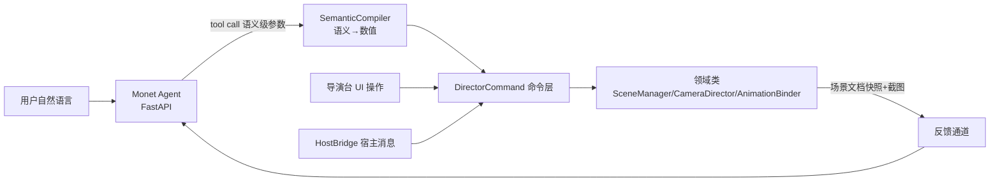
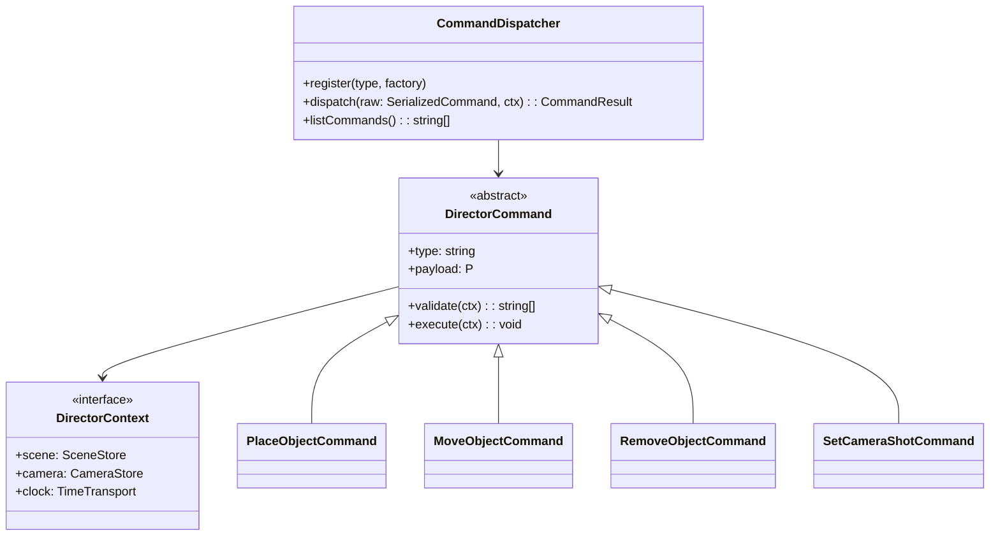

# AI 语言控制导演台 — 方案设计(未来铺垫)

> 状态:方案已定,命令层骨架已落地(`src/command/`);SemanticCompiler 与 Monet agent 工具接入属阶段一尾声/阶段二。

## 场景分级

| 级            | 场景                                    | 依赖                               |
| ------------- | --------------------------------------- | ---------------------------------- |
| S1 资产       | 「把刚生成的怪物模型放进场景」          | 资产目录可查 + 放置命令            |
| S2 摆位       | 「两个角色面对面,相距两米」             | 语义→坐标编译                      |
| S3 动作       | 「给主角挂跑步动作」                    | 动作库 + 骨骼匹配                  |
| S4 机位       | 「来个过肩镜头」「换特写」              | 电影语言库(景别/机位模板)          |
| S5 输出       | 「截图喂给视频模型」                    | CaptureService(已有)               |
| S6 复合编排   | 「主角从门口走到沙发坐下,镜头跟着推近」 | 阶段二时间轴(TimeTransport 已预埋) |
| S7 视觉反馈环 | 「看看现在的画面,再调亮一点」           | 截图回传多模态 + 灯光(阶段二)      |

## 架构:三方调用方收敛于命令层

**核心决策**:UI、HostBridge、AI 是命令层的三个平级调用方。AI 接入不做新 API,只做 tool schema 生成(从 `CommandDispatcher.listCommands()` 派生)+ SemanticCompiler。

## 命令层(已落地 `src/command/`)

- `validate()` 先于 `execute()`:非法输入产出结构化 issues 供 AI 重试,不静默失败。
- payload 纯数据可序列化 → 兑现可序列化纪律,天然支持操作日志回放/撤销。
- 幻觉围栏在 validate:坐标有限性、fov 范围、id 存在性(`finiteVec3` 等)。

## SemanticCompiler(待建,AI 方案心脏)

LLM 不擅长数值、擅长语义。禁止 LLM 直接输出世界坐标:

| 语义                         | 编译产物                                                         |
| ---------------------------- | ---------------------------------------------------------------- |
| 「过肩镜头」「特写」「俯拍」 | 机位模板 → CameraShot(参考 xiaozangao 18 套运镜预设的参数化思路) |
| 「A 的左边两米」「面对面」   | 相对关系 + 锚点 → Transform,经碰撞/边界 clamp                    |
| 「跑起来」                   | 动作名 → 动作资产解析 + 骨骼兼容性预检                           |

失败路径返回结构化错误(如 `{error:"bone-incompatible", availableActions:[...]}`),让 LLM 换方案而非终止。

## AI 的「眼睛」与「手」

| 能力     | 机制                                         | 现状                               |
| -------- | -------------------------------------------- | ---------------------------------- |
| 眼睛     | 场景文档快照(纯数据,JSON)+ 截图喂多模态      | 序列化纪律 + CaptureService 已就位 |
| 手       | tool call → SemanticCompiler → 命令层        | 命令层已就位,Compiler 待建         |
| 资产目录 | AssetCatalog 查询工具(接 Monet 资产接口)     | 待建                               |
| 撤销     | 一批 AI 命令 = Monet undoManager 一个 record | Monet 侧集成时处理                 |

## 接入路线

1. 阶段一尾声:Monet agent 侧定义 director-desk 工具组(schema 从命令层派生),跑通 S1~S5。
2. 阶段二:时间轴命令(轨迹段写入 TimeTransport),解锁 S6。
3. 阶段三:截图回传多模态形成 S7 闭环。
