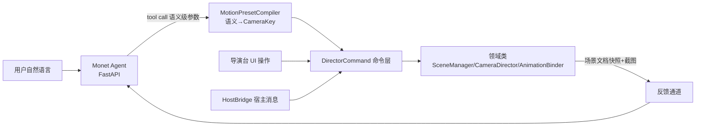
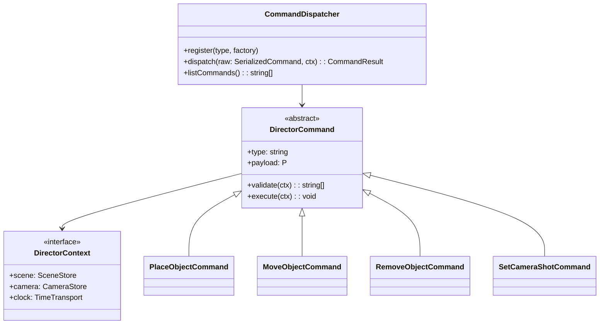

# AI 语言控制导演台 — 方案设计(未来铺垫)

> 状态:命令层 65 命令 + 15 查询全部落地并携带 payload 契约(`PayloadContract`,债 D1 已清);语义编译双落地——运镜 `MotionPresetCompiler` + `motion.author`、摆位 `PlacementCompiler` + `object.place-relative`;`listCapabilities()` 即 AI tool schema 真相源。Monet agent 工具接入属阶段一尾声/阶段二。

## 场景分级

| 级            | 场景                                    | 依赖                                      |
| ------------- | --------------------------------------- | ----------------------------------------- |
| S1 资产       | 「把刚生成的怪物模型放进场景」          | 资产目录可查 + 放置命令                   |
| S2 摆位       | 「两个角色面对面,相距两米」             | 语义→坐标编译(已落地 `PlacementCompiler`) |
| S3 动作       | 「给主角挂跑步动作」                    | 动作库 + 骨骼匹配                         |
| S4 机位       | 「来个过肩镜头」「换特写」              | 电影语言库(景别/机位模板)                 |
| S5 输出       | 「截图喂给视频模型」                    | CaptureService(已有)                      |
| S6 复合编排   | 「主角从门口走到沙发坐下,镜头跟着推近」 | 时间轴命令族(已提前落地)                  |
| S7 视觉反馈环 | 「看看现在的画面,再调亮一点」           | 截图回传多模态 + 灯光(阶段二)             |

## 架构:三方调用方收敛于命令层

**核心决策**:UI、HostBridge、AI 是命令层的三个平级调用方。AI 接入不做新 API,只做 tool schema 生成 + 语义编译；`listCapabilities()` 的每条 `CommandCapability` 携带 `payload` 契约(JSON Schema 子集),tool input schema 由此直接派生,与 `dispatch` 外层契约检查共用同一定义——手写 schema 不复存在。权限经 `dispatch/query` 的 `permissions` 选项强制(缺省放行=UI 同进程路径)。

## 命令层(已落地 `src/command/`)

- `validate()` 先于 `execute()`:非法输入产出结构化 issues 供 AI 重试,不静默失败。
- payload 纯数据可序列化 → 兑现可序列化纪律,天然支持操作日志回放/撤销。
- 幻觉围栏在 validate:坐标有限性、fov 范围、id 存在性(`finiteVec3` 等)。

## 语义编译（运镜已落地）

LLM 不擅长数值、擅长语义。禁止 LLM 直接输出世界坐标。运镜已由 `MotionPresetCompiler` 编译为标准 `CameraKey` 序列，再通过 `motion.author` 落地；UI 预设按钮与 AI 共用同一命令，产物可继续按 key 编辑。

| 语义                       | 编译产物                                                                              |
| -------------------------- | ------------------------------------------------------------------------------------- |
| 「推近」「环绕」「横移」   | `MotionPresetCompiler` → `motion.author` → 可编辑 `CameraKey` 序列(已落地)            |
| 「特写」「大远景」等景别   | `camera.frame-subject` → `ShotSizePresets` 按被摄体包围球定距(已落地)                 |
| 「A 的左边两米」「面对面」 | `PlacementCompiler` → `object.place-relative`:相机视线参考系 + 包围球表面间距(已落地) |
| 「跑起来」                 | 动作名 → `assets.list` 目录发现 + `assets.mount` 骨骼预检(已落地)                     |

失败路径返回结构化错误(如 `{error:"bone-incompatible", availableActions:[...]}`),让 LLM 换方案而非终止。

## AI 的「眼睛」与「手」

| 能力     | 机制                                                                                                                                                                                              | 现状                                        |
| -------- | ------------------------------------------------------------------------------------------------------------------------------------------------------------------------------------------------- | ------------------------------------------- |
| 眼睛     | 注册查询(15 条:scene.describe/camera.get-pose/camera.list-shots/motion.get/timeline.get-document/transport.get-state/lighting.×2/pose.×3/actor.×2/assets.list/desk.export-document)+ 截图喂多模态 | 已就位;截图/录制产物经 requestId 幂等键对账 |
| 手       | tool call → 语义编译 → 命令层                                                                                                                                                                     | 运镜/摆位双编译器 + 命令层已就位            |
| 资产目录 | `assets.list`/`assets.place`/`assets.mount`(内置目录已入库,宿主注入经 register-assets)                                                                                                            | 已就位                                      |
| 撤销     | 一批 AI 命令 = Monet undoManager 一个 record                                                                                                                                                      | 命令层逆命令历史已就位;Monet 侧归口待集成   |

## 接入路线(2026-09-02 定稿)

已定:**Monet 同页 npm 包嵌入**(非 iframe——HostBridge 命令通道不建);**权限全开**(`AgentBridge.fullPermissions` 直传 dispatch);**AI 桥独立模块**(`src/ai/AgentBridge`,功能模块零感知)。

1. 本仓(已落地):`AgentBridge.listToolSchemas()` 由能力契约派生工具组(描述缺登记 dev 即抛);`awaitFrameCapture/awaitVideoCapture` 按 requestId 对账异步产物;契约/权限闸门在 dispatcher。
2. Monet 侧(待排期):agent 工具组注册 + 前端中继(tool call → `dispatcher.dispatch(cmd, stores, { permissions })`;一次 tool call 的命令序列收口为 undoManager 一个 record),跑通 S1~S6。
3. 阶段三:截图产物经 `capture-produced → OSS → 画布节点` 回 agent 多模态,S7 闭环。
