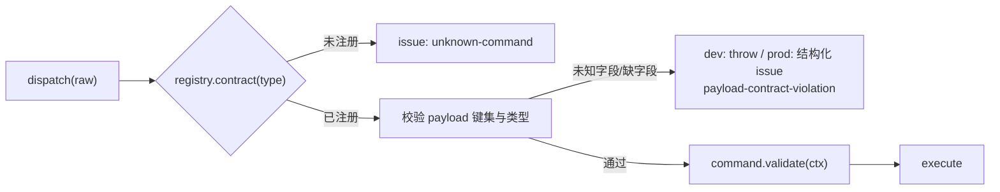
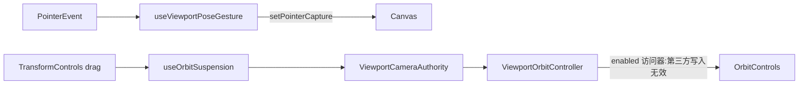

# 架构债与修复方案 — 视口输入 / 运镜编排

> 状态:视口输入、轨道所有权与运镜自动验收债已于 2026-09-02 清偿。本文保留事故根因与已落地机制，作为后续修改的约束记录。

## 一、本轮事故清单

用户报告只有两句话——「移动和视角拖拽和普通模式不太一样」「会自动回到其他视角,然后自动落了一个关键帧」——实际是 **9 个独立缺陷**叠加。全部在 playground + 真实 Chrome 实测复现(headless 无 rAF,`useFrame` 不跑,必须用 headful)。

| #   | 症状                                                           | 根因                                                                                                                                                            | 定性               |
| --- | -------------------------------------------------------------- | --------------------------------------------------------------------------------------------------------------------------------------------------------------- | ------------------ |
| 1   | WASD 快一倍                                                    | `FlyDrive`(判据 `activeShotId === null`)与 `LensNavigation`(判据 `lensViewActive`)同时挂 `useFlyNavigation`,各推一次 `FLY_SPEED × delta`;实测 9.97 单位/秒 = 2× | 体系化             |
| 2   | 拖拽既转又漂                                                   | 同一串指针事件被 `OrbitControls`(绕 target 公转)与摆位手势(绕相机 pan/tilt)各处理一次;掌镜靠 `ShotCameraRig` 关轨道,镜头视角没人关                              | 体系化             |
| 3   | 滚轮变焦不对                                                   | 轨道 dolly 与自研 FOV 变焦同时生效                                                                                                                              | 体系化(随 2 消失)  |
| 4   | 松手画面还在滑、落的 key ≠ 松手画面                            | 镜头视角仍开 `enableDamping`,400ms 防抖抓到惯性中的姿态                                                                                                         | 体系化(随 2 消失)  |
| 5   | 进入镜头视角首帧偏移 0.03 单位                                 | `CameraMotionRuntimeSink.applyMotion` 先写采样姿态、后 `controls.update()`,把上一次拖拽的阻尼余速叠加了上去                                                     | **补丁**           |
| 6   | 右键拖拽也在转画面                                             | 摆位手势不看 `event.button`,与关键帧右键菜单抢同一串事件                                                                                                        | **补丁**           |
| 7   | 拖完选中被清空                                                 | `onPointerMissed` 只豁免掌镜(`activeShotId !== null`),镜头视角的转向 mouseup 被当成「点空」                                                                     | 体系化(改读所有权) |
| 8   | 预览 B 片段却看到 A 机位,并把 key 落进 A                       | 采样器 = Program 优先/预览兜底,打点服务 = 预览优先/Program 兜底,**两个方向相反**;同一判据全仓共四份拷贝                                                         | 体系化             |
| 9   | 落键瞬间画面自己跳(实测 z 3.68 → 3.86),菱形显示时刻 ≠ 出画时刻 | 采样用 `easedProgress(easing, progressAt(t))`(轨迹参数),打点用线性 `progressAt(t)`,`easing = smooth` 时两者不同域                                               | 体系化             |

另修一个哑火:`DirectorDesk` 点关键帧跳转发的是 `payload: { timeSeconds }`,而 `transport.seek` 的契约是 `{ time }` —— 全仓唯一写错的调用点,点了没反应,无任何报错(见债 **D1**)。

## 二、已收口的机制

判据只有一条:**能不能让同类 bug 下次写不出来。**

| 机制                                                        | 落点                                              | 消灭的类                             | 强度                                         |
| ----------------------------------------------------------- | ------------------------------------------------- | ------------------------------------ | -------------------------------------------- |
| `ViewportCameraAuthority`                                   | `src/camera/ViewportCameraAuthority.ts`           | 「多个视口所有者同时成立」           | 中:消费方靠自觉去读,无编译期强制             |
| `CameraMotionStore.resolveOutputClipAt`                     | `src/store/CameraMotionStore.ts`                  | 「同一判据多份拷贝互相漂移」(原四份) | 中:同上                                      |
| `trajectoryProgressAt` / `timeAtProgress`,**删除 `timeAt`** | `src/camera/CameraMotionClip.ts`                  | 「时间比例与轨迹参数混用」           | **高:旧入口物理删除,`tsc` 逼出全部调用点**   |
| `useOrbitSuspension`(计数 + 卸载兜底)                       | `src/ui/viewport/scene/useOrbitSuspension.ts`     | 「拖拽中途卸载把轨道锁死」           | 中高:配对结构自带兜底                        |
| `useViewportPoseGesture` 的 `onCommit` 可选                 | `src/ui/viewport/scene/useViewportPoseGesture.ts` | 「手势内核与写入策略耦合」           | 中:策略显式化,掌镜自动落 / 镜头视角只有 K 落 |

**历史补丁已收口**：`applyMotion` 的阻尼刷新经 `ViewportOrbitController`、右键输入经 `isPrimaryDrag`、payload 经 `PayloadContract` 各自拥有唯一机制；提示条文案仍为独立体验决策。

## 三、已清偿结构债

### D1 命令 payload 没有契约校验(风险最高)—— 已修复(2026-09-02)

> 落地:`src/command/PayloadContract.ts`(JSON Schema 子集契约 + 校验器)+ `CommandDispatcher` 外层契约闸门(dev throw / prod `payload-contract-violation` 结构化 issue)+ 全部 65 命令/15 查询随 `capability` 强制登记(`register` 缺契约即 tsc 报错)+ `listCapabilities()` 直接派生 AI tool schema。同批顺带补上权限闸门(`DispatchOptions.permissions`)与 4 条历史漏登记 capability(camera.activate/deactivate/remove-shot、capture.frame)。以下为原始登记,存档备查。

**现象**:`dispatcher.dispatch(raw, ctx)` 收 `SerializedCommand`,`payload` 是 unknown。字段名写错 → 命令内部读到 `undefined` → 要么 `validate()` 兜住(报一句无关的错),要么静默无操作。`transport.seek { timeSeconds }` 就是这样哑火的,而 UI、HostBridge、AI 三个调用方共用这一个入口。

**方案**:注册表登记 payload 契约,在 `dispatch` 的最外层做「未知字段 / 缺失必填」检查。

- 契约随 `dispatcher.register(...)` 一起登记(与既有 `capability(...)` 同一处,不新开注册表)。
- 开发期 `throw`(立刻暴露写错的调用点),生产期降级为结构化 issue,与现有 `issue.options` 契约一致。
- 顺带白拿:`listCapabilities()` 可直接派生 AI 的 tool schema,不再手写。

**验收**:把 `transport.seek` 的 payload 故意写成 `{ timeSeconds }`,开发期必须抛错并指名 `time`;`listCapabilities()` 输出里每条命令带 payload 键集。

### D2 视口输入层同时存在两条事件流 —— 已修复(2026-09-02)

`useViewportPoseGesture` 已统一为 `pointerdown` / `pointermove` / `pointerup` / `pointercancel`；仅主指针经 `isPrimaryDrag()` 进入摆位，按下后由 Canvas `setPointerCapture()` 持有到结束。原有 `window` mousemove/mouseup 常驻监听已删除。

### D3 `controls.enabled` 是别人对象上的可变字段 —— 已修复(2026-09-02),2026-09-16 补强为不可越权

`ViewportOrbitController` 是每桌唯一的 OrbitControls 启停与阻尼刷新写方。`OrbitAuthorityRig` 只做 controls 挂接与所有权同步；`useOrbitSuspension` 在 gizmo/关键帧拖拽申请或归还轨道后，经控制器即时重申授权。

**2026-09-02 那版只是「约定 + 事后重申」,不足**:约定挡不住第三方直接写字段,而重申只在 `isOrbitEnabled` **跳变**时随 effect 重跑——授权值本来就是 `false` 的掌镜/镜头视角下,drei `TransformControls` 在 `dragging-changed` 里执行的 `defaultControls.enabled = !event.value`(见其源码)把轨道悄悄置回 `true` 后,没有任何 observable 变化,effect 不重跑,越权写因此长期存活。此后同一串指针事件被 `OrbitControls`(绕 target 公转)与摆位手势(绕相机 pan/tilt)各处理一次:实测一次 400px 单向拖拽转出 **243.3°** 而应为 121.1°(2.01×);来回拖时摆幅在 **0.1°~40°** 之间乱跳——用户报告的「拖着拖着晃动角度越来越大」。

**现改为结构性不可越权**:`attach()` 用 `Object.defineProperty` 把 `enabled` 换成访问器,读回授权真值、写入被吞掉,`detach()` 复原普通字段。第三方的赋值语句照常执行且不报错,但物理上无效——**这类 bug 从此写不出来**,不再依赖「谁记得重申」。

同批修正 `drainDampingResidual()`:它此前裸调 `update()`,而开阻尼时 `update()` 只消费 `dampingFactor` 那一份 `sphericalDelta`、余量乘 `(1 - dampingFactor)` 留到下一帧,所以它不是「清残量」而是「再转一点」——实测连调 20 次多转 **15.8°**,污染进入机位/镜头视角的首帧姿态与落帧(即上表债 5 的真正原因)。现在先临时关阻尼再 `update()`(走 `sphericalDelta.set(0,0,0)` 分支)、随后恢复原值:实测一次调用后再调 20 次角度不再变化,而导演视角的惯性手感不受影响。

**阻尼本身不是缺陷,不要再去关它**:实测同一段 240px 位移无论派 15 / 30 / 60 个指针事件,总转角恒为 72.7°(= 理论值),阻尼只改变到达时间曲线,不改变总量。

**同批清掉的三处同源缺陷**(都源于「残量没被真正归零」这一误解):

1. `BonePicker` 的骨骼旋转 gizmo 从未接 `useOrbitSuspension`,一直靠 drei 那条越权写兜底。访问器守卫把越权写作废后,这条兜底随之消失,必须显式接上让位链——已接,且 `release()` 前移到 `commitRotation` 的所有提前 `return` 之前(否则让位计数泄漏 = 视口永久卡死)。
2. `ShotCameraRig` 与 `CameraMotionRig` 的三处复原路径原本是「先写姿态、后 drain」。drain 会把残量一次性施加到当前姿态上,写在后面等于把残量转移到刚复原的姿态上。全部改为**先 drain 后写**;取景请求那条原先靠 drain 内部的 `update()` 顺带完成取向,drain 前移后已补显式 `camera.lookAt`。
3. 导演姿态暂存记在 `controls` 的 `end` 事件上,而 `end` 在 `pointerup` 即触发、阻尼滑行还要再走约 1 秒——「存为机位」存到的是惯性中的姿态。实测松手瞬间记录值与最终画面差 `[-4.74,4,8.80]` vs `[-8.08,4,5.90]`。现在 `end` 先记一次保证非空,再用 rAF 轮询到两帧姿态不再变化时补记**落定姿态**;实测滑行结束后 `lastDirectorPose` 与相机姿态逐位相等。

**验收不变量**：`controls.enabled` 的唯一真值是 `ViewportOrbitController.authorized`,第三方赋值必须无效(掌镜下执行 `controls.enabled = true` 后读回仍为 `false`);`controls.update()` 的调用点仅保留在 `ViewportOrbitController`,且排空后残量必须为零(连续 drain 角度不变)。

### D4 这些不变量没有自动验收 —— 已修复(2026-09-02)

`src/stories/camera/camera-motion.stories.tsx` 现以运行时断言覆盖：预览优先与自动 seek、smooth/linear 时间-轨迹进度往返、镜头打点闭环、空档不写/不复位镜头、镜头视角与导演视角的关键帧命令分派。该项目禁止单测，Storybook acceptance story 是此领域的自动化回归门。

## 四、清偿顺序

| 债              | 状态   | 交付物                                  |
| --------------- | ------ | --------------------------------------- |
| D1 payload 契约 | 已修复 | `PayloadContract` + `CommandDispatcher` |
| D4 运镜验收     | 已修复 | `camera-motion.stories.tsx` 运行时断言  |
| D2 输入统一     | 已修复 | Pointer Events + Pointer Capture        |
| D3 轨道所有权   | 已修复 | `ViewportOrbitController`               |

## 五、判定规则(以后自评用)

1. **能不能写不出来**:旧入口是否被删除 / 类型是否不允许?能 → 体系化;只是"现在没人这么写" → 补丁。
2. **真相源有几个**:同一判据是否只剩一处、其余全部改读?否 → 补丁。
3. **失败是否响亮**:错误路径是静默(undefined / 无操作)还是结构化报错?静默 → 补丁。

三条判定规则现由 `CameraMotionClip` 的换算收口、`ViewportOrbitController` 的轨道写方收口，以及 Pointer Events 输入链共同满足。
