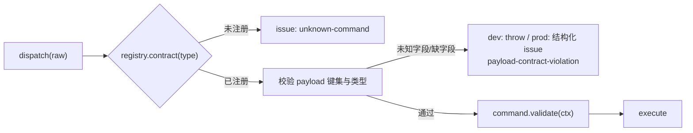

# 架构债与修复方案 — 视口输入 / 运镜编排

> 状态:本轮(镜头视角预览交互)暴露的问题已全部定位并修复;文末四条遗留结构债尚未动工,按优先级排期。
> 本文是「同类 bug 不再犯」的登记簿:动这几块代码前先读,不要在补丁上再叠补丁。

## 一、本轮事故清单

用户报告只有两句话——「移动和视角拖拽和普通模式不太一样」「会自动回到其他视角,然后自动落了一个关键帧」——实际是 **9 个独立缺陷**叠加。全部在 playground + 真实 Chrome 实测复现(headless 无 rAF,`useFrame` 不跑,必须用 headful)。

| #   | 症状                                                           | 根因                                                                                                                                                            | 定性               |
| --- | -------------------------------------------------------------- | --------------------------------------------------------------------------------------------------------------------------------------------------------------- | ------------------ |
| 1   | WASD 快一倍                                                    | `FlyDrive`(判据 `activeShotId === null`)与 `LensNavigation`(判据 `lensViewActive`)同时挂 `useFlyNavigation`,各推一次 `FLY_SPEED × delta`;实测 9.97 单位/秒 = 2× | 体系化             |
| 2   | 拖拽既转又漂                                                   | 同一串指针事件被 `OrbitControls`(绕 target 公转)与摆位手势(绕相机 pan/tilt)各处理一次;掌镜靠 `ShotCameraRig` 关轨道,镜头视角没人关                              | 体系化             |
| 3   | 滚轮变焦不对                                                   | 轨道 dolly 与自研 FOV 变焦同时生效                                                                                                                              | 体系化(随 2 消失)  |
| 4   | 松手画面还在滑、落的 key ≠ 松手画面                            | 镜头视角仍开 `enableDamping`,400ms 防抖抓到惯性中的姿态                                                                                                         | 体系化(随 2 消失)  |
| 5   | 进入镜头视角首帧偏移 0.03 单位                                 | `CameraMotionRuntimeSink.applyMotion` 先写采样姿态、后 `controls.update()`,把上一次拖拽的阻尼余速叠加了上去                                                     | **补丁**           |
| 6   | 右键拖拽也在转画面                                             | 摆位手势不看 `event.button`,与关键帧右键菜单抢同一串事件                                                                                                        | **补丁**           |
| 7   | 拖完选中被清空                                                 | `onPointerMissed` 只豁免掌镜(`activeShotId !== null`),镜头视角的转向 mouseup 被当成「点空」                                                                     | 体系化(改读所有权) |
| 8   | 预览 B 片段却看到 A 机位,并把 key 落进 A                       | 采样器 = Program 优先/预览兜底,打点服务 = 预览优先/Program 兜底,**两个方向相反**;同一判据全仓共四份拷贝                                                         | 体系化             |
| 9   | 落键瞬间画面自己跳(实测 z 3.68 → 3.86),菱形显示时刻 ≠ 出画时刻 | 采样用 `easedProgress(easing, progressAt(t))`(轨迹参数),打点用线性 `progressAt(t)`,`easing = smooth` 时两者不同域                                               | 体系化             |

另修一个哑火:`DirectorDesk` 点关键帧跳转发的是 `payload: { timeSeconds }`,而 `transport.seek` 的契约是 `{ time }` —— 全仓唯一写错的调用点,点了没反应,无任何报错(见债 **D1**)。

## 二、已收口的机制

判据只有一条:**能不能让同类 bug 下次写不出来。**

| 机制                                                        | 落点                                              | 消灭的类                             | 强度                                         |
| ----------------------------------------------------------- | ------------------------------------------------- | ------------------------------------ | -------------------------------------------- |
| `ViewportCameraAuthority`                                   | `src/camera/ViewportCameraAuthority.ts`           | 「多个视口所有者同时成立」           | 中:消费方靠自觉去读,无编译期强制             |
| `CameraMotionStore.resolveOutputClipAt`                     | `src/store/CameraMotionStore.ts`                  | 「同一判据多份拷贝互相漂移」(原四份) | 中:同上                                      |
| `trajectoryProgressAt` / `timeAtProgress`,**删除 `timeAt`** | `src/camera/CameraMotionClip.ts`                  | 「时间比例与轨迹参数混用」           | **高:旧入口物理删除,`tsc` 逼出全部调用点**   |
| `useOrbitSuspension`(计数 + 卸载兜底)                       | `src/ui/viewport/scene/useOrbitSuspension.ts`     | 「拖拽中途卸载把轨道锁死」           | 中高:配对结构自带兜底                        |
| `useViewportPoseGesture` 的 `onCommit` 可选                 | `src/ui/viewport/scene/useViewportPoseGesture.ts` | 「手势内核与写入策略耦合」           | 中:策略显式化,掌镜自动落 / 镜头视角只有 K 落 |

**仍是补丁的四处**,各自归属的债在括号里:`applyMotion` 的 `update()` 顺序(靠注释约束,**D3**)、右键 guard(**D2**)、`transport.seek` payload 修正(**D1**)、提示条文案(无债)。

## 三、遗留结构债

### D1 命令 payload 没有契约校验(风险最高)

**现象**:`dispatcher.dispatch(raw, ctx)` 收 `SerializedCommand`,`payload` 是 unknown。字段名写错 → 命令内部读到 `undefined` → 要么 `validate()` 兜住(报一句无关的错),要么静默无操作。`transport.seek { timeSeconds }` 就是这样哑火的,而 UI、HostBridge、AI 三个调用方共用这一个入口。

**方案**:注册表登记 payload 契约,在 `dispatch` 的最外层做「未知字段 / 缺失必填」检查。

- 契约随 `dispatcher.register(...)` 一起登记(与既有 `capability(...)` 同一处,不新开注册表)。
- 开发期 `throw`(立刻暴露写错的调用点),生产期降级为结构化 issue,与现有 `issue.options` 契约一致。
- 顺带白拿:`listCapabilities()` 可直接派生 AI 的 tool schema,不再手写。

**验收**:把 `transport.seek` 的 payload 故意写成 `{ timeSeconds }`,开发期必须抛错并指名 `time`;`listCapabilities()` 输出里每条命令带 payload 键集。

### D2 视口输入层同时存在两条事件流

**现象**:`OrbitControls` 监听 `pointerdown/move/up`,自研摆位手势监听 `mousedown/mousemove/mouseup`。今天两者不打架,靠的是「轨道已被 `OrbitAuthorityRig` 禁用」,**不是设计上的隔离**。谁再往 pointer 流上挂手势,冲突照旧;右键 guard 也只是在 mouse 流里加了个 `event.button !== 0` 判断。

**方案**:摆位手势统一改用 PointerEvent + `setPointerCapture`,与 R3F / OrbitControls 同流。

- `useViewportPointerPoseGesture` 只监听 `pointerdown/pointermove/pointerup/pointercancel`;按下即 `canvas.setPointerCapture(pointerId)`,拖出画布不丢事件、不必挂 window 监听。
- 按键判定收成一处 `isPrimaryDrag(event)`,右键/中键留给上下文菜单与宿主。
- 触控板与触屏顺带可用(现在的 mouse 流在触屏上根本不触发)。

**验收**:同一份手势代码在鼠标、触控板、触屏三种输入下行为一致;`window` 上不再有摆位相关的常驻监听。

### D3 `controls.enabled` 是别人对象上的可变字段

**现象**:`OrbitAuthorityRig` 是「对抗式」拨正——drei 的 `TransformControls` 在 `dragging-changed` 时会把默认控制器**无条件**置回 `enabled = true`(其源码 `defaultControls.enabled = !event.value`),我们只能在 gizmo 手势结束后靠 effect 再拨回去。同理 `applyMotion` 里 `controls.update()` 的调用顺序也只有注释在约束。

**方案**(两档,按需要升级):

1. **轻**:把「轨道状态」封成 `ViewportOrbitController` 类,`enabled` / `update()` / 阻尼残量清理全部只经它;任何外部直写视为越权,rig 只调用它的方法。顺序纪律写进方法名(`drainDampingResidual()` 而不是裸 `update()`)。
2. **重**:不再用 drei 的 `<OrbitControls>`,自持 `three-stdlib` 的实例并交给上述类管理,`makeDefault` 只作为 R3F 的引用登记。drei 组件的越权写入从根上不存在。

**验收**:全仓 `controls.enabled` 的赋值点为 1(在该类内部);gizmo 拖拽结束后,掌镜/镜头视角下轨道仍保持禁用(当前只能靠 effect 事后拨正)。

### D4 这些不变量没有自动验收

**现象**:本轮所有结论都来自手工驱动浏览器(预览优先、progress 闭环、试镜不写入、WASD 单速、空档保持画面),**可重复性为零**。仓库禁单元测试,但 `src/stories/acceptance/*.stories.tsx` 的运行时断言是既定机制,而它完全没覆盖这几条。

**方案**:在 `CameraMotionAcceptance.stories.tsx` 补断言(纯 store/命令层,不需要真实画布):

| 断言          | 判据                                                                                                                                           |
| ------------- | ---------------------------------------------------------------------------------------------------------------------------------------------- |
| 预览优先      | playhead 落在 A 片段区间时 `resolveOutputClipAt(t, 'takeB')` 仍返回 A;`motion.preview.enter { takeB }` 后 playhead 被 seek 进 B,且解析结果为 B |
| progress 往返 | 对 `smooth` / `linear` 两档,`timeAtProgress(trajectoryProgressAt(t)) === t`(容差 1e-6)                                                         |
| 打点闭环      | 在 t 落 key 后,`clip.timeAtProgress(key.progress) === t`                                                                                       |
| 空档保持      | scrub 出片段区间时 `sampleCurrent` 返回 false 且**不触发**任何 sink 复位调用                                                                   |
| 写入策略      | 镜头视角下手势不产出命令;`keyframeAuthoring.resolve` 在 `lensViewActive` 时产出 `motion.set-key`,否则产出走位 key                              |

**验收**:Storybook acceptance 故事全绿即覆盖上述五条;改动运镜采样/裁决相关代码时,故事失败先于人工走查。

## 四、优先级

| 债              | 影响面                          | 触发频率               | 建议顺序                 |
| --------------- | ------------------------------- | ---------------------- | ------------------------ |
| D1 payload 契约 | UI + HostBridge + AI 三个调用方 | 每次新增/改命令        | 1                        |
| D4 验收断言     | 运镜与视口全域                  | 每次改采样/裁决        | 2(投入最小,可与 D1 并行) |
| D2 输入层统一   | 视口手势                        | 新增视口交互时         | 3                        |
| D3 轨道所有权   | 视口相机                        | 引入新的 drei 控制器时 | 4                        |

## 五、判定规则(以后自评用)

1. **能不能写不出来**:旧入口是否被删除 / 类型是否不允许?能 → 体系化;只是"现在没人这么写" → 补丁。
2. **真相源有几个**:同一判据是否只剩一处、其余全部改读?否 → 补丁。
3. **失败是否响亮**:错误路径是静默(undefined / 无操作)还是结构化报错?静默 → 补丁。

三条全过才算体系化。本轮第 1、2、3 条同时满足的只有 `CameraMotionClip` 的换算收口(旧 `timeAt` 已删除)。
