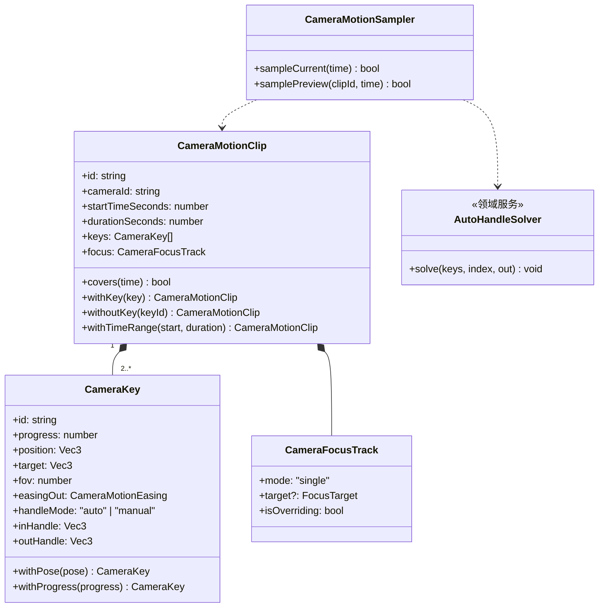
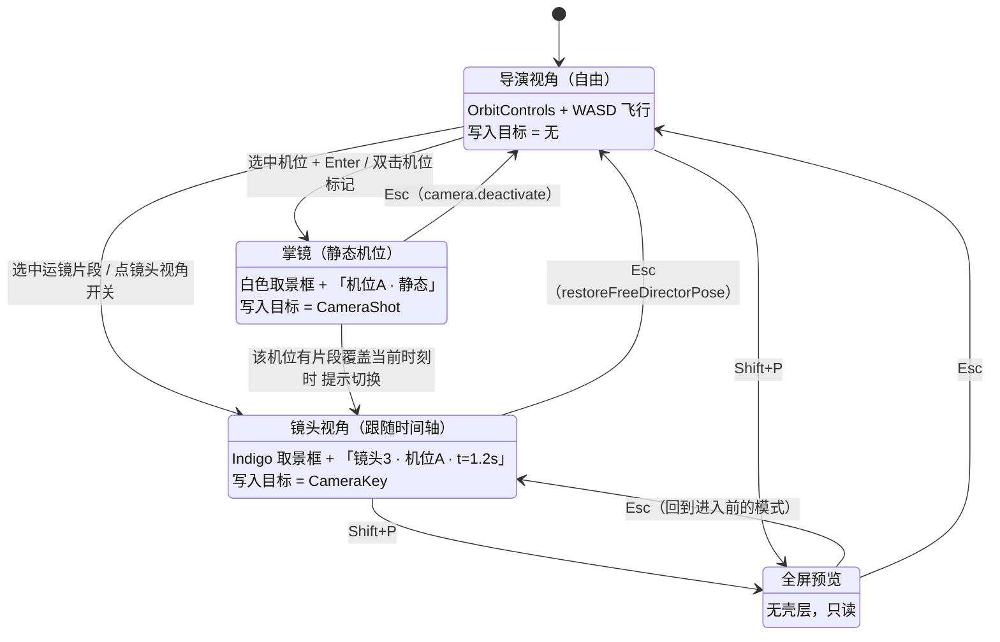
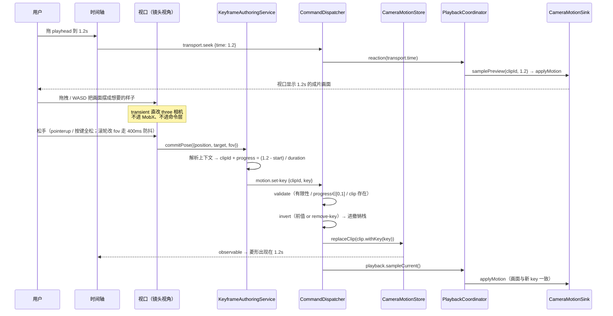
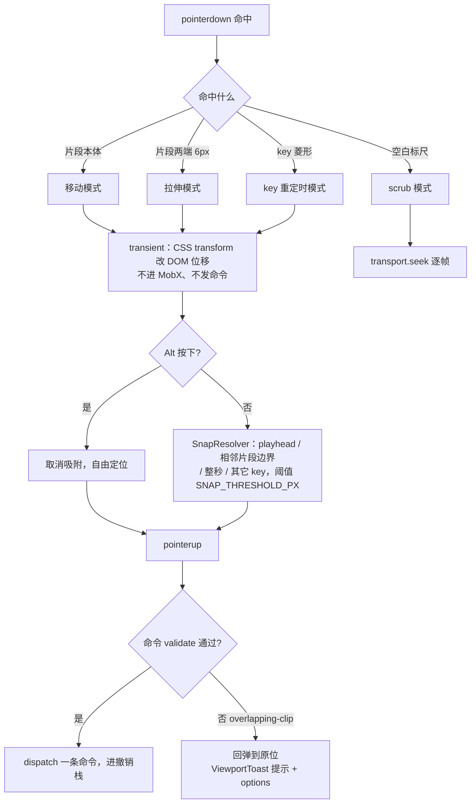

# 运镜编排交互设计方案 —— 「掌镜即运镜」

> 状态：✅ P0–P2 已落地。
> 前置：[phase2-design.md](./phase2-design.md)、[exec2/02-camera-motion.md](./exec2/02-camera-motion.md)（已交付）、[exec2/04-camera-future.md](./exec2/04-camera-future.md)（后续能力）、[layouts/interaction-guidelines.md](./layouts/interaction-guidelines.md)、[state-management.md](./state-management.md)。
> 命题：**运镜最终服务于时间轴**。本文给出把这条命题落成日常手感的领域模型演进、交互契约与分期。
> 姊妹篇：[camera-motion-drafting.md](./camera-motion-drafting.md) —— 轨迹怎么画、效果怎么看（含对本文第十二节「画中画监视器」判断的修正）。

---

## 一、现状盘点（代码事实）

### 1.1 已经成立的地基

| 层 | 承载类 | 事实 |
|---|---|---|
| 机位领域 | `CameraShot` / `CameraDirector` | 不可变值对象 `{position, target, fov}`，observable map 聚合，`camera.set-shot` 唯一写入口 |
| 时序领域 | `CameraMotionClip` | `{id, cameraId, startTimeSeconds, durationSeconds, keys, focus}`，`covers(t)`、`withKey/withoutKey/withFocus/withTimeRange` 全不可变 |
| 空间轨迹 | `MotionTrajectory<CameraKey>` / `AutoHandleSolver` | key 按 `progress` 排序，构造期预解算控制点；采样零分配，默认 Catmull-Rom 自动手柄 |
| 注视 | `CameraFocusTrack` / `FocusTargetResolver` | 可选跟拍覆盖层；`null` 时由 key 的 `target` 插值，非空时覆盖注视目标 |
| 输出 | `CameraProgramTrack` | `cameraAt(t)` 同一时刻唯一机位，硬切，允许空隙；`motion.create-take` 默认同步落 Program |
| 运行时 | `CameraMotionSampler` + `CameraMotionSink` | `bindSink/sampleCurrent/restore`，只写调用方标量，不写 MobX |
| 定序 | `PlaybackCoordinator` | 单条 `reaction(transport.time)`：`binder → transform → motionSampler → pose → invalidate` |
| 命令 | `motion.*` / `program.*` | `create-take / create-clip / set-clip-range / set-key / move-key / remove-key / set-key-handle / reset-key-handles / set-key-easing / set-focus / remove-clip / author / preview.enter / preview.exit`，全部持久写入命令可撤销 |
| 引用完整性 | `RemoveObjectCommand.validateIssues` | 删除被跟拍对象返回 `focus-target-in-use` + `options: freeze-world-point / remove-dependent-focus` |

**P0–P2 的领域、命令和交互面已形成闭环。**

### 1.2 「从零做出一段运镜」当前动作序列

1. 左栏点「机位与运镜」打开 `ShotPanel`，创建或选中静态机位；
2. 选择「推/拉/摇/移/升降/环绕/静止」预设，UI 通过 `motion.author` 生成可编辑 key，或在 AI/高级流程中调用 `motion.create-take` 一次提交 key 与 Program；
3. 在镜头视角 scrub 时间轴，视口显示该时刻的运镜画面；
4. 摆位松手以 `motion.set-key` 提交完整 pose，时间轴显示 key 菱形；
5. 拖 key 重定时用 `motion.move-key`，拖片段移动/拉伸用 `motion.set-clip-range`，拖手柄用 `motion.set-key-handle`；
6. 需要跟拍时用 `motion.set-focus` 绑定对象；解除覆盖传 `target: null`；
7. 从任意时刻播放、scrub 或预览片段；`TimeTransport` 将 playhead clamp 到时间轴时长，并支持循环。

### 1.3 历史断裂（P0–P2 已解决）

| # | 断裂 | 证据 | 危害 |
|---|---|---|---|
| **D1** | **编辑期看不到运镜** | `CameraMotionRig.tsx:82` `isProgramOutput = layout.presentationMode`；编辑期 sink 未绑定，scrub 时 `motionSampler.sampleCurrent` 跑了但无处落地 | 所见非所得。手柄只能盲调，运镜的「手感」根本无从建立 |
| **D2** | **时间轴上运镜是只读装饰** | `TimelinePanel.tsx:300-323` 运镜行无任何 handler；`motion.set-clip-range` 命令存在但**零 UI 调用方**；`TimelineConsole.tsx:121-145` 迷你轨压根不画运镜 | 「运镜服务于时间轴」在 UI 上是空头支票：不能拖、不能拉伸、不能吸附 |
| **D3** | **作者意图与编辑对象错位** | 用户想的是「2 秒从这里推到脸上」；系统要求他产出机位实体 + 片段时间 + 锚点序列 + 手柄向量 + focus 目标 + Program 片段，横跨四个面板 | 概念负担压垮新手；AI 也得跨六个命令拼一个意图 |
| **D4** | **Program 轨手工双维护** | 创建 motion clip 不生成 Program 片段；`TimelinePanel` 的 `ProgramCutInButton` 是独立动作 | 做完运镜忘了切 Program = 成片该段黑屏，且没有任何提示 |
| **D5** | **playhead 不封顶** | `TimeTransport.ts:57-66` 无 `duration`，`tick` 不 clamp，`seek` 只 clamp `≥0`，无 loop | 播过尾后 `program.cameraAt` 返回 `null`、画面停住而时间继续涨，编排期反复踩 |

附带历史缺陷已随 P0–P2 清理：掌镜写入仍只走 `camera.set-shot`，镜头视角下路径辅助物与 key 编辑均可见；AI 词汇、预设与 UI 命令均收敛到 clip/key 制。

---

## 二、设计主张

> **掌镜即运镜（Live Camera Authoring）**：
> 把 playhead 拖到某一刻 → 视口直接显示该刻的成片画面 → 在视口里把画面摆成你要的样子 → 松手即在该时刻落下一枚**镜头关键帧**。
> 运镜编辑 = 「时间轴 scrub」× 「视口摆位」两个已有手势的乘积，不引入第三种手势。

三条推论：

1. **编辑对象从「贝塞尔路径」上移为「镜头关键帧（CameraKey）」**。路径、手柄、fov 曲线、注视插值全部由 key 序列派生；手柄退化为可选的高级 override。用户的唯一动词是「打点」，与 transform 轨的 `K` 完全同构（Rule of Two）。
2. **视口获得第二种模式：镜头视角**。`导演视角`（自由，现状）↔ `镜头视角`（跟随时间轴 Program 输出）。这不是恢复被砍掉的「Render Cam / Free Cam」药丸——那时「镜头视角」= 掌镜静态机位，与 `Enter` 重复；现在它是**跟随时间轴的动态输出**，`Enter` 进不去，语义真实存在。
3. **时间轴成为运镜的主编辑面**。clip 可拖可拉伸可吸附，key 在 clip 内显示为菱形并可拖动，Program 轨默认自动跟随运镜片段。

---

## 三、架构

```mermaid
flowchart TB
    subgraph Authoring[编排输入]
        Viewport[视口摆位手势<br/>OrbitControls / Fly / 滚轮]
        Track[时间轴手势<br/>clip 拖拽 / key 拖拽 / scrub]
        Preset[运镜预设<br/>推 拉 摇 移 升降 环绕]
        AI[AI 工具调用]
    end

    subgraph Service[编辑器领域服务]
        KeyAuthor[KeyframeAuthoringService<br/>解析 K 的归属上下文]
        Snap[SnapResolver<br/>吸附候选策略]
        Compile[MotionPresetCompiler<br/>语义→CameraKey 序列]
    end

    subgraph Cmd[命令层 唯一写入口]
        Dispatcher[CommandDispatcher]
    end

    subgraph Domain[领域纯数据]
        Clip[CameraMotionClip<br/>keys: CameraKey&#91;&#93;]
        Program[CameraProgramTrack]
        Doc[TimelineDoc<br/>transform 轨]
    end

    subgraph Runtime[运行时 帧级只读]
        Coord[PlaybackCoordinator]
        Sampler[CameraMotionSampler]
        Sink[CameraMotionSink<br/>→ R3F 相机]
    end

    subgraph View[投影 视图模型]
        Layout[TimelineLayout<br/>三数据源→统一行几何]
    end

    Viewport --> KeyAuthor
    Track --> Snap
    Preset --> Compile
    AI --> Compile
    KeyAuthor --> Dispatcher
    Snap --> Dispatcher
    Compile --> Dispatcher
    Dispatcher --> Clip
    Dispatcher --> Program
    Dispatcher --> Doc
    Clip --> Sampler
    Program --> Sampler
    Doc --> Coord
    Coord --> Sampler
    Sampler --> Sink
    Clip --> Layout
    Program --> Layout
    Doc --> Layout
    Layout --> Track
```



边界不变的部分：命令层仍是唯一写入口；采样仍是帧级只读、零分配、不写 MobX；三层领域（机位 / 时序 / 输出）职责不动。

新增的只有四个可扩展件：`KeyframeAuthoringService`（上下文分派）、`SnapResolver`（策略）、`MotionPresetCompiler`（语义编译）、`TimelineLayout`（视图模型投影）。

---

## 四、领域模型演进：`CameraKey` 与通用 `MotionTrajectory`

### 4.1 模型



### 4.2 五个设计决策与理由

**决策 1：key 用归一化 `progress ∈ [0,1]`，不用绝对秒。**
拖动或拉伸 clip 时运镜形状必须整体保持——绝对秒会让缩放 clip 变成「前面的 key 不动、后面的被截断」。`04-camera-future.md` 预留的 `FocusKey.progress` 已经是这个契约，两者对齐，未来 focus 关键帧化时不需要第二套重定时规则。

**决策 2：key 携带完整 pose（`position` + `target` + `fov`），不只是 position。**
这一条同时解决三件事：目标随时间变（`04-camera-future` 的「目标关键帧」）、fov 随时间变（推镜/变焦，现在 fov 是 `CameraShot` 的静态值，整段运镜恒定）、以及「用户摆的就是画面本身」——摆位手势天然产出这三个量，拆开反而要求用户理解它们是三条独立的轨。

**决策 3：`progress` 显式承担分段配速，因此不做弧长参数化。**
没有弧长重参数化：显式 `progress` 让作者决定每段配速，长段和短段无需在帧级查表或迭代；速度曲线编辑器仍是后续独立能力。

**决策 4：手柄默认 `auto`，`AutoHandleSolver` 用 Catmull-Rom 张力求解。**
现状创建锚点时已按「相邻弦长的三分之一」建手柄，这本就是 Catmull-Rom 的特例。把它提升为**声明式的 `handleMode: "auto"`**：key 移动时手柄自动重算（曲线始终平滑），用户拖动手柄才切 `"manual"` 冻结。这样「打三个点就得到一条顺滑运镜」是默认结果，而不是需要手工调 6 个数值框的成果。

**决策 5：`CameraFocusTrack` 从「必需目标」降为「覆盖层」。**
默认注视来自 key 的 `target` 插值（用户摆画面时自然产生）。只有显式绑定跟拍对象时，`FocusTargetResolver` 的解析结果**覆盖** key 的 target，UI 上把 target 字段置灰并标注「由跟拍目标接管」。这既保留了跟拍能力，又免除了「必须先设 focus 才能做运镜」的前置心智。

### 4.3 清洁切换

功能未上线,清洁切换,无迁移。

---

## 五、视口模式状态机



**三态的写入目标必须在 HUD 上说清楚**，这是本方案的防误操作核心：现状用户在掌镜里飞一圈就悄悄改了机位数据（`ShotNavigation` 400ms 后落 `camera.set-shot`），而他以为自己在做运镜。

| 模式 | 取景框 | 角标文案 | 视口手势写入 |
|---|---|---|---|
| 导演视角 | 无 | 无 | 不写（仅 `rememberDirectorPose`） |
| 掌镜 | 白 | `机位A · 静态默认姿态` | `camera.set-shot` |
| 镜头视角 | Indigo | `镜头3 · 机位A · t=1.20s` | `motion.set-key` |
| 全屏预览 | 无 | 无 | 只读 |

**镜头视角的实现代价接近零**：`CameraMotionRig` 的 `isProgramOutput` 判据从 `layout.presentationMode` 放宽为 `layout.presentationMode || authoring.lensViewActive`，采样器加一个 `samplePreview(clipId, time)`（绕过 `program.cameraAt` 直采指定 clip，用于「预览尚未切入 Program 的片段」）。sink、restore、定序全部复用。

**镜头视角下 playhead 不在任何片段内**：视口保持上一次采样画面并弹出提示条「当前时间没有镜头片段」，携带 option「在此创建 1 秒片段」——对齐命令层的 `issue.options` 契约，让用户（和 AI）换方案而不是卡住。

---

## 六、一次打点的完整调用链



关键纪律：摆位期间**一帧命令都不发**（transient 直改 three 相机），只在手势终点提交一次。这是 `ShotNavigation` 已验证的模式（Rule of Two 复用其 commit 语义），既保住撤销栈干净，也保住「播放期 DOM 增删为 0」的验收线。

---

## 七、时间轴：运镜成为一等轨道

### 7.1 目标形态

```
        0s        1s        2s        3s        4s        5s
        ├─────────┼─────────┼─────────┼─────────┼─────────┤
[输出]  ▓▓▓▓机位A▓▓▓▓▓▓│▓▓▓▓▓▓▓机位B▓▓▓▓▓▓▓▓│              ← Program 轨（硬切）
[机位A] ╞═◆═══◆══════◆╡                                     ← 运镜片段（内含 CameraKey 菱形）
[机位B]                 ╞══◆══════════◆═╡
[角色1] ──◆──────────◆────────────────────────◆───          ← transform 关键帧轨
                          ┃ playhead
```

四条纪律：

1. **按机位聚合成行**，不是每片段一行（现状 `TimelinePanel.tsx:300-301` 每 clip 一行，机位一多就爆行）。一台机位一行，行内多个不重叠片段。
2. **片段本体可拖拽移动、两端可拉伸** → `motion.set-clip-range`（命令已存在，只缺手势）。拉伸时 key 按 `progress` 等比重定时，运镜形状不变。
3. **key 显示为菱形，可横向拖拽**（改 `progress`）、可双击把 playhead 定位到它、可 `Delete` 删除。
4. **迷你轨（收起态）必须画运镜**（现状只画 program + transform 关键帧），否则收起后用户失去运镜的时间感知。

### 7.2 视图模型：`TimelineLayout`

现状 `TimelinePanel` 手拼 `program.clips` / `motion.clips` / `document.tracks` 三个数据源共用一把标尺（`TimelinePanel.tsx:270-323`），而 `MiniTimeline` 又拼了一遍且漏了运镜——Rule of Two 已经被触发两次。

抽出视图模型（应用层，不入文档、不入撤销栈）：

```ts
interface TimelineViewport {              // 值对象，可缩放平移
    readonly startSeconds: number
    readonly secondsPerPixel: number
}

interface TimelineRow {                   // 投影结果
    readonly kind: "program" | "camera" | "transform"
    readonly id: string                   // cameraId / targetId
    readonly label: string
    readonly bars: readonly TimelineBar[]     // clip 几何（含 program 片段）
    readonly marks: readonly TimelineMark[]   // key / 关键帧几何
}

class TimelineLayout {                    // 领域服务：三源 → 统一行几何
    project(viewport: TimelineViewport): readonly TimelineRow[]
}
```

`TimelinePanel`、`MiniTimeline`、未来的音频轨共用同一份投影。缩放与平移退化为「改 `TimelineViewport` 值对象」，无需在两处各写一套像素换算——同时补上现状缺失的缩放/平移（`useScrubGesture.ts:28-60` 只有 `ratio = (clientX - left) / width`，没有 viewport 概念）。

### 7.3 拖拽手势与吸附



- 吸附阈值用**像素**（`SNAP_THRESHOLD_PX = 6`）而非秒，缩放后手感恒定。
- `Alt` 临时关闭吸附是 DCC 通行惯例。
- 拖拽期不发命令、松手提交一条——离散手势有明确终点，无需 `ShotNavigation` 的 400ms 防抖；只有滚轮类连续输入才用防抖。
- 重叠被 `motion-overlapping-clip` / `program-overlapping-clip` 拒绝时**回弹并提示**，不静默截断。

### 7.4 Program 自动跟随（消灭 D4）

新增复合命令 `motion.create-take`：一次 dispatch 同时产出运镜片段与其 Program 输出片段。`invert` 返回两条逆命令，撤销栈天然支持（`CommandHistory.HistoryEntry.undo` 本就是 `SerializedCommand[]`）。

| 场景 | 行为 |
|---|---|
| 目标时段 Program 为空 | 自动生成同范围 Program 片段 |
| 目标时段已被**同一机位**占用 | 扩展现有 Program 片段的范围 |
| 目标时段已被**其它机位**占用 | 不静默覆盖：返回 `program-overlapping-clip` + `options: ["replace-program", "keep-current"]`，UI 弹二选一，AI 也读同一份 options |

移动 / 拉伸运镜片段时，若其 Program 片段与它同范围（判定为「跟随态」），一并重定时；用户手工改过 Program 边界（判定为「独立态」）则不联动。这条规则必须在 UI 上可见：跟随态的 Program 片段带链接图标，点击可解除。

### 7.5 `TimeTransport` 封顶（消灭 D5）

`TimeTransport` 增加 `durationProvider`（由 `TimelineStore.document.duration` 注入，仍是**单一权威时长**，`motion.*` / `program.*` 的越界校验不变）与 `loop` 二态：

- `tick` 到达 `duration`：`loop` 关 → `pause()` 并停在 `duration`；`loop` 开 → `seek(0)` 继续；
- `seek` 双端 clamp `[0, duration]`；
- 循环开关放在迷你播放条，与播放/停止同域。

---

## 八、交互契约（细则）

### 8.1 手势映射

| 场景 | 输入 | 行为 | 落地命令 |
|---|---|---|---|
| 导演视角 | 左拖 / 右拖 / 滚轮 | 轨道 / 平移 / 推拉 | 无（`rememberDirectorPose`） |
| 导演视角 | `W A S D` + `Space` / `Shift` | 飞行 | 无 |
| 掌镜 | 同上 + 滚轮改 fov | 改机位静态姿态 | `camera.set-shot`（400ms 防抖） |
| **镜头视角** | 同上 + 滚轮改 fov | **改当前时刻画面** | `motion.set-key`（手势终点提交） |
| 时间轴 | 拖标尺空白 | scrub | `transport.seek` |
| 时间轴 | 拖片段本体 | 平移片段（吸附） | `motion.set-clip-range` |
| 时间轴 | 拖片段两端 | 拉伸（key 等比重定时） | `motion.set-clip-range` |
| 时间轴 | 拖 key 菱形 | 重定时 | `motion.move-key` |
| 时间轴 | 双击 key 菱形 | playhead 跳到该 key | `transport.seek` |
| 时间轴 | `Alt` + 拖 | 临时取消吸附 | —— |
| 视口 | 拖路径锚点 / 手柄 | 空间微调（见 8.3） | `motion.set-key` / `motion.set-key-handle` |

### 8.2 快捷键增量

现有 18 条快捷键（`builtinShortcuts.ts` 的 `SHORTCUT_SPECS`）保持不动，增量按既有 scope 机制挂载：

| id | chord | scope | 行为 |
|---|---|---|---|
| `timeline.add-key` | `k` | gizmo / **lens** | **按上下文分派**：选中场景对象 → transform key；镜头视角 → camera key |
| `lens.toggle` | `` ` `` | global | 导演视角 ↔ 镜头视角 |
| `lens.exit` | `escape` | lens | 退出镜头视角（Esc 优先级插在 `presentation` 之后、`shot` 之前） |
| `motion.key.delete` | `delete` / `backspace` | lens | 删除选中的 camera key |
| `transport.loop` | `l` | global | 循环开关 |

`K` 的上下文分派收敛进 `KeyframeAuthoringService.resolve(ctx): SerializedCommand | CommandIssue`——**禁止**在 `SHORTCUT_ACTIONS` 里堆并列 `if`（AGENTS 规范），返回结构化 issue 时直接进 `ViewportToast`。

### 8.3 视口内路径编辑

现状 `TransformGizmoController.tsx:28-33` 显式排除机位领域，锚点是无交互的 `<points>`——这个排除是对的（不该把 `TransformControls` 直接绑到机位数据上），但结果是空间编辑完全失能。

方案：**不复用 gizmo，做专用的路径编辑辅助物**（领域边界清晰、生命周期自持）：

- key 显示为小球（Indigo），选中后长出两根手柄杆（`handleMode` 切 `manual` 后变实心）；
- 拖 key 小球 → `motion.set-key` 只改 `position`（target / fov 不动）；
- 拖手柄端点 → `motion.set-key-handle`，同时把 `handleMode` 置 `manual`；
- 右键 key → 菜单：`删除` / `恢复自动手柄` / `把 playhead 定位到此`；
- 全部辅助物打 `userData.helper = true`（截图排除，与现状一致），资源登记 `DisposeBag`。

**镜头视角下路径辅助物必须可见**（现状受 `authoringVisible` 门控在掌镜/预览期全隐）：拆分门控——`authoringVisible` 继续管壳层与机位标记，路径辅助物改由 `MotionAuthoringStore.pathVisible ∧ !presentationMode` 决定。这样「一边看着成片画面，一边看着自己的轨迹」成立，这正是运镜手感的来源。

### 8.4 面板收敛

`ShotPanel` 现在混装了机位存盘、景别、创建运镜、追加锚点、6 个手柄数值框、注视绑定、路径开关七类东西，而机位列表已经收敛到 `OutlinerPanel`。重新划界：

| 面板 | 职责 |
|---|---|
| `OutlinerPanel` | 机位与实体的唯一索引（不变） |
| `ShotPanel`（左栏 CAMERA） | **机位**：当前视角存为机位、景别预设、机位默认 fov；**运镜预设**按钮组（推/拉/摇/移/升降/环绕，见第九节） |
| `InspectorSheet`（右栏，选中运镜片段时） | 片段属性：所属机位、起止时间、时长、跟拍目标绑定、key 列表（选中 key 显示其 pose、出段缓动与手柄数值，支持拖拽微调） |
| `TimelinePanel` | 片段与 key 的时间编排 |

手柄的 6 个数值框从常驻表单降级为「选中 key 且 `handleMode === "manual"` 时才出现」的高级项——默认路径自动平滑，绝大多数用户永远不需要打开它。

---

## 九、语义层：运镜预设与 AI 词汇

`docs/ai-control.md` 规划的 `SemanticCompiler` 在这里落地为 `MotionPresetCompiler`：把导演语汇编译成标准 `CameraKey` 序列。

```ts
interface MotionPresetRequest {
    readonly cameraId: string
    readonly startTimeSeconds: number
    readonly durationSeconds: number
    readonly move: "dolly-in" | "dolly-out" | "pan" | "tilt" | "truck" | "crane" | "orbit" | "hold"
    readonly subjectId?: string        // 有 subject 则自动绑跟拍
    readonly shotSize?: ShotSize       // 落幅景别，复用 ShotSizePresets
    readonly easing?: CameraMotionEasing
}
```

对应一条复合命令 `motion.author`，**UI 预设按钮与 AI 工具调用共用它**（Rule of Two 的正解：不为 AI 单开一条路径）。产出是普通 `CameraKey` 序列 —— 生成后完全可再编辑，不是黑盒。

配套已经完成：

- `skills/director-desk/SKILL.md` 以 clip/key 制词汇、`motion.author` 与 `motion.get` 感知结构为准；
- `listCapabilities()` 覆盖 `object.*`、`camera.set-shot`、`action.*`、`transport.*`、`view.frame`，每项均携带权限与 `appliesWhen`；
- 片段时间编辑走 `motion.set-clip-range`；关键帧的缓动、位置与手柄分别走 `motion.set-key-easing`、`motion.set-key` 与 `motion.set-key-handle`。

新增命令的能力契约（`appliesWhen: "director-desk.camera-motion-v3"`，权限沿用 `motion:edit` / `motion:read`）：

| 命令 | payload | 可撤销 | 校验要点 |
|---|---|---|---|
| `motion.create-take` | `{cameraId, startTimeSeconds, durationSeconds, keys, program}` | ✅（两条逆命令） | 时长内、不重叠、机位存在 |
| `motion.set-clip-range` | `{id, startTimeSeconds, durationSeconds}` | ✅ | 同机位不重叠；跟随态 Program 一并重定时 |
| `motion.set-key` | `{clipId, key}` | ✅ | `progress ∈ [0,1]`、pose 有限性、fov 为 `null` 或围栏内 |
| `motion.move-key` | `{clipId, keyId, progress}` | ✅ | progress 唯一且有序 |
| `motion.remove-key` | `{clipId, keyId}` | ✅ | 剩余 key ≥ 2 |
| `motion.set-key-handle` / `motion.reset-key-handles` | `{clipId, keyId, ...}` | ✅ | 有限向量；拖手柄切到 manual，重置回 auto |
| `motion.set-key-easing` | `{clipId, keyId, easing}` | ✅ | easing 为 `linear` 或 `smooth` |
| `motion.set-focus` / `motion.remove-clip` | `{id, target}` / `{id}` | ✅ | focus 可传 `null` 解除覆盖 |
| `motion.author` | `MotionPresetRequest` | ✅ | 同 create-take + `move` 枚举 + subject 存在 |
| `motion.preview.enter` / `motion.preview.exit` | `{clipId}` / `{}` | ❌ 瞬态 | clip 存在 |
| `view.set-mode` | `{mode: "director" \| "lens"}` | ❌ 瞬态 | —— |

---

## 十、性能与状态纪律（红线复核）

| 红线 | 本方案的落法 |
|---|---|
| three 对象不进 MobX | `CameraKey` 全是 `number[3]` 纯数据；路径辅助物 mesh 存 `SceneManager` 普通 Map，登记 `DisposeBag` |
| 渲染循环零分配 | 采样仍写调用方标量；`AutoHandleSolver` 用模块级临时缓冲，且**只在 key 变更时求解一次**、结果缓存进不可变 clip，不进帧循环 |
| `frameloop="demand"` | 镜头视角下 scrub → `invalidate()` 即可，不切 `always`；只有播放/飞行才切 |
| 播放期 DOM 增删 = 0 | 时间轴行、片段、菱形全部 `observer` 叶子自取；拖拽 transient 走本地 ref + **CSS `transform`**（合成器属性），不进 MobX、不触发重排 |
| 禁 `backdrop-filter` / 禁尺寸过渡 / 阴影 ≤ `0 2px 8px` | 新增的取景框描边、路径 HUD、片段条一律不透明底色，只允许 `opacity` 过渡 |
| 收起的重面板必须卸载 | `TimelinePanel` 收起即卸载（现状已如此）；路径编辑辅助物在非镜头视角时卸载，不是 `visible = false` |
| props 边界纪律 | 片段条 / 菱形 / HUD 只收 `clipId` / `keyId` / 回调；`playhead`、`progress`、`fov` 一律组件内自取；帧级 observable 只在叶子读 |
| 禁全局单例 | 新增 `MotionAuthoringStore`（`lensViewActive` / `previewClipId` / `selectedKeyId` / `pathVisible` / `snapEnabled`）随 `createDirectorDeskStores` 每实例一套，**不入工程文档、不入撤销栈** |

`MotionAuthoringStore.pathVisible` 归属编排态（不属于壳层布局），随 `createDirectorDeskStores` 每实例创建。

---

## 十一、分期与验收

```mermaid
gantt
    dateFormat X
    axisFormat %s
    section P0 闭环
    编辑期镜头视角（消灭 D1）      :p0a, 0, 1
    时间轴片段可拖可拉（消灭 D2）  :p0b, 0, 1
    Program 自动跟随（消灭 D4）    :p0c, 0, 1
    transport 封顶与循环（D5）     :p0d, 0, 1
    section P1 手感
    CameraKey 模型演进            :p1a, 1, 1
    视口摆位打点 + 菱形拖拽        :p1b, 1, 1
    TimelineLayout 投影 + 缩放吸附 :p1c, 1, 1
    路径辅助物可拖拽              :p1d, 1, 1
    section P2 语义
    运镜预设 motion.author        :p2a, 2, 1
    skill / ai-control 词汇同步   :p2b, 2, 1
    listCapabilities 补齐         :p2c, 2, 1
    section P3 后续
    速度曲线 / 转场 / 胶片带缩略图 :p3a, 3, 1
```



P0–P2 已按下列清单验收；P3 仍是后续范围，不在本期交付内。

### 验收清单

**P0**
- [x] 镜头视角下拖 playhead，视口逐帧显示成片画面；`Esc` 退出后自由视角 pose 精确还原
- [x] 时间轴拖动/拉伸运镜片段生效且可撤销；重叠被拒时片段回弹并给出 `options`
- [x] 创建运镜自动产出 Program 片段；其它机位占用时弹二选一，不静默覆盖
- [x] 播放到 `duration` 自动停止（或循环），playhead 不越界
- [x] 迷你轨画出运镜片段
- [x] 播放期 `MutationObserver` 采样 3 秒：DOM 节点增删 = 0

**P1**
- [x] 镜头视角下摆位松手即落 key，菱形出现在正确时刻；撤销一步回到摆位前
- [x] 打三个 key 即得平滑运镜，全程不碰任何手柄数值框
- [x] 拉伸片段后运镜形状不变（key 按 `progress` 等比重定时）
- [x] 时间轴可缩放平移；拖拽吸附到 playhead / 边界 / 整秒，`Alt` 取消吸附
- [x] 视口可直接拖拽 key 与手柄，`handleMode` 自动 → 手动的切换可见
- [x] 200 个 key 的片段播放不掉帧；采样期零分配

**P2**
- [x] 一次点击「推镜」按钮产出可再编辑的运镜片段
- [x] AI 用 `motion.author` 走同一条命令产出相同结果；`motion.get` 断言一致
- [x] `skills/director-desk/SKILL.md` 与 AI 控制文档已同步 clip/key 词汇
- [x] `listCapabilities()` 覆盖新增的 scene/camera/action/transport/view 命令元数据

**P3（未做）**
- [ ] 速度曲线编辑器、镜头转场与胶片带缩略图

---

## 十二、明确不做

- **不把运镜片段并入 `TimelineDoc`**。`TimelineTrack` 是关键帧点容器，无 clip（start + duration）语义、无重叠不变量、`kind` 只有 `transform`；硬塞会污染 transform 轨模型，而 `CameraProgramTrack` 的「同一时刻唯一输出」不变量属于输出领域，不是通用轨。真正需要统一的是**时间基准**（已统一：`timeline.document.duration` 权威）与**UI 呈现**（由 `TimelineLayout` 视图模型投影），不是存储。
- **不做弧长重参数化**（理由见决策 3）。
- **不做速度曲线编辑器 / 镜头转场 / 多机位宫格**——保留在 `exec2/04-camera-future.md`，不以临时分支混入。
- ~~**画中画 Program 监视器降为 P3**~~ —— **已修正**：补上量级后（`320×180` ≈ 主画布像素量的 0.7%，瓶颈在第二次场景遍历而非填充率）提到 P1，带「帧间隔中位数劣化 ≤ 1ms」的硬门槛，超标才退回。见 [camera-motion-drafting.md §2.2](./camera-motion-drafting.md)。
- **不做运镜录制（实时采样 + 曲线抽稀）**：产出的仍是标准 `CameraKey` 序列，但拟合与抽稀阈值的调参成本高，等 P1 的打点手感被验证后再评估。
