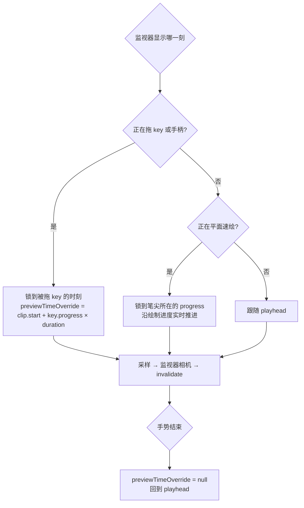
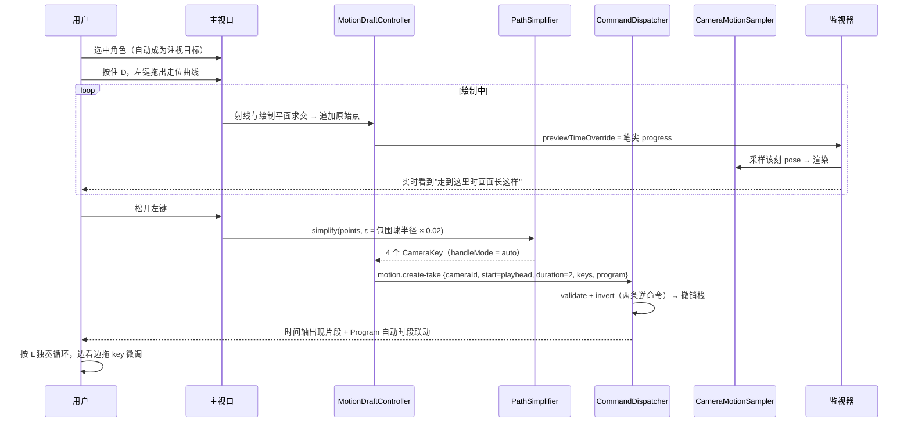

# 运镜轨迹绘制与效果查看

> 状态：⬜ 提案，待评审。主方案见 [camera-motion-authoring.md](./camera-motion-authoring.md)（领域模型演进、时间轴编排、命令契约）。
> 本文只回答两个问题：**用户怎么把脑子里的轨迹画出来**，**画完怎么看到效果**。

---

## 零、一句话结论

**绘制不该是一种手段，而是四层入口；查看不该是一个模式，而是四层反馈。**
关键不在于把某一层做得多强，而在于**让「画」和「看」在同一屏内咬合成闭环**——拖哪个点，就看哪一刻的画面。

---

## 一、绘制侧：四层入口，同一产物

三维轨迹用二维输入设备去画，这是问题的硬核。**没有单一手势能同时满足「快」「准」「自由」**，所以不该让手绘包打天下——给对的工具比把一个工具做强更重要。

四层入口产出的都是标准 `CameraKey[]`（见主方案第四节），互相之间**没有模式墙**：任何一层的产物都能被后面任何一层继续改。

```mermaid
flowchart LR
    subgraph L1[L1 语义预设 · 最快]
        Preset["推 / 拉 / 摇 / 移 / 升降 / 环绕<br/>参数化生成"]
    end
    subgraph L2[L2 平面速绘 · 最自由]
        Draft["在绘制平面上拖出曲线<br/>RDP 抽稀成 3~6 个 key"]
    end
    subgraph L3[L3 视口打点 · 最准]
        Punch["镜头视角摆画面<br/>松手落 key"]
    end
    subgraph L4[L4 控制点精修]
        Tweak["拖 key 小球 / 手柄 / 站杆"]
    end

    Preset --> Keys["CameraKey&#91;&#93;"]
    Draft --> Keys
    Punch --> Keys
    Tweak --> Keys
    Keys -.可再编辑.-> Draft
    Keys -.可再编辑.-> Punch
    Keys -.可再编辑.-> Tweak
```



### 1.1 选层判据（写进帮助浮层，不靠用户悟）

| 作者意图                                    | 该用哪层        | 为什么不用别层                                                       |
| ------------------------------------------- | --------------- | -------------------------------------------------------------------- |
| 规则运动：推近 / 拉远 / 绕角色转 90° / 升降 | **L1 预设参数** | 圆弧手绘画不准；「绕谁、转多少度、半径多少」是三个数字，不是一条曲线 |
| 自由走位：穿过门洞、绕开柱子、沿走廊推进    | **L2 平面速绘** | 参数表达不了不规则路径；逐点打太慢                                   |
| 画面精确：这一刻构图必须是这样              | **L3 视口打点** | 只有摆画面才能同时定死 position + target + fov                       |
| 形状微调：曲线太胖 / 转弯太急 / 这个点高了  | **L4 控制点**   | 前三层都是「重来一遍」，微调只要动一个点                             |

**弧线与环绕不该手绘**——这是本节最重要的判据。手绘擅长自由曲线，参数擅长规则运动，混淆两者是绝大多数三维软件运镜难用的根因。

### 1.2 L2 平面速绘：核心设计

这是当前完全缺失、且提效最大的一层。导演在纸上画的**调度平面图**（机位移动线 + 视线箭头）本来就是这个东西的模拟版。

#### 不切正交顶视图，而是投影到「绘制平面」

切顶视图会打断空间感（看不见角色朝向、道具遮挡关系）。方案是在**当前透视视口里**放一个可见的半透明绘制平面（`MotionDraftPlane`，Indigo 细网格，`userData.helper = true`）：

- 鼠标射线与该平面求交 = 轨迹点；
- 平面默认高度 = 选中对象包围盒中心高度，无选中时 = 当前相机高度；
- 平面高度可直接拖（竖直箭头把手），拖动时显示 `H = 1.62m` 数字；
- 透视场景全程可见 —— 用户能看着角色和道具画路线，这正是平面图的价值。

#### 绘制手势：弹簧修饰键，不抢导航

绘制模式**不能独占左键**——用户画一半常要转个角度看清遮挡。

| 输入                              | 行为                                                                |
| --------------------------------- | ------------------------------------------------------------------- |
| 按住 `D` + 左键拖                 | 绘制（弹簧态，松开 `D` 即退出）                                     |
| 点击左栏「绘制轨迹」按钮          | 钉住绘制模式（与 rail / 时间线的「hover 展开 + 点击钉住」惯例一致） |
| 绘制模式下 右键拖 / 中键拖 / 滚轮 | 保留平移 / 轨道 / 推拉，随时调整观察角度                            |
| `Esc`                             | 退出绘制模式                                                        |

#### 松手即抽稀：RDP，不是原始采样点

拖动产生几百个原始点，直接入库就是不可编辑的死数据。松手时跑 **Ramer–Douglas–Peucker** 抽稀成 3~6 个 `CameraKey`：

```ts
class PathSimplifier {
    // 领域服务，无状态
    simplify(points: readonly Vec2[], epsilon: number): readonly Vec2[];
}
```

- **epsilon 与场景尺度无关**：取 `场景包围球半径 × SIMPLIFY_RATIO`，二档 `简洁 = 0.02` / `保真 = 0.005`。硬编码世界单位会在大场景里退化成折线、在小场景里抹平细节。
- 抽稀在**绘制平面上做二维 RDP**（共面，只有位置），是三十行的教科书算法。
  这与主方案里降到 P3 的「运镜录制」不同——那是对 6DoF pose 序列（position + target + fov + 时间）做拟合，参数耦合、调参成本高。**二维共面抽稀是 P1 可交付的，六自由度拟合不是。**
- 抽稀后每个 key 的 `handleMode = "auto"`，`AutoHandleSolver` 直接给出平滑曲线 —— 用户画一条抖手的线，得到一条顺滑的运镜。

#### 高度（Y）单独解决

平面绘制只定 XZ。三条补齐手段，按使用频率排序：

1. **整段线性升降**（最常用，= crane）：片段属性里两个数字 `起幅高度 → 落幅高度`，一填即成升降镜头；
2. **站杆拖拽**：每个 key 下方一根竖直杆（`MotionKeyStick`），向上/下拖改该点高度 —— Blender / UE 的 pivot stick 惯例；
3. **数值输入**：Inspector 里选中 key 后的 Y 字段。

#### 注视线：可选的第二条曲线

导演平面图上其实有两条线：机位移动线 + 视线箭头。对应设计：

| 情形                        | 注视来源                                                                            |
| --------------------------- | ----------------------------------------------------------------------------------- |
| 绘制前**选中了场景对象**    | 自动绑定为注视目标（`CameraFocusTrack` 注视覆盖层），整段看向它 —— 覆盖绝大多数意图 |
| 未选中，且未画第二条线      | 所有 key 的 `target` = 轨迹前进方向前方 `LOOK_AHEAD_METERS`，即「向前开」           |
| 按住 `D` + `Shift` 再拖一条 | 画**注视线**：与位置线按 `progress` 一一对应，逐 key 写 `target`                    |

注视线是可选的高级动作，默认路径上用户永远不需要知道它存在。

#### 时间与空间分离（沿用现有设计意图）

`CameraMotionPath` 的现有注释已经写明：_"Time belongs to CameraMotionClip, so one path can be retimed without redrawing it."_ 绘制严格遵守这条：

- 绘制**不计时**（不是"边画边录"）；
- 起点 = 当前 playhead，时长 = `DEFAULT_TAKE_SECONDS = 2`；
- 松手瞬间片段出现在时间轴上，两端可直接拉伸重定时，形状不变（key 用归一化 `progress`）。

### 1.3 L4 控制点精修：视口里的三种把手

现状 `TransformGizmoController.tsx:28-33` 显式排除机位领域（这个排除是对的，不该把 `TransformControls` 直接绑到机位数据上），结果是空间编辑完全失能。方案是**专用把手**，不复用 gizmo：

| 把手     | 外观                                                | 拖动效果                                  | 命令                    |
| -------- | --------------------------------------------------- | ----------------------------------------- | ----------------------- |
| key 小球 | Indigo 实心球                                       | 改 `position`（`target` / `fov` 不动）    | `motion.set-key`        |
| 站杆     | 球下竖直细杆                                        | 只改 Y                                    | `motion.set-key`        |
| 手柄杆   | 选中 key 后长出两根；`auto` 时空心、`manual` 时实心 | 改切线，**并把 `handleMode` 置 `manual`** | `motion.set-key-handle` |

右键 key → `删除` / `恢复自动手柄` / `把 playhead 定位到此`。全部 `userData.helper = true`（截图排除），资源登记 `DisposeBag`。

「空心 → 实心」的视觉切换是关键：它让用户知道自己刚刚**接管**了这条曲线，此后系统不再自动平滑它。

---

## 二、查看侧：四层反馈

四层各解决一个**不同的**问题，不是同一件事的四种做法：

| 层                | 回答什么问题                       | 渲染成本                                |
| ----------------- | ---------------------------------- | --------------------------------------- |
| L1 镜头视角接管   | 「这一刻画面长什么样」             | 零（复用主 pass）                       |
| L2 画中画监视器   | 「我一边改轨迹，一边看成片」       | 一次额外场景遍历，像素量 ≈ 主画布 0.7%  |
| L3 轨迹时间可视化 | 「整段运镜的形状、朝向、**快慢**」 | 零（helper 几何，只在 clip 变更时重建） |
| L4 片段独奏循环   | 「这 2 秒的**节奏**对不对」        | 零（只是 transport 的循环区间）         |

### 2.1 L3 轨迹时间可视化 —— 被低估的零成本反馈

一条素色曲线只说明「走哪」，说明不了「怎么走」。四项增强，全部在现有 helper 体系内：

```
起幅                                                          落幅
 ●·······●·······●·····●···●··●·●●●●●●                        ← 刻度点疏密 = 速度
 ▽       ▽       ▽     ▽   ▽  ▽                               ← 每 key 一个视锥 ghost
 └─────────────── Indigo 明度渐变（暗 → 亮）───────────────┘
                        ◉ ← 当前时刻位置球（Red，与 playhead 同色）
```

1. **等时刻度点**：沿轨迹每 `TICK_INTERVAL_SECONDS = 0.5` 一个点。**点的疏密直接表达速度**（密 = 慢，疏 = 快）——这是 After Effects 的 motion path 速度可视化，一眼看懂加减速，不需要打开任何曲线编辑器。用 `InstancedMesh` 一次画完。
2. **时间着色**：轨迹按 Indigo 明度从暗（起幅）渐变到亮（落幅），解决「这条线往哪个方向走」的歧义。
3. **视锥 ghost**：每个 key 处画一个线框视锥，张角由该 key 的 `fov` 决定 —— **变焦一眼可见**（视锥张开 = 拉广角，收拢 = 推长焦）。
4. **当前时刻位置球**：Red 小球沿轨迹跑，与 playhead 同色（沿用 `interaction-guidelines` 的色彩语言：Indigo = 运镜与关键帧，Red = 当前时刻）。每帧只写 `position`，复用模块级 `Vector3`，零分配。

**色彩语言一致性是这层能被"一眼读懂"的前提**，不是装饰：用户在时间轴上认识的红色播放头，在三维空间里就是这个红球。

**门控修正**：现状路径辅助物受 `authoringVisible` 门控，掌镜 / 预览期全隐，导致「看得到画面就看不到轨迹」。必须拆分——`authoringVisible` 继续管壳层与机位标记，路径辅助物改由 `MotionAuthoringStore.pathVisible ∧ !presentationMode` 决定。**一边看成片一边看轨迹，是运镜手感的来源。**

### 2.2 L2 画中画监视器 —— 修正主方案的判断

> **这是对主方案的一处修正。** 主方案第十二节把画中画监视器降到 P3，理由是「第二个 `RenderTarget` 在活动画布上是真实 GPU 成本」。那是一个没有量级的笼统判断。补上量级后结论改变，提到 **P1**。

#### 成本量级

| 项           | 数值                                 |
| ------------ | ------------------------------------ |
| 监视器分辨率 | `320 × 180`（16:9）= 57,600 px       |
| 主画布       | `1920 × 1080` @ dpr 2 = 8,294,400 px |
| **像素占比** | **≈ 0.7%**                           |

填充率不是瓶颈。真正的成本是**第二次场景遍历与重复 draw call（CPU 侧）**。导演台的场景规模（个位数模型 + 三点布光）下 draw call 数量小，这是可控的。三条纪律把它钉住：

1. **按需刷新**：`frameloop="demand"` 下监视器只在主画布 `invalidate()` 时同步渲染一次；播放期与主画布同频；暂停静置时两者都是 0 帧。
2. **不新建相机对象**：复用 `CameraMotionSampler` 的采样结果写进一个常驻的 `PerspectiveCamera`，帧循环零分配。
3. **收起即卸载**：监视器关闭时销毁 `WebGLRenderTarget`（`DisposeBag`），不是 `visible = false`。这是 AGENTS 红线第 13 条的明文要求。

#### 验收线（不是承诺，是门槛）

- 监视器开启前后，播放期帧间隔中位数劣化 **≤ 1ms**；超过则退回 P3，改用 L1 接管式。
- 播放期 `MutationObserver` 采样 3 秒：DOM 节点增删仍为 **0**（监视器是 canvas 内的 `RenderTarget`，不是 DOM 面板 —— 这也是它比"第二个 `<Canvas>`"正确的原因）。

#### 布局

右下角 `320×180`，不透明底色 + `1px` Indigo 描边（**禁 `backdrop-filter`、禁尺寸过渡、阴影 ≤ `0 2px 8px`**，AGENTS 红线第 13 条）。角标显示 `机位A · t=1.20s`。可折叠成一个小图标。

它与时间线控制台在同一侧会打架 —— 监视器停在时间线迷你条上方 `timelineMiniPx + edgeGapPx` 处，展开时间线时一并上移（复用 `CHROME` 尺寸常量，不写第二套魔术数字）。

### 2.3 L4 片段独奏循环 —— 评估节奏的唯一可靠手段

**运镜的好坏是节奏问题，节奏只能靠反复看同一段来判断。** 这是所有动画 / 剪辑软件的核心工作方式，而当前系统连整段都只能从 `t=0` 顺放一次。

`TimeTransport` 增加循环区间（主方案 7.5 节已提出 `loop` 二态，这里收紧为区间）：

```ts
readonly loopRange: { readonly startSeconds: number; readonly endSeconds: number } | null
```

| 输入               | 行为                                                                             |
| ------------------ | -------------------------------------------------------------------------------- |
| 选中运镜片段 + `L` | `loopRange = [clip.start, clip.start + clip.duration]`，立即播放，反复循环该片段 |
| 无选中 + `L`       | `loopRange = [0, duration]`，整片循环                                            |
| 再按 `L`           | 关闭循环                                                                         |

片段条在循环中时显示循环角标。实现成本近乎为零（`tick` 到 `endSeconds` → `seek(startSeconds)`），收益是**让"改一点 → 立刻看效果"的循环周期从十几秒压到两秒**。

---

## 三、闭环：画与看如何咬合

### 3.1 屏幕分工

```
┌─────────────────────────────────────────────────┐
│                                                 │
│      主视口（导演视角）                          │
│      看轨迹 · 画曲线 · 拖控制点                  │
│                              ┌────────────────┐ │
│                              │ 监视器          │ │
│                              │ 看成片          │ │
│                              │ 机位A · t=1.20s │ │
│                              └────────────────┘ │
│  ┌───────────────────────────────────────────┐  │
│  │ 时间线：scrub · 片段拖拉 · 独奏循环         │  │
│  └───────────────────────────────────────────┘  │
└─────────────────────────────────────────────────┘
```

主视口保持**导演视角**（自由，看得见轨迹全貌），成片画面交给监视器。这样「画」和「看」不再抢同一块屏幕 —— 这正是主方案里 L1 接管式镜头视角解决不了的问题：接管之后就看不见自己的轨迹了。

**两者不是二选一**：监视器是常态工作面，镜头视角接管是「我要仔细看这一帧构图」时的临时全屏（`` ` `` 切换）。

### 3.2 拖谁看谁（follow-the-drag preview）

最有价值的一处细节。**拖某个 key 时，监视器该显示哪一刻？**



- **拖 key** → 监视器锁到该 key 的时刻：我在调这个点，就让我看这个点的画面。松手回到 playhead。
- **平面速绘中** → 监视器跟着笔尖走：画到哪，看到哪的画面 —— 绘制过程本身变成一次预演。
- 状态由 `MotionAuthoringStore.previewTimeOverride: number | null` 承载（每实例 UI 态，**不入工程文档、不入撤销栈**）。

这条规则把「画」和「看」焊成一个动作：**用户不需要画完再去 scrub 检查，画的过程就是检查的过程。**

### 3.3 一次完整的绘制闭环



从「我想要一段走位」到「看到它在循环播放」——**一次按住拖动 + 一次按键**。对比现状的 12 步点击序列（主方案 1.2 节）。

---

## 四、落点与纪律

### 4.1 新增件

| 件                                         | 职责                                                                                                          | 类型                                       |
| ------------------------------------------ | ------------------------------------------------------------------------------------------------------------- | ------------------------------------------ |
| `MotionDraftPlane`                         | 绘制平面 helper（网格 + 高度把手）                                                                            | R3F 组件                                   |
| `MotionDraftController` / `useMotionDraft` | 绘制手势状态机（弹簧键、射线求交、原始点缓冲）                                                                | 控制器 + hook                              |
| `PathSimplifier`                           | RDP 二维抽稀                                                                                                  | 领域服务（无状态纯函数集合）               |
| `MotionKeyHandles`                         | key 小球 / 站杆 / 手柄杆的拖拽把手                                                                            | R3F 组件                                   |
| `MotionTrailVisualizer`                    | 时间着色 + 等时刻度 + 视锥 ghost + 当前位置球                                                                 | R3F 组件（取代现 `MotionClipPathPreview`） |
| `ProgramMonitor`                           | 画中画 `WebGLRenderTarget` 渲染                                                                               | R3F 组件                                   |
| `MotionAuthoringStore`                     | `draftMode` / `draftPlaneHeight` / `previewTimeOverride` / `monitorVisible` / `pathVisible` / `selectedKeyId` | 每实例 MobX store，不入文档                |

`TimeTransport` 扩展 `loopRange`；`WorkbenchLayoutStore.motionPathPreviewVisible` 迁入 `MotionAuthoringStore`（它属编辑器领域的编排态，不属壳层布局）。

### 4.2 命令增量

| 命令                           | payload                                                                                              | 可撤销          |
| ------------------------------ | ---------------------------------------------------------------------------------------------------- | --------------- |
| `motion.draft-take`            | `{cameraId, startTimeSeconds, durationSeconds, planePoints, planeHeight, simplifyRatio, subjectId?}` | ✅              |
| `motion.set-key-height`        | `{clipId, keyId, height}`                                                                            | ✅              |
| `motion.set-elevation-ramp`    | `{clipId, startHeight, endHeight}`                                                                   | ✅ 整段线性升降 |
| `transport.set-loop-range`     | `{startSeconds, endSeconds} \| null`                                                                 | ❌ 瞬态         |
| `motion.preview.override-time` | `{timeSeconds \| null}`                                                                              | ❌ 瞬态         |

`motion.draft-take` 让 **AI 也能"画"轨迹**（传平面点序列），与 UI 共用同一条命令 —— Rule of Two 的正解，不为 AI 单开路径。

### 4.3 性能纪律复核

| 红线                                       | 落法                                                                                                                  |
| ------------------------------------------ | --------------------------------------------------------------------------------------------------------------------- |
| 渲染循环零分配                             | 绘制期原始点写入预分配 `Float32Array` 环形缓冲；当前位置球复用模块级 `Vector3`；RDP 只在松手时跑一次                  |
| 轨迹几何仅在不可变路径引用变化时重建       | `MotionTrailVisualizer` 以 `clip.keys` 引用为 memo 键；刻度点用 `InstancedMesh`，旧 `BufferGeometry` 必须 `dispose()` |
| `frameloop="demand"`                       | 绘制拖动 / key 拖动 / `previewTimeOverride` 变化 → `invalidate()`，不切 `always`                                      |
| 播放期 DOM 增删 = 0                        | 监视器是 canvas 内 `RenderTarget`，不是 DOM 面板；角标时间码由叶子 observer 自取（12Hz 节流）                         |
| 收起的重面板必须卸载                       | 监视器关闭销毁 `RenderTarget`；绘制平面退出模式即卸载                                                                 |
| 禁毛玻璃 / 禁尺寸过渡 / 阴影 ≤ `0 2px 8px` | 监视器外框走 `theme.ts` 的 `panel` 变体，只允许 `opacity` 过渡                                                        |
| props 边界纪律                             | 把手组件只收 `clipId` / `keyId` / 回调；`progress`、`fov`、`playhead` 一律自取                                        |

### 4.4 分期

| 期     | 内容                                                                                     | 判据                                             |
| ------ | ---------------------------------------------------------------------------------------- | ------------------------------------------------ |
| **P0** | L3 轨迹时间可视化（刻度点 / 时间着色 / 视锥 ghost / 位置球）+ 门控拆分 + L4 片段独奏循环 | 零渲染成本、无模型改动，**先让用户看懂现有轨迹** |
| **P1** | L2 平面速绘 + `PathSimplifier` + L4 控制点把手 + L2 画中画监视器（带性能门槛）           | 依赖主方案 P1 的 `CameraKey` 模型                |
| **P2** | 注视线双线绘制 + `motion.draft-take` 的 AI 通道 + 整段升降 ramp                          | ——                                               |
| **P3** | 胶片带缩略图（片段条上烘 N 张离屏渲染，异步一次、不入帧循环）                            | 依赖监视器的离屏渲染基建                         |

**P0 单独就有意义**：不改任何领域模型、不加任何渲染通道，只是把已有的轨迹画得能读懂、再加一个循环区间。建议先落 P0 实测，再决定 P1 的绘制层投入。

### 4.5 验收清单

**P0**

- [ ] 轨迹刻度点疏密与实际速度一致（加速段点变疏）；起落幅方向由明度渐变可辨
- [ ] 每个 key 的视锥张角随其 `fov` 变化，推长焦时肉眼可见收拢
- [ ] 镜头视角 / 掌镜下轨迹仍可见（门控拆分生效），全屏预览下不可见
- [ ] 选中片段按 `L` 循环该片段区间；再按关闭；播放期 DOM 节点增删 = 0

**P1**

- [ ] 按住 `D` 拖一条抖手曲线，松手得到 ≤ 6 个 key 的平滑运镜，且全程未碰任何数值框
- [ ] 绘制期间监视器跟随笔尖推进；拖 key 时监视器锁到该 key 时刻，松手回 playhead
- [ ] 大场景与小场景下抽稀密度一致（epsilon 随包围球缩放）
- [ ] 拖站杆改高度、拖手柄自动切 `manual`（空心 → 实心）且曲线立即更新
- [ ] **监视器开启前后播放期帧间隔中位数劣化 ≤ 1ms**；超标则退回 P3

每期收口前 `bun run typecheck && bun run lint && bun run build`，Storybook 人工走查（本仓禁单测）。

---

## 五、明确不做

- **不做正交顶视图/三视图布局**：多视口在活动 WebGL 画布上是成倍渲染成本，且打断空间感；绘制平面已覆盖平面图诉求。
- **不做六自由度运镜录制**（实时采样 pose 序列 + 曲线拟合）：与二维共面抽稀不是一个复杂度，调参成本高，等 P1 的绘制手感被验证后再评估。
- **不做速度曲线编辑器**：保留在 [`exec2/04-camera-future.md`](./exec2/04-camera-future.md)。等时刻度点已经把速度**可读**，可编辑是另一件事。
- **不用 `TransformControls` 做 key 把手**：`TransformGizmoController` 对机位领域的排除是正确的边界，专用把手的生命周期与视觉语义都需要自持。
