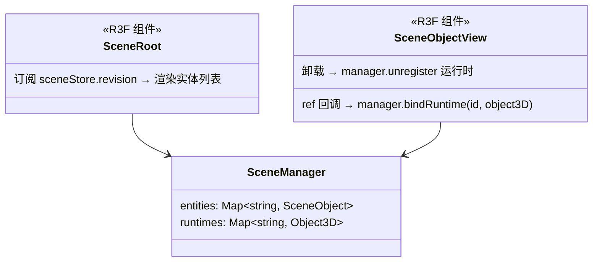

# 02 · 3D 场景画布

## 目标

可摆放、可浏览的三维空间容器:网格地面、灯光、轨道相机、场景对象渲染管线。后续所有任务的地基。

## 范围

- 做:`SceneRoot` 渲染管线(实体→Object3D)、模型渲染、运行时绑定、demand 渲染闭环
- 不做:模型导入(03)、gizmo(04)、机位(06)

## 类设计

- `SceneRoot`:observer 组件,按 `sceneStore.revision` 重读实体列表(细粒度:revision 是 number,避免订阅整个 Map 引用)。
- `SceneObjectView`:每个实体一个;按 `kind` 渲染模型/灯光内容;`ref` 回调完成运行时绑定。**禁在渲染体里写 store**。
- 渲染失效:实体变更后调 `invalidate()`(frameloop="demand" 下唯一渲染触发)。

## 实现步骤

1. `src/ui/scene/SceneObjectView.tsx`:按 `entity.kind` 渲染模型和灯光内容，`ref` 绑定/解绑运行时。
2. `src/ui/scene/SceneRoot.tsx`:observer,`sceneStore.revision` → `manager.list()` → map 到 `SceneObjectView`;变更后 `invalidate()`。
3. `DirectorDesk.tsx`:Canvas 内挂 `SceneRoot`;模型导入统一经 `importModelFile` 分发 `object.place` 命令。
4. 卸载清理:`DirectorDesk` unmount 已 dispose SceneManager(基建已做),本任务核对无遗漏。
5. playground 场景:导入/删除模型,走查交互。

## 验收清单

- [ ] playground 可导入模型,轨道相机浏览正常
- [ ] 添加/删除对象后画面立即更新(demand 渲染下 invalidate 生效)
- [ ] React DevTools:静置时 DirectorDesk 无重渲染;拖轨道相机只渲染 three 帧
- [ ] 添加 50 个对象后全部删除,内存面板无持续增长(Snapshot 对比)
- [ ] 添加对象走 `dispatcher.dispatch`(grep 验证工具条无 store 直写)
- [ ] `pnpm typecheck && pnpm lint && pnpm build` 全绿
