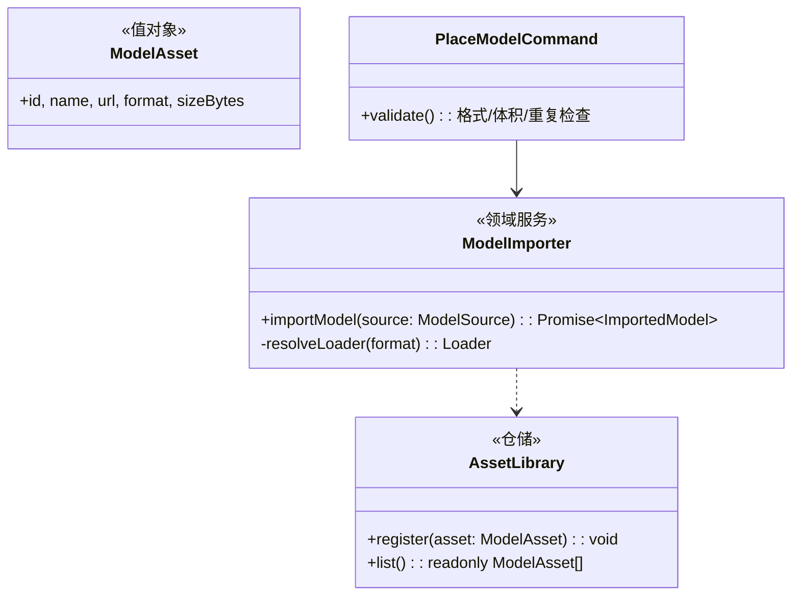

# 03 · 对象放置(游戏模型导入)

## 目标

导入游戏 3D 模型(FBX/GLB/OBJ)放入场景;Monet 生成的模型经 HostBridge 进入。**本仓最贵的性能风险点:大模型加载。**

## 范围

- 做:本地文件导入、URL 导入、资产注册表、异步加载态、大模型不卡 UI
- 不做:模型库面板美化(06 后面板统一)、快照缓存(性能专项,见文末)

## 类设计

- `ModelImporter`:three 官方 loader(FBXLoader/GLTFLoader/OBJLoader),**URL 一律 blob/objectURL,禁 base64**(storyai 的教训);加载结果注册 DisposeBag。
- `AssetLibrary`:纯数据资产表(MobX),Monet 模型经 `import-model` 消息 → `connectBridgeCommands` → `object.place` 命令(基建已通)。
- 格式判定:扩展名映射表(Record,不堆 if)。

## 实现步骤

1. `src/assets/AssetLibrary.ts` + `ModelAsset` 值对象(MobX store 持有列表)。
2. `src/loaders/ModelImporter.ts`:格式→loader 映射;`importModel` 返回 `{ object3d, animations }`;加载进度回调。
3. `SceneObjectView` 扩展 `kind="model"` 分支:加载中占位(骨架盒)→ 完成后挂 Object3D;卸载 dispose 几何体/材质/纹理。
4. 工具条「导入模型」:文件选择 → `URL.createObjectURL` → `object.place` 命令带 sourceUrl。
5. 加载纪律:异步不阻塞交互;同一 URL 去重(AssetLibrary 查重)。
6. playground 走查:导入测试 GLB/FBX(仓库外测试资产,不入 git)。

## 验收清单

- [ ] GLB/FBX/OBJ 各导入一个,正常显示、可删除
- [ ] 重复导入同一文件 → 资产去重提示,不重复加载
- [ ] 50MB+ 模型导入过程中界面可交互(loading 态,无白屏)
- [ ] 全仓 grep 无 `readAsDataURL` / base64 模型路径
- [ ] 删除模型后 geometry/material/texture 已 dispose(Scene 面板内存回落)
- [ ] HostBridge `import-model` 消息 → 模型出现在场景(postMessage 手工模拟验收)

## 性能专项(后置,不在本任务)

@dm/3d-viewer 的解析产物快照缓存(15s→<1s)在阶段一功能跑通后单独立项接入;需先验证其 `ModelCache` 可否脱离 viewer 组件单独使用。
