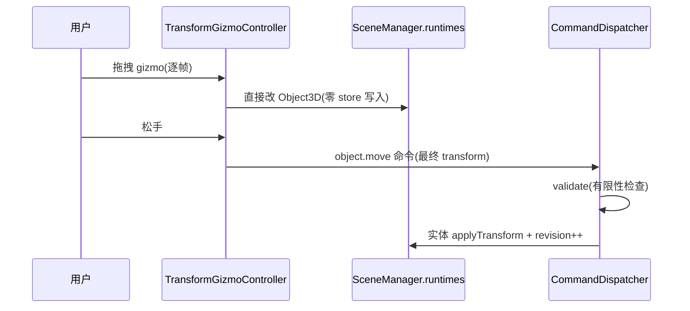

# 04 · 摆位操作(gizmo)

## 目标

选中对象后 gizmo 移动/旋转/缩放;拖拽全程零 store 写入,松手一次性落命令。

## 范围

- 做:点选/取消选中、三模式 gizmo、transient 拖拽、多选(cmd/ctrl 点选)
- 不做:框选、吸附对齐、多对象联动拖拽(后置)

## 类设计

- `TransformGizmoController`(新,`src/transform/`):封装 drei `TransformControls`;**拖拽中只写运行时**,`onMouseUp` 才 dispatch——对应 Monet 的 `undoManager.snapshot` 思路。
- 选中:`SelectionStore`(已有);点击拾取走 R3F `onPointerDown` 事件(禁 raycast 自研)。
- 模式切换:工具条三态按钮(translate/rotate/scale),MUI ToggleGroup。
  注:W/E/R 快捷键曾分配给模式切换,后按规格决策让位给 WASD 飞行导航(navigation/FlyDrive),模式切换只走工具条。

## 实现步骤

1. `src/transform/TransformGizmoController.tsx`:挂 drei `TransformControls`,`object` 取自 `manager.getRuntime(selection.selectedId)`。
2. transient 拖拽:`onObjectChange` 仅 `invalidate()`;`onMouseUp` 读 Object3D 最终 pose → dispatch `object.move`。
3. `SceneObjectView` 加点击选中(`e.stopPropagation` + `selection.select(id)`);空点地面取消。
4. 多选:`SelectionStore.selectedId` 升级为 `selectedIds: Set<string>`(注意:Set 引用变化触发订阅,gizmo 只挂主选);**cmd 点选**。
5. 键盘:Delete 删选中(`object.remove` 命令);快捷键层简单封装,后续接 Monet 事件系统。

## 验收清单

- [ ] 三种模式 gizmo 正常拖拽,模式切换正确
- [ ] 拖拽全程 `sceneStore.revision` 不变(MobX 无写入);松手后 revision +1
- [ ] 拖拽中帧率不掉(零 store 写入生效)
- [ ] 松手后刷新 playground,位置持久(实体数据已写)
- [ ] cmd 多选高亮正确;Delete 删除走命令层
- [ ] gizmo 拖拽非法值(NaN 注入测试)被 validate 拦截
