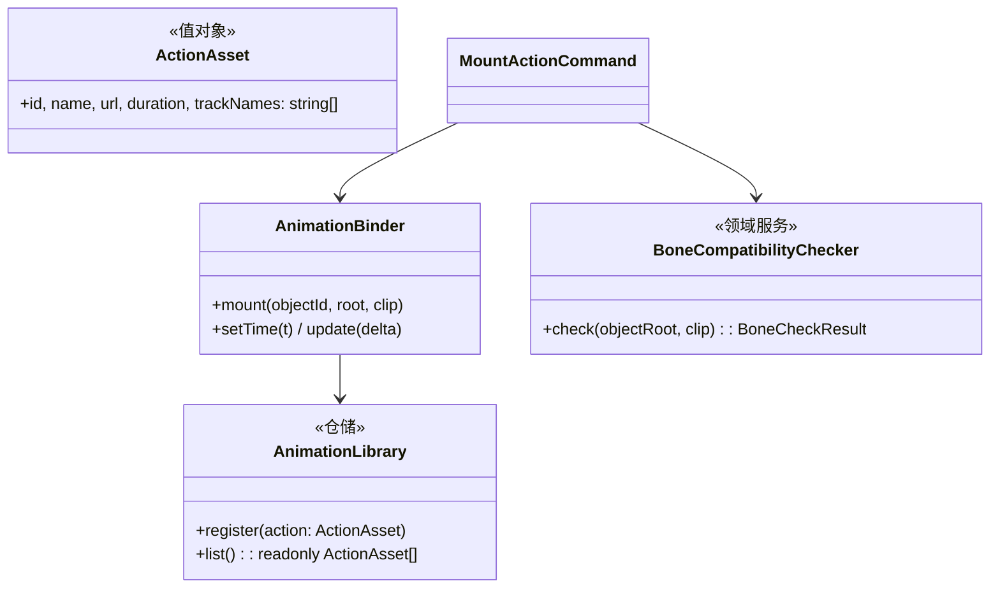

# 05 · 游戏动作挂载

## 目标

给模型挂载 Monet 生成的 3D 动作(GLB 动作 clip);播放/暂停/定位走统一时钟。

## 范围

- 做:动作资产解析(GLB animations)、同构骨骼挂载、骨骼兼容预检、播放控制
- 不做:动作重定向(异构骨骼,接 @dm/3d-viewer retarget,专项)、K 帧

## 类设计

- `BoneCompatibilityChecker`:clip 的 track 目标名与模型骨骼名求交集,匹配率 < 阈值 → validate 返回 `bone-incompatible` + 可用动作清单(AI 重试路径,见 ai-control.md)。
- 时钟纪律:渲染循环 `useFrame` 里 `clock.tick(delta)` → transport 订阅驱动 `binder`;**播放期 frameloop 切 "always",暂停回 "demand"**(性能铁律)。

## 实现步骤

1. `src/assets/AnimationLibrary.ts` + `ActionAsset`;动作 GLB 导入(复用 03 的 ModelImporter 管线,只取 animations)。
2. `src/animation/BoneCompatibilityChecker.ts`:track 名 ∩ 骨骼名匹配率。
3. 命令:`action.mount` / `action.unmount` / `transport.play` / `transport.pause` / `transport.seek`,注册进 `registerBuiltinCommands`。
4. `AnimationBinder` 接入 `TimeTransport`(基建已留 setTime);播放/暂停联动 frameloop 切换。
5. 对象面板:选中模型 → 动作列表 → 挂载/卸载;播放控制条(play/pause/时间拖动)。

## 验收清单

- [ ] 给带骨骼模型挂上跑步动作,播放正常
- [ ] 异构模型挂不匹配动作 → 结构化错误提示(含可用动作列表),不崩溃
- [ ] play/pause/seek 三操作与时间轴位置一致
- [ ] 暂停状态静置 0 渲染帧;播放时帧率 ≥55
- [ ] 两个模型各挂不同动作,独立播放互不干扰(每对象一个 mixer)
