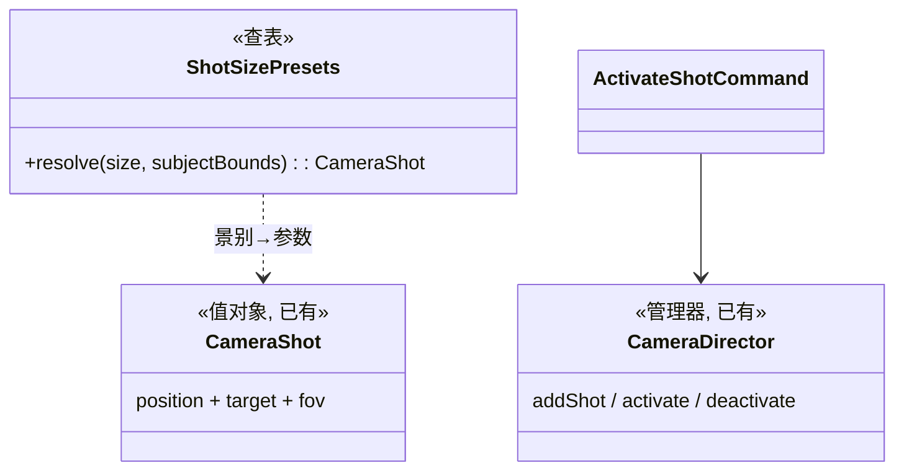

# 06 · 基础虚拟摄像机

## 目标

机位创建/切换/删除;景别预设;导演视角(自由轨道)与机位视角(定机位)双视角。

## 范围

- 做:机位 CRUD、当前视角存为机位、双视角切换、景别预设表、fov 调节
- 不做:运镜轨迹、多机位时间轴对齐、跟拍(阶段二)

## 类设计

- 景别预设(`SHOT_SIZE` 已有枚举):景别 → 相对被摄体包围盒的距离/高度系数查表,**Record 查表,禁 if 链**。
- 双视角:机位视角 = 把主相机写为 shot 参数并禁 OrbitControls;导演视角 = 恢复自由轨道。切换走 `camera.activate` / `camera.deactivate` 命令。
- 取景框:机位视角叠加画幅框 + 三分构图网格(R3F viewport overlay,纯展示)。

## 实现步骤

1. `src/camera/ShotSizePresets.ts`:景别 → 构图参数查表(参考 storyai cameraGeometry 的景别系数思路,不搬代码)。
2. 命令:`camera.activate` / `camera.deactivate`;`camera.set-shot` 基建已有。
3. 机位面板(shadcn):机位列表(选中/删除)、「当前视角存为机位」(读相机当前 pose → CameraShot)、景别下拉 + FOV 滑杆。
4. 机位视角渲染:激活时相机写死 shot 参数;叠加画幅框/三分网格 overlay。
5. 视口药丸双视角切换按钮(机位视图/自由视角)。

## 验收清单

- [ ] 自由视角摆好构图 → 存为机位 → 切导演视角乱动 → 切回机位视角,构图精确还原
- [ ] 机位列表增删改;激活态唯一
- [ ] 景别预设(远景/全景/中景/特写)对被摄体出片合理
- [ ] 机位视角有画幅框 + 三分网格;导演视角无
- [ ] 机位视角下轨道拖拽无效(不漂)
- [ ] fov 非法值(0/200/NaN)被命令 validate 拦截
