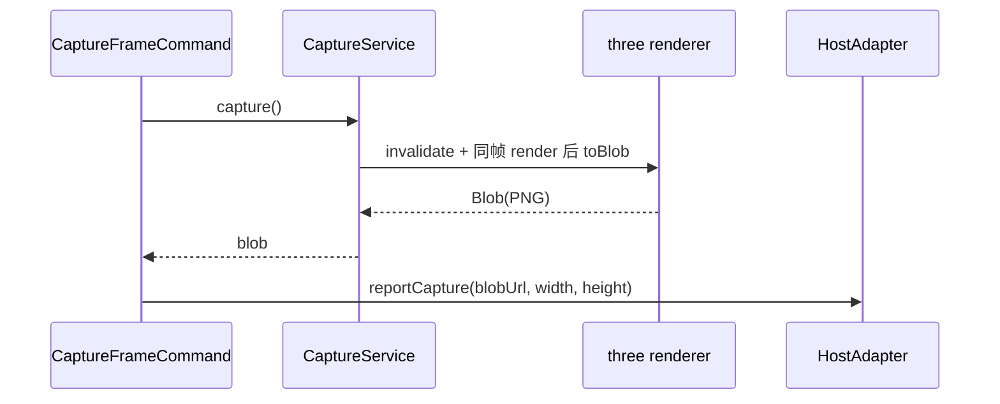

# 07 · 预演画面输出

## 目标

当前机位视角导出 PNG 截图;产物可回传 Monet 宿主。

## 范围

- 做:截图命令、帧内取样、辅助物隐藏、宿主回传
- 不做:录屏(MediaRecorder,功能跑通后增强项)

## 类设计

- **帧内取样**:frameloop="demand" 下直接 `gl.render(scene, camera)` 强制渲一帧,同一 JS 帧内 `toBlob`——不需要常驻 `preserveDrawingBuffer`(性能铁律)。
- 辅助物隐藏:截图前隐藏网格/gizmo/取景框(`visible=false`),取完恢复(参考 storyai 的 withHelpersHidden 思路,不搬代码)。
- `capture.frame` 命令走命令层(AI 可调的 S5 场景)。

## 实现步骤

1. `CaptureService.capture()` 增强:注入 invalidate/render 句柄,保证同帧取样;加 `hideHelpers` 选项。
2. 命令 `capture.frame` 注册;执行后 blob → objectURL → `HostAdapter.reportCapture`。iframe 形态由受信任的 HostBridge 附加匹配 `sessionId` 后发送 `capture-produced`。
3. 顶部输出药丸「截图」与掌镜时 Enter「拍照」复用截图命令；掌镜提示从快捷键规格自动展示。
4. playground 验收 + 仅接受配置 origin/source window/session 的宿主消息。

## 验收清单

- [ ] 截图内容与机位视角像素一致(无辅助物入镜)
- [ ] 静置场景截图成功(demand 模式强制渲染生效)
- [ ] 连续截 20 张,内存无泄漏(objectURL 及时 revoke)
- [ ] 宿主收到携带匹配 session ID 的 `capture-produced`,且 blobUrl 可打开
- [ ] `capture.frame` 出现在 `dispatcher.listCommands()`(AI 可调)
