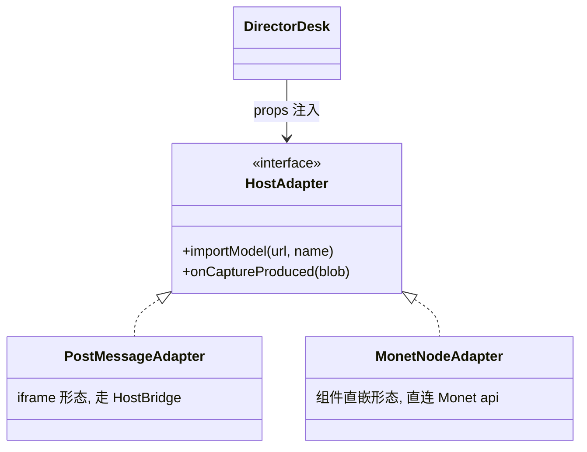

# 08 · 无限画布接入

## 目标

导演台作为 Monet 画布节点上线;Monet 生成模型一键入导演台;截图回传节点产物。

## 范围

- 做:HostAdapter 接口、Monet 插件壳节点、资产互通、产物回传
- 不做:画布内多导演台实例联动、撤销栈融合(后续专项)

## 关键设计:HostAdapter 接口(两形态一契约)

- `DirectorDesk` 组件接受 `host?: HostAdapter` prop;iframe 形态才用 postMessage(基建 HostBridge),**Monet 组件直嵌走 props 回调,不绕 postMessage**。
- Monet 侧:`monet-plugins/nodes/` 新建导演台节点(薄壳),`React.lazy` 加载本包;节点规范遵循主仓 plugin-guide(node.meta.json 等)。
- 主题:已决策不做 Monet 视觉一致;宿主确需调整经 `DirectorDesk` 的 `theme` prop 传 MUI theme。
- 版本握手:`PROTOCOL_VERSION` 已备。

## 实现步骤

1. 本仓:`src/host/HostAdapter.ts` 接口 + `PostMessageAdapter`(复用 HostBridge);`DirectorDesk` 接 `host` prop。
2. Monet 插件仓:新建导演台节点薄壳(`frontend/node.ts` + `node.meta.json`,遵循 plugin-guide);懒加载 `@dm/3d-director-desk`(先经 packages/ 软链,发版后换 npm 版本号)。
3. MonetNodeAdapter:导入 Monet 模型(读节点 outputs / 资产库)、截图回传(上传 OSS → 写节点 outputs,走 CanvasNodeBridge)。
4. 验收联动:Monet 画布建节点 → 导入 Monet 生成模型 → 截图回传为该节点产物。

## 验收清单

- [ ] Monet 画布可创建导演台节点,打开正常渲染
- [ ] Monet 生成的 GLB 模型可导入导演台场景
- [ ] 导演台截图回传成为节点 outputs(连线可用)
- [ ] 主题:默认暗色主题在节点内正常;宿主经 theme prop 可覆盖
- [ ] 包体积:导演台代码不进 Monet 主包(动态 import 验证 network 面板)
- [ ] 主仓规范:`pnpm check:plugins` 通过;节点壳无 `@/` 深路径违规
