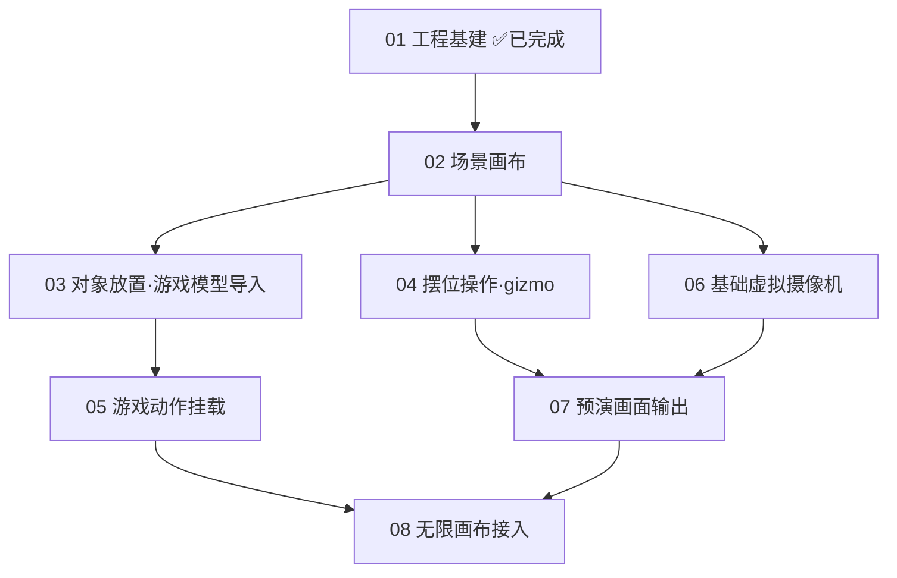

# 阶段一·执行文档索引

> 每个文档独立可执行:目标 → 类设计 → 实现步骤 → 验收清单(Storybook/playground 走查,本阶段禁单测)。
> 全局纪律见 `AGENTS.md`:命令层收口、性能铁律、实例化纪律、可序列化纪律。

## 执行顺序与依赖

## 状态追踪

| #   | 文档                                       | 状态                                                                    | 验收人 |
| --- | ------------------------------------------ | ----------------------------------------------------------------------- | ------ |
| 01  | 工程基建                                   | ✅ 完成                                                                 | —      |
| 02  | [场景画布](./02-scene-canvas.md)           | ✅ 完成(待验收人签字)                                                   |        |
| 03  | [对象放置·模型导入](./03-model-import.md)  | ✅ 完成(待验收人签字)                                                   |        |
| 04  | [摆位操作·gizmo](./04-transform-gizmo.md)  | ✅ 完成(待验收人签字)                                                   |        |
| 05  | [游戏动作挂载](./05-action-mount.md)       | ✅ 完成(待验收人签字)                                                   |        |
| 06  | [基础虚拟摄像机](./06-camera-shots.md)     | ✅ 完成(待验收人签字)                                                   |        |
| 07  | [预演画面输出](./07-capture-output.md)     | ✅ 完成(待验收人签字)                                                   |        |
| 08  | [无限画布接入](./08-canvas-integration.md) | ◐ 本仓侧完成(HostAdapter/PostMessageAdapter);Monet 节点壳暂缓(用户决策) |        |

## Storybook 验收入口(`pnpm storybook` → 侧栏「验收」组)

| 任务 | Story                                             | 预置内容                                           |
| ---- | ------------------------------------------------- | -------------------------------------------------- |
| 02   | `验收/02 场景画布`(Empty Scene / With Primitives) | 空场景 / 5 几何体                                  |
| 03   | `验收/03 模型导入`(Three Formats)                 | GLB+FBX+OBJ 各一                                   |
| 04   | `验收/04 摆位操作`(Gizmo Ops)                     | 3 几何体                                           |
| 05   | `验收/05 动作挂载`(Mount Actions)                 | 狐狸(左,带骨骼)+ 头盔(右,无骨骼)+ 狐狸三段动作入库 |
| 06   | `验收/06 基础虚拟摄像机`(Camera Shots)            | 狐狸 + 两个预置机位                                |
| 07   | `验收/07 预演画面输出`(Capture Output)            | 狐狸 + 两个预置机位                                |

每个 story 页内嵌「验收走查」清单面板;测试资产经 `/test-assets/`(public,已入库,来源见目录 README)提供。

## 验收通则(每个任务必查)

- [ ] `pnpm typecheck` / `pnpm lint` / `pnpm build` 全绿
- [ ] 对应 Storybook story 或 playground 场景人工走查通过
- [ ] 一切写操作经 `CommandDispatcher`(`grep -rn "sceneStore\." src/ui` 应无直写)
- [ ] 性能核对:静态场景静置 0 渲染帧;卸载后无泄漏;渲染循环零分配
- [ ] 本文档状态置为 ✅,提交信息引用文档编号
