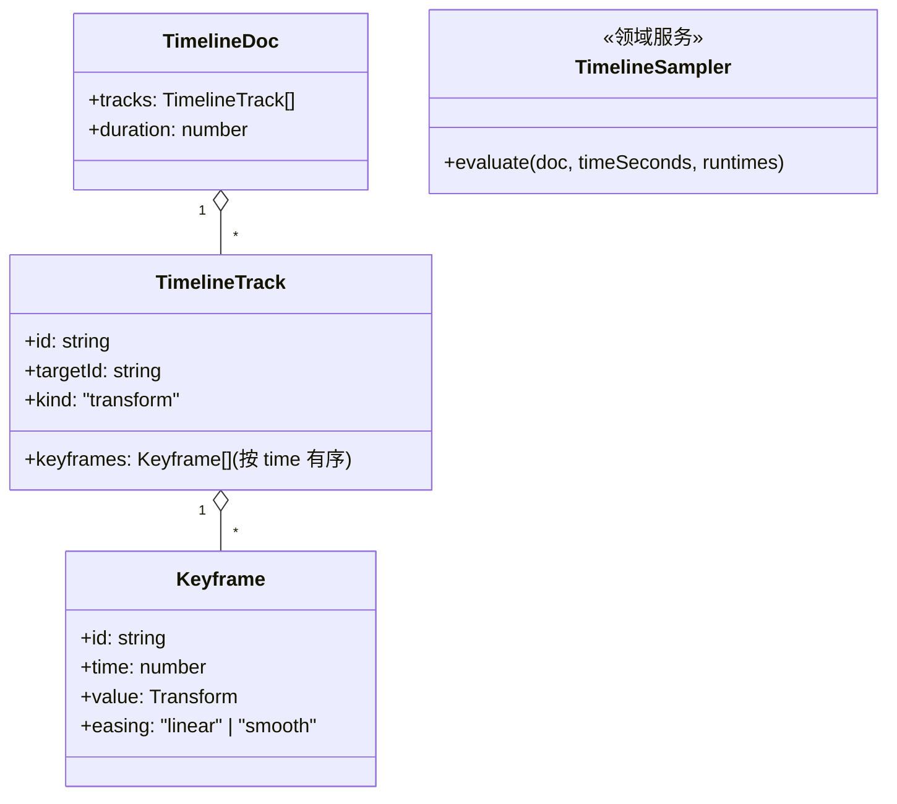

# 01 · 时间轴编排

## 目标

统一 playhead 上的关键帧编排:对象走位(transform 轨道)在时间维度可编排、可回放、可撤销。阶段二一切动态内容的地基。

## 范围

- 做:TimelineDoc/Track/Keyframe 纯数据模型、时间轴面板(轨道区+标尺+播放头)、关键帧 CRUD 命令、采样回放
- 不做:曲线编辑器(easing 先枚举 linear/smooth)、多场景 timeline 嵌套、音频轨(阶段三挂)

## 类设计

- `TimelineStore`(MobX):持有 `TimelineDoc` 纯数据(实体/集合全部 observable,状态管理纪律见 ../state-management.md);一切增删改走命令。
- `TimelineSampler`(领域服务):`reaction(() => transport.time, …)` 驱动;每帧对每轨道二分查找相邻关键帧 → 插值 → **直接写 SceneManager.runtimes**;零分配(模块级临时对象);不写 MobX、不产生命令。
- 面板:`TimelinePanel`(底部抽屉,MUI),轨道行 + 关键帧菱形标记 + 播放头;播放控制复用 Inspector 的 transport 命令族。

## 实现步骤

1. `src/timeline/Keyframe.ts` + `TimelineTrack.ts` + `TimelineDoc.ts`(纯数据类,可 JSON 往返)。
2. `src/store/TimelineStore.ts` + 命令 `timeline.add-key` / `timeline.move-key` / `timeline.remove-key` / `timeline.set-duration`(invert 全部可实现,进撤销栈)。
3. `src/timeline/TimelineSampler.ts`:以 reaction 订阅 `transport.time`;回放期写运行时;`stop()` 时把末帧 transform 写回实体(observable 字段),observer 视图自动恢复编辑态画面。
4. `src/ui/timeline/TimelinePanel.tsx`:MUI 抽屉 + 关键帧打点;双击打点编辑数值(复用 TransformFields);拖播放头 → `transport.seek`。
5. 「打关键帧」入口:Inspector 加「在当前时间打关键帧」按钮(读实体当前 transform → `timeline.add-key`)。
6. 走查:两个对象各打 3 个走位关键帧 → 播放/seek/停止恢复 → 撤销重做关键帧操作。

## 验收清单

- [ ] 关键帧增删改全部经命令层且可撤销/重做
- [ ] 播放时对象平滑走位;暂停静置 0 渲染帧;停止后恢复实体数据姿态
- [ ] 拖播放头 seek 立即成像(demand 下 sampler 写运行时 + invalidate)
- [ ] 200 关键帧播放不掉帧(采样二分,evaluate 零分配)
- [ ] `pnpm typecheck && pnpm lint && pnpm build` 全绿
