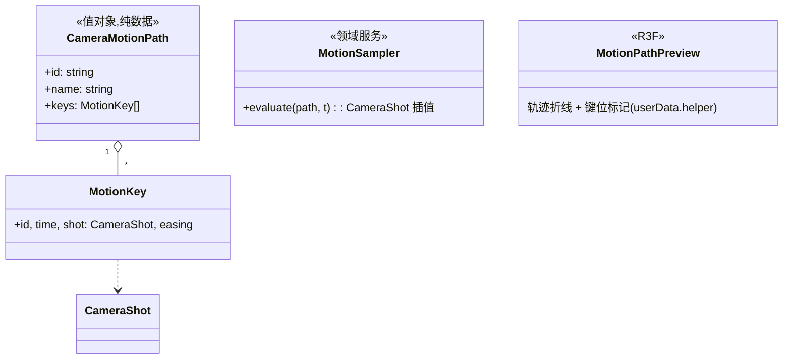

# 02 · 运镜与轨迹

## 目标

机位关键帧连成运动轨迹,播放时相机沿轨迹推拉摇移,预演从"照片"变"片子"。

## 范围

- 做:CameraMotionPath(时间+CameraShot 键序列)、轨迹预览线、运镜采样回放、轨迹编辑(增删键/调时间)
- 不做:轨迹曲线编辑器(贝塞尔手柄)、跟拍约束(lookAt 对象追踪)、速度曲线

## 类设计

- 轨迹是 TimelineDoc 的兄弟而非成员:相机轨迹键值是 `CameraShot`(position+target+fov),采样插值直接产 shot;目标点平滑移动天然获得"摇"的效果。
- 采样落地:播放时经 `CameraStore.requestDirectorPose` 逐帧请求(导演视角预览轨迹);掌镜轨迹(机位上挂轨迹)后置。
- 预览线:CatmullRom 折线 + 键位小球,`userData.helper=true`(截图摘除纪律)。

## 实现步骤

1. `src/camera/CameraMotionPath.ts`:值对象 + 插值采样(position 球面插值?否——位置线性/平滑,fov 线性)。
2. 命令 `motion.add-path` / `motion.add-key` / `motion.move-key` / `motion.remove-key`(可撤销);「当前视角加为轨迹键」按钮(读 `lastDirectorPose`)。
3. `src/camera/MotionSampler.ts`:挂 transport;播放期每帧产 CameraShot → requestDirectorPose。
4. `MotionPathPreview.tsx`:轨迹线渲染;选中轨迹高亮。
5. 运镜面板(并入 ShotPanel 新区块):轨迹列表 + 键时间列表 + 播放预览。

## 验收清单

- [ ] 4 个键的轨迹播放:相机平滑推拉摇移,目标点跟随
- [ ] 轨迹线在场景中可见、可隐藏;截图不入镜
- [ ] 轨迹编辑(加键/挪时间/删键)可撤销;播放不污染任何实体/机位数据
- [ ] 暂停即静默(0 渲染帧);掌镜视角下轨迹请求被正确丢弃
- [ ] `pnpm typecheck && pnpm lint && pnpm build` 全绿
