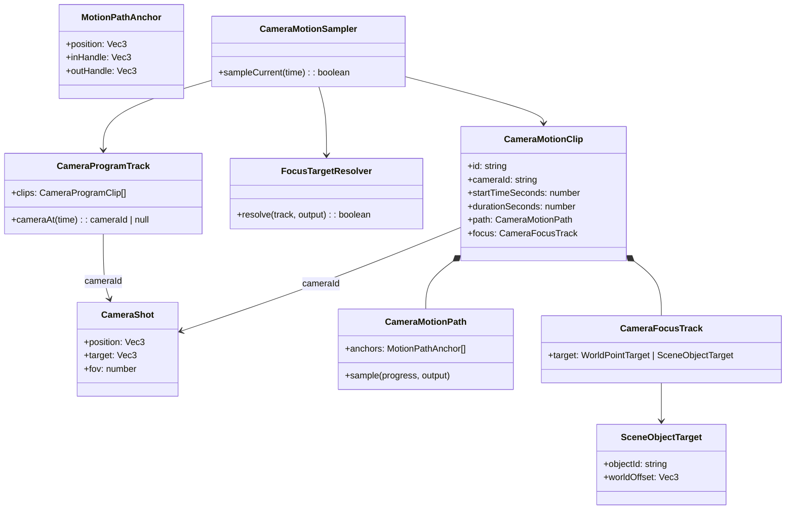
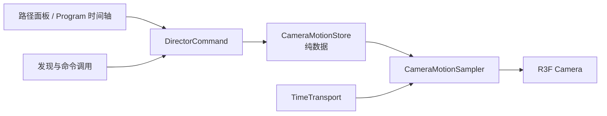

# 02 · 机位运镜与 Program 输出

## 目标

机位保持可复用的静态摄影配置；运镜成为时间轴片段。每个片段绘制一条可编辑 Bézier 路径，并通过 `CameraFocusTrack` 注视世界点或绑定场景对象；唯一 Program 输出轨负责时间上的机位切换。

## 范围

- 做：每机位独立 `CameraMotionClip`、时间范围、空间 Bézier 路径、世界点/场景对象注视绑定、Program 硬切轨、路径锚点/入出手柄编辑、自由编辑视口。
- 做：对象绑定经 `SceneManager` 运行时索引直接解析，不遍历场景树；删除被绑定对象会返回结构化 `focus-target-in-use` 拒绝。
- 不做：目标关键帧、速度曲线编辑器、交叉淡化、多机位宫格或 Preview Monitor；详见 [`04-camera-future.md`](./04-camera-future.md)。

## 类设计

## 写入与回放规则

- 同机位的运镜片段不得重叠；Program 片段也不得重叠；空白时间允许存在。
- 路径在片段时间之外不采样；Program 没有机位时自由视口保持不受影响。
- 出入手柄是相对于锚点的位置偏移。追加路径点时用相邻弦长的三分之一建立可继续调节的 Bézier 手柄。
- UI 与 AI 均通过 `motion.*` / `program.*` 命令。`motion.set-focus` 接受世界点或对象引用；错误携带稳定 code 与 payload path；查询不泄漏 Three 引用。
- `FocusTargetResolver` 与 `CameraMotionSampler` 复用标量缓冲，播放、seek 与停止均不写 MobX 或撤销栈；运行时对象未加载时回退其可序列化实体位置。

## 验收清单

- [x] 两台机位可有各自的 Bézier 路径与不重叠时间段；删除机位时清理其路径和 Program 引用，Undo 可恢复。
- [x] Program 时间轴同一时刻输出唯一机位；切到任意时间直接采样正确机位和路径。
- [x] 运镜工作区保持自由编辑视口；成片工作区才把 Program pose 写入 R3F 相机，退出时恢复编辑视角。
- [x] 面板可从机位到当前视角创建片段、追加路径点、调入/出手柄，并可绑定当前选中场景对象或恢复为固定注视点；辅助路径带 `userData.helper`，截图排除。
- [x] `pnpm typecheck && pnpm lint && pnpm build` 通过；Storybook 走查 Program 片段、时间尺、路径曲线、对象注视绑定与引用删除拒绝。
