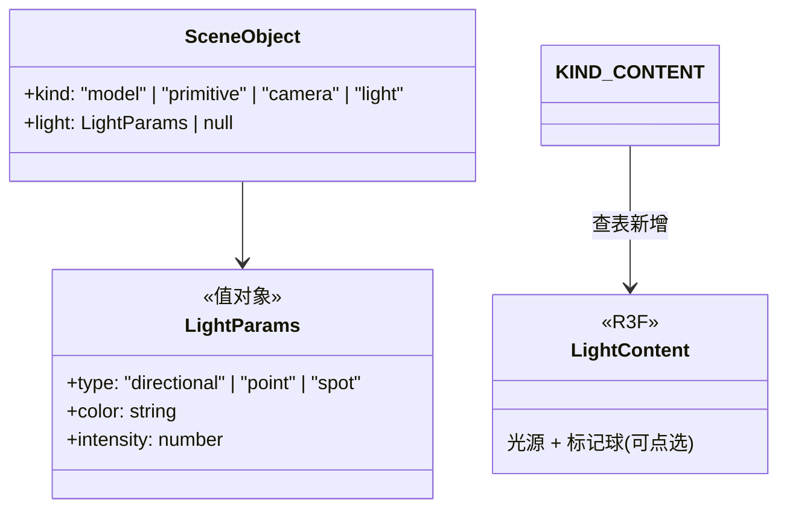

# 03 · 灯光氛围

## 目标

场景内可布置平行光/点光/聚光,调参数影响预演观感;灯光是场景对象,纳入实体/命令/撤销体系。

## 范围

- 做:`SceneObjectKind` 加 `"light"`;三种光源;灯光面板(类型/颜色/强度/位置);灯光标记(marker)可点选拖动
- 不做:阴影贴图调优、IES 光域网、全局光照

## 类设计

- `LightParams` 是纯数据字段挂在实体上(可序列化纪律);`light.adjust` 命令改参数(可撤销)。
- `KIND_CONTENT` 查表加 `light` 成员——阶段一的查表设计在这里兑现扩展性。
- 灯光辅助标记(LightHelper 类)打 `userData.helper`,截图摘除;标记球本身保留(它是可交互对象)。
- 摆位复用现有 gizmo(`SceneManager` 运行时对 light 同样注册)。

## 实现步骤

1. `SceneObject` 加 `light: LightParams | null` 字段 + `applyLight` 方法;`SceneStore.setLightParams`。
2. 命令 `object.place`(kind="light" 带 light 参数)+ `light.adjust { id, light }`(invert 可撤销)。
3. `contents.tsx`:`LightContent` 渲染三种光源 + 可点选标记球;按参数响应式更新。
4. 工具条「加灯光」三态菜单;Inspector 灯光区(类型 Select + 颜色 + 强度 Slider)。
5. 走查:8 盏灯场景帧率、截图摘除辅助标记、撤销灯光调整。

## 验收清单

- [ ] 三种光源 CRUD + 参数调节实时生效
- [ ] 灯光可 gizmo 拖动、可 undo;数据可 JSON 往返
- [ ] 8 盏灯帧率 ≥55;静置 0 渲染帧
- [ ] 截图无灯光辅助标记,有灯光效果
- [ ] `pnpm typecheck && pnpm lint && pnpm build` 全绿
