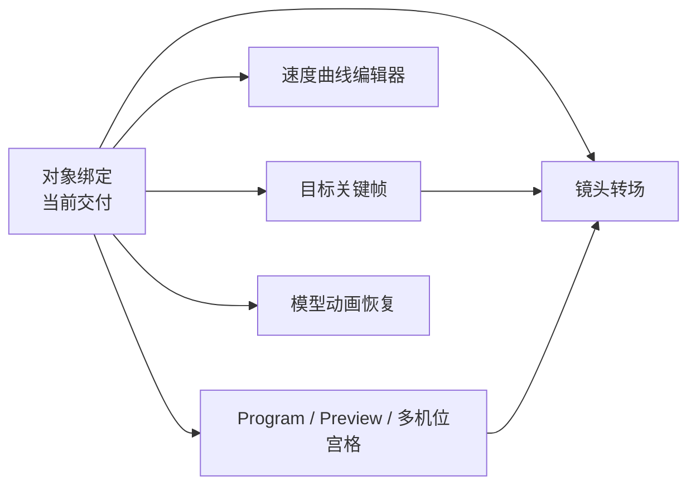

# 04 · 后续镜头能力

> 状态：⬜ 未开始。依赖当前 `CameraFocusTrack` 的对象绑定能力稳定；本文件是明确排除在当前对象绑定交付外的后续路线，禁止以临时分支混入基础运镜。

## 已交付边界

当前运镜片段有一条 `CameraFocusTrack`，其唯一目标可为：

- `world-point`：固定世界坐标；
- `scene-object`：场景对象 ID 加世界偏移。

回放通过 `FocusTargetResolver` 直接从 `SceneManager` 的运行时索引读取对象位置；不遍历场景树，不将 Three 引用写入文档或 MobX。

## 未完成能力



| 能力 | 产品语义 | 依赖与约束 | 状态 |
| --- | --- | --- | --- |
| 目标关键帧 | 一个运镜片段中按归一化进度改变注视目标，可在世界点与对象绑定之间转场 | `CameraFocusTrack` 演进为 `FocusKey[]`；两个对象目标先分别解析，再标量插值；关键帧随片段缩放而重定时 | ⬜ 未开始 |
| 速度曲线编辑器 | 路径空间不变，单独控制 `progress → pathProgress` 的加减速、停顿与缓入缓出 | 新建纯数据 `MotionProgressCurve`；采样须无分配；不得用路径锚点时间偷代速度语义 | ⬜ 未开始 |
| 镜头转场 | Program 从 A 机位到 B 机位的硬切、叠化或匹配切 | 新建 `CameraTransitionClip`；硬切保持默认；叠化需要两个渲染输入和受限 RenderTarget 生命周期 | ⬜ 未开始 |
| Preview Monitor | Program 外同时监看下一机位或选中机位 | 编辑器局部 UI 状态，不入工程文档；低分辨率、按需刷新、`DisposeBag` 管理 RenderTarget | ⬜ 未开始 |
| 多机位宫格 | 同时监看多个机位的运行画面 | 视图数线性增加 GPU 重绘与纹理内存；只渲染可见面板，不在默认工作区启用 | ⬜ 未开始 |
| 模型动画恢复 | 为模型重新引入动作资产、兼容校验、运行时 Mixer 与局部预览 | 必须与静态姿势分层；不得重新把对象 transform 或骨骼动作混进镜头时间轴；需重新定义导入、暂停、取消和 AI 契约 | ⬜ 未开始 |

## 模型动画恢复的预留边界

当前版本仅支持静态 `PoseSnapshot`。模型 ActionMixer、动作资产、动作挂载命令、动作预览控制和对象 transform 关键帧均已移除；恢复时必须以独立 `ModelAnimationTrack` 或独立局部预览为起点，不得复活旧的通用对象时间轴。

## 目标关键帧的预留契约

未来的 `CameraFocusTrack` 从单一 `target` 升级为下列稳定外壳，不改变 `CameraMotionClip` 与 `FocusTargetResolver` 的职责边界：

```ts
interface FocusKey {
    readonly id: string
    readonly progress: number
    readonly easing: CameraMotionEasing
    readonly target: FocusTarget
}

interface CameraFocusTrack {
    readonly mode: "single" | "keyframes"
    readonly target?: FocusTarget
    readonly keys?: readonly FocusKey[]
}
```

`progress` 必须在 `[0, 1]`。片段移动或缩放时，目标关键帧随片段整体重定时；对象绑定不创建第二条“跟拍轨”，而是继续作为 `FocusTarget` 的一种来源。

## 引用完整性

删除被 `scene-object` 目标引用的对象必须被拒绝，并返回：

```ts
{
    code: "focus-target-in-use",
    objectId: string,
    dependentMotionClipIds: string[],
    options: ["freeze-world-point", "remove-dependent-focus"]
}
```

“冻结为世界点后删除”必须显式批量写入世界点，再删除对象；禁止运行时静默回退到原点或删除镜头设计。
