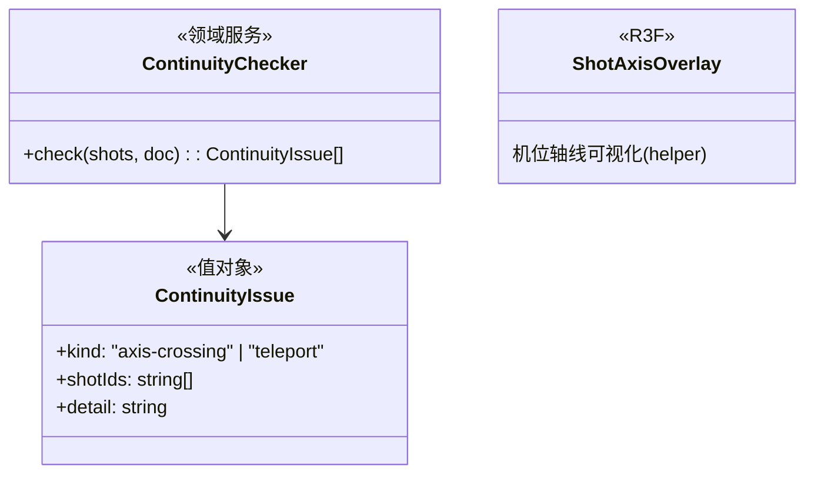

# 04 · 多机位一致性

## 目标

同场景多机位成组时,机器辅助发现空间关系错误:越轴(180° 规则)、跨镜头对象位移突变。

## 范围

- 做:ContinuityChecker 领域服务 + 诊断面板(机位列表内联告警);轴线可视化
- 不做:视线匹配(eyeline)自动判定、色彩一致性、自动修复建议执行

## 类设计

- 越轴判定:取相邻机位的相机方位角,相对主体连线的同侧性检查;跨 180° 线即告警。
- 位移突变:同对象在相邻机位(按时间轴顺序)的世界坐标距离 > 阈值且无对应走位关键帧 → 提示疑似跳切。
- 检查时机:机位/时间轴变更后按需重算(面板「检查」按钮 + 变更后自动);结果入 MobX 只读快照,面板渲染。

## 实现步骤

1. `src/camera/ContinuityChecker.ts`:纯函数检查器,输入 CameraShot 列表 + TimelineDoc,输出 issues。
2. `ShotAxisOverlay.tsx`:场景内画出轴线(相邻机位连线 + 180° 参考线,helper 标记)。
3. ShotPanel 加「一致性」区块:issue 列表,点击 issue 高亮相关机位。
4. 走查:构造越轴双机位 → 告警出现;修正机位 → 告警消失。

## 验收清单

- [ ] 越轴机位对被检出并指向两个机位 id
- [ ] 对象无走位关键帧却在相邻镜头间位移 > 阈值 → 突变提示
- [ ] 告警消除后状态正确收敛;误报率人工评估可接受
- [ ] 检查器零 three 依赖(纯数据,可单测化——但阶段二仍禁单测,走查验证)
- [ ] `pnpm typecheck && pnpm lint && pnpm build` 全绿
