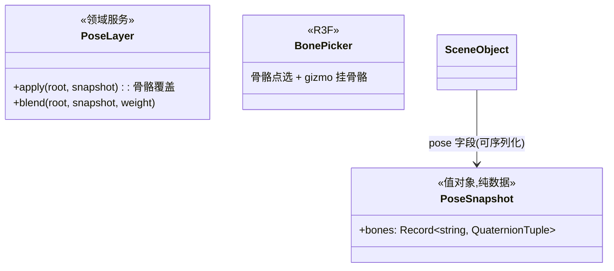

# 05 · 姿态与动作精修

## 目标

对骨骼模型做姿态微调(转骨骼),姿态快照挂在时间轴上与动作 clip 叠加,实现"动作播到一半头部微调"这类精修。

## 范围

- 做:骨骼点选 + 骨骼 gizmo(旋转)、姿态快照(PoseSnapshot)存取、姿态层与动作播放的加法叠加
- 不做:IK、蒙皮权重、形态键(blendshape)编辑、动作重定向(专项)

## 类设计

- 姿态存**纯数据**(骨骼名 → 四元组),挂在实体 `pose` 字段——阶段二兑现「SceneObject 加 pose 字段是兼容变更」的审计结论。
- 叠加语义:`AnimationBinder` 采样后 `PoseLayer.apply` 在后——姿态层覆盖/混合在动作之上;weight 0~1 可做衔接过渡。
- 骨骼 gizmo:TransformControls 的 `object` 换挂骨骼节点(复用控制器,对象切换);提交走 `pose.set-bone` 命令(可撤销)。

## 实现步骤

1. `SceneObject` 加 `pose: PoseSnapshot | null`;命令 `pose.set-bone { objectId, bone, quaternion }` / `pose.clear`。
2. `PoseLayer`:apply/blend;接入渲染循环采样链(binder 之后)。
3. `BonePicker`:模型骨骼模式开关;骨骼列表(树)+ 点选;gizmo 挂骨骼旋转;松手落命令。
4. Inspector 加「姿态」区:快照存/取/清空 + 叠加权重滑杆。
5. 走查:狐狸跑步中头部扭转;快照存入时间轴关键帧,播放衔接自然。

## 验收清单

- [ ] 骨骼可选中、可旋转微调;松手落命令可撤销
- [ ] 姿态快照与动作播放叠加正确(weight 0 纯动作,1 纯姿态)
- [ ] 姿态数据 JSON 往返一致;快照在时间轴上衔接平滑
- [ ] 暂停静置 0 渲染帧;采样链零分配
- [ ] `pnpm typecheck && pnpm lint && pnpm build` 全绿
