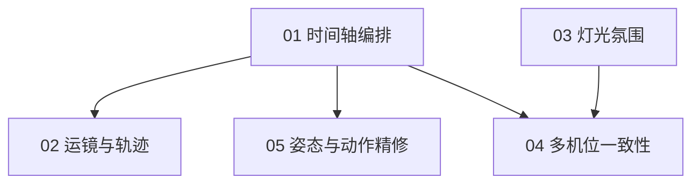

# 阶段二·执行文档索引

> 全局纪律与验收通则沿用阶段一(`../exec/README.md`):命令层收口、性能铁律、实例化纪律、可序列化纪律。
> 阶段二新增纪律:**回放不污染数据**——播放/seek 只写运行时,编辑才走命令层(见 ../phase2-design.md)。

## 执行顺序与依赖

## 状态追踪

| #   | 文档                                     | 状态      | 验收人 |
| --- | ---------------------------------------- | --------- | ------ |
| 01  | [时间轴编排](./01-timeline.md)           | ⬜ 待执行 |        |
| 02  | [运镜与轨迹](./02-camera-motion.md)      | ⬜ 待执行 |        |
| 03  | [灯光氛围](./03-lighting.md)             | ⬜ 待执行 |        |
| 04  | [多机位一致性](./04-multi-shot.md)       | ⬜ 待执行 |        |
| 05  | [姿态与动作精修](./05-pose-refine.md)    | ⬜ 待执行 |        |
