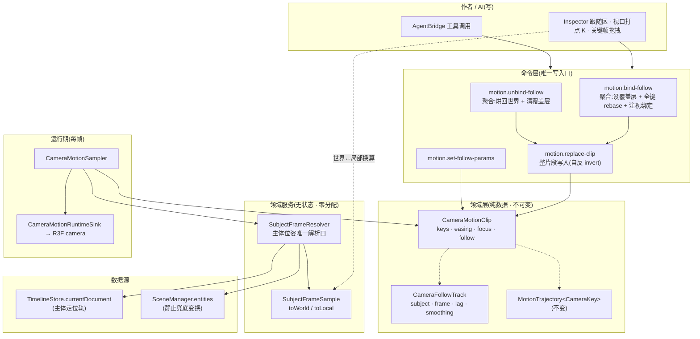
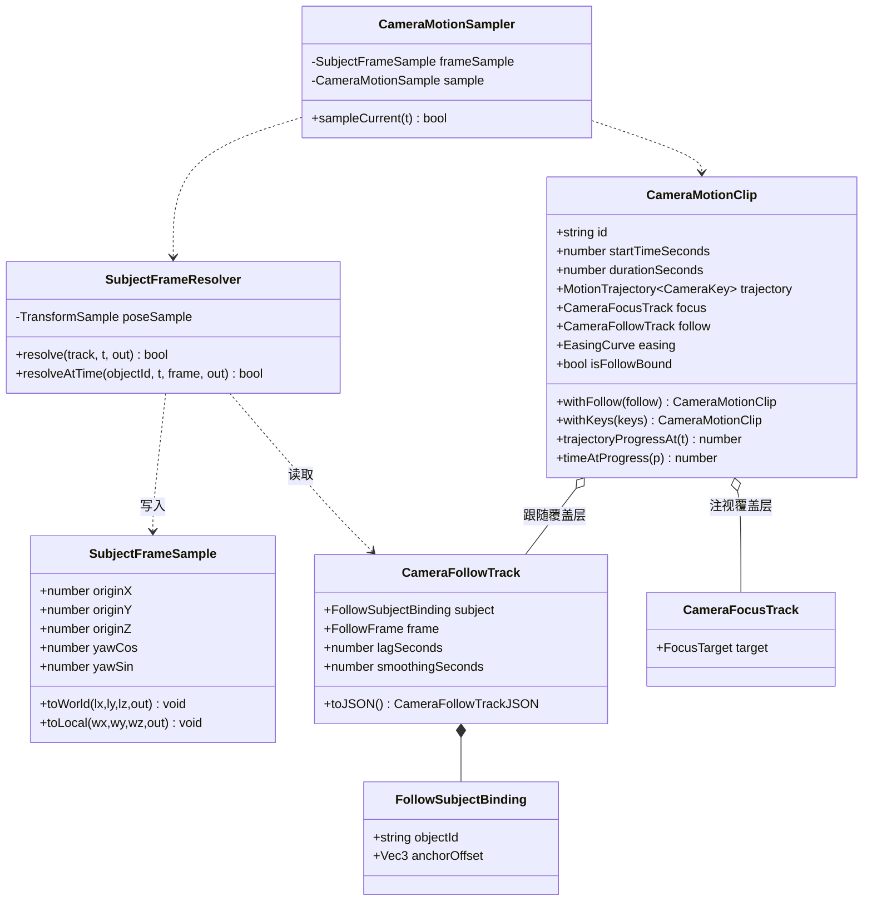
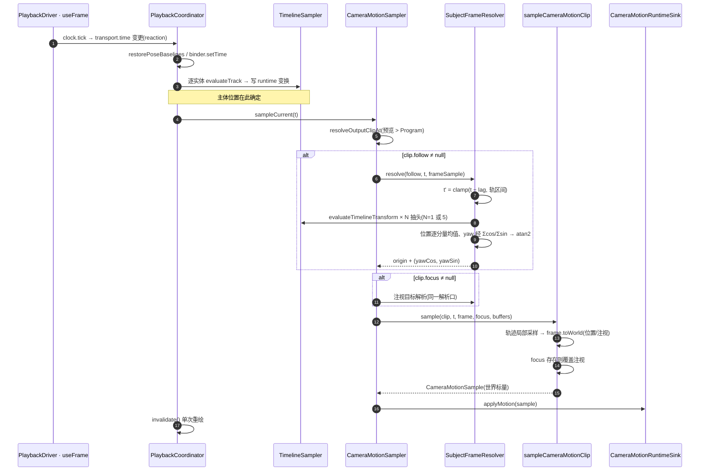
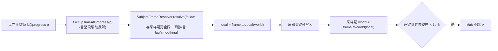
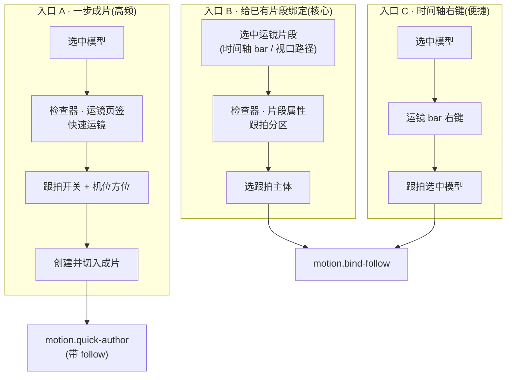
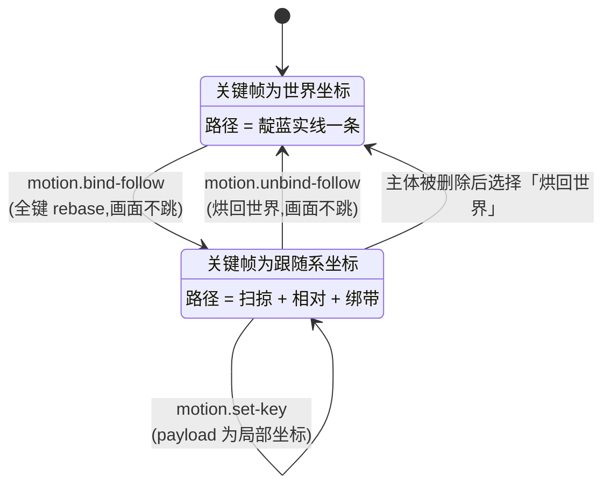

# 模型运动轨迹跟拍运镜 · 技术方案

> 领域:相机(camera)× 时间线(timeline)。产出物:片段级「跟随覆盖层」+ 主体位姿唯一解析口 + 一组聚合命令。
> 本文遵循 AGENTS.md 全部红线;第 11 节给出逐条自查。

---

## 1. 结论先行

**跟拍不是一种新运镜,而是一次参考系变换。**

现状:`CameraKey` 的 `position` / `target` 是**世界坐标**,`CameraMotionClip.focus` 只覆盖**注视点**(`src/camera/CameraMotionClip.ts:211-213`)。所以今天的「跟拍」只能做到**镜头站着不动、眼睛跟着人转**,做不到**镜头跟着人走**。

方案:给 `CameraMotionClip` 增加与 `focus` 并列的第二个覆盖层 `follow`。绑定后,该片段的**全部关键帧改在「主体跟随系」里解释**——主体在原点、主体前方为 −Z。采样期把局部采样值经跟随系变换回世界。

由此得到的性质:

| 性质 | 来源 |
|---|---|
| 复用全部曲线能力(Bézier 手柄、整段缓动、弧长、打点、拖拽) | 轨迹类不变,只换解释空间 |
| **任何现有运镜(orbit / dolly-in / hold / spiral …)都自动获得跟随版本** | resolver 只需把 `subject.center` 传 `[0,0,0]` |
| 主体走位改了、片段重定时了,跟拍自动跟上 | 采样期求值,不烘焙 |
| 可 JSON 往返、可撤销、可被 AI 调用 | 覆盖层是纯数据,写入走命令 |
| 拖动播放头/倒放/确定性导出结果一致 | 跟随是 **t 的纯函数**(见决策 D4) |

被否方案见 §3 每条决策的「否决项」。

---

## 2. 现状盘点

### 2.1 已经具备(直接复用,不重写)

| 能力 | 位置 | 说明 |
|---|---|---|
| 主体在任意时刻的位姿(纯数据) | `evaluateTimelineTransform(doc, targetId, t, fallback, out)` `src/timeline/TimelineSampler.ts:174` | 零分配、无 Three 依赖、脱离渲染循环可用 |
| 主体朝向(yaw) | `TransformSample.rotation[1]`;PATH 策略下由切线求得 `TimelineSampler.ts:131`(`atan2(-tx,-tz)`,**模型正面 = −Z**) | 跟随系的旋转来源 |
| 采样顺序保证 | `PlaybackCoordinator.sample` `src/timeline/PlaybackCoordinator.ts:150`:主体变换 → 相机采样 | 相机永远读到本帧的新位置 |
| 覆盖层范式 | `CameraFocusTrack` / `FocusTargetResolver` | 新覆盖层照抄其结构与命令形态 |
| 零分配采样纪律 | `CameraMotionSample` / `MotionPositionSample` / `FocusTargetSample` | 新增 `SubjectFrameSample` 同款 |
| 主体包围球 | `subjectBoundsFor(ctx, id)` `src/command/subjectBounds.ts:60` | **仅命令期**可用(`measureModelBox` 需遍历+骨骼更新) |
| 变更后重采样 | 所有 timeline 命令末尾 `ctx.playback.sampleCurrent()`(如 `timelineCommands.ts:469`) | 改走位后跟拍画面自动刷新,无需新机制 |

### 2.2 缺口(本方案要补的地基)

1. **相机位置无法被场景驱动**:`sampleCameraMotionClip` 是无场景依赖的纯函数,只有 `CameraMotionSampler` 持有 `SceneManager`,且只覆盖 `target`。
2. **主体位姿有两个答案**:`FocusTargetResolver` 读运行时 `matrixWorld`(`src/camera/FocusTargetResolver.ts:25-29`),而时间线读文档求值。二者今天数值相等(运行时根节点挂在场景根,变换由 `TimelineSampler.evaluateTrack` 写入),但**滞后/平滑需要在任意 t 求值,`matrixWorld` 给不了**。违反 Rule of Two,必须收口。
3. **没有整片段写入命令**:`motion.create-clip` 拒绝已存在 id,`motion.remove-clip` 会顺带遗忘预览态。绑定/解绑要重写全部关键帧,其 `invert` 必须携带前态整片段。

---

## 3. 领域决策

### D1 跟随是「片段级覆盖层」,与 focus 并列 — 不是新片段类型、不是新 Program 源

```
CameraMotionClip {
  keys, easing,
  focus:  CameraFocusTrack  | null   // 注视覆盖层(既有):决定「看哪」
  follow: CameraFollowTrack | null   // 跟随覆盖层(新增):决定「站哪」
}
```

依据:`CameraProgramTrack` 的 `ProgramSource` 保持 `static-shot | motion-clip` 两种不变;跟随是片段属性,不是编排概念。
**否决**:新增 `ProgramSource.follow-shot`(污染编排不变式)、新增 `FollowClip` 类(与 `CameraMotionClip` 90% 重复,违反 Rule of Two)。

### D2 绑定后关键帧改在跟随系里解释 — 不是「rig 参数直接决定站位」

**否决方案 A(参数式)**:`follow` 携带 `distance/azimuth/height`,直接算出机位,忽略关键帧。
否决理由:轨迹作废——无法表达「从背后绕到侧面」「跟随中推近」;等于在相机领域里再造一条平行的运动表达,与 `MotionTrajectory` 重复。

**采纳方案 B(参考系式)**:关键帧位置 = 主体系局部偏移。
- 保持相对站位 = 两枚相同的局部关键帧(即现有 `hold` move + 跟随绑定);
- 环绕跟拍 = 局部关键帧扫方位角(即现有 `orbit` move + 跟随绑定);
- 跟随中推近 = `dolly-in` + 跟随绑定。

**关键推论:跟随系里主体恒在原点,现有全部 `MOVE_RESOLVERS` 只要拿 `subject.center = [0,0,0]` 就直接产出跟随版关键帧,一条 resolver 都不用改。跟随是正交能力,不是新运镜词。**

`space` 不落在每个 key 上:**片段级 `follow` 是否为空,唯一决定该片段全部关键帧的空间**。零兼容纪律下不存在混空间的历史档。

### D3 跟随系 = 平移 + **仅 yaw** 旋转,永不继承主体的 pitch/roll

`SubjectFrame = T(origin) · R_y(yaw)`,`origin = subjectPos(t') + R_y(yaw)·anchorOffset`。

依据:摄影不变式——地平线必须水平。主体翻滚/俯仰(倒地、坐下、上坡)绝不能让画面歪斜。
参考系模式(枚举 + 查表,禁并列 if):

| `FOLLOW_FRAME` | yaw 来源 | 用途 |
|---|---|---|
| `world` 平移跟随 | 恒 0 | 相机随主体平移但不随其转身;侧向平行推轨、俯瞰跟随 |
| `heading` 朝向跟随 | `TransformSample.rotation[1]` | 背后跟随、前导倒退、越肩 |

```ts
const FOLLOW_FRAME_YAW: Record<FollowFrame, (sample: TransformSample) => number> = {
    world: () => 0,
    heading: (sample) => sample.rotation[1],
};
```

**否决**:第三种 `path`(轨迹切线)模式。PATH 朝向策略下 `rotation[1]` 已经**就是**切线 yaw;KEYED 策略下作者显式指定了朝向,相机应服从作者而不是猜测。

### D4 滞后与平滑走**时间域**,不走**积分域** — 这是确定性的红线

跟拍的「手持感/反应慢半拍」通常用弹簧阻尼实现,但弹簧是**逐帧积分的状态**:拖动播放头、倒放、跳转、`DeterministicMp4Exporter` 逐帧导出会得到不同结果。

采纳:两个纯时间参数,采样恒为 `f(t)`。

- `lagSeconds`(带符号):在 `t' = t − lagSeconds` 处取主体位姿。正数 = 相机落后(自然跟拍),负数 = 相机预判(先行)。
- `smoothingSeconds`:在 `[t' − w/2, t' + w/2]` 上做 **定点数 5 抽头**箱型平均。位置逐分量平均;**yaw 用 Σcos/Σsin 后 `atan2` 平均**(角度环绕安全,不会在 ±π 处炸掉)。`w ≤ 0` 时退化为单抽头,不付 5 倍代价。

**时间夹取(易踩)**:`t'` 必须先夹到主体轨的成文区间 `[firstKey.time, lastKey.time]` 再求值。否则 `evaluateTimelineTransform` 在区间外返回 `fallback = entity.transform`(`TimelineSampler.ts:182-184`),片段首尾会出现跳变。

### D5 主体位姿只有一个答案:`SubjectFrameResolver`

新建领域服务作为「主体此刻在哪、朝哪」的**唯一**解析口(文档求值 + 实体变换兜底),并把既有 `FocusTargetResolver` 一并收口到它上面,删除 `matrixWorld` 读取路径。

- 数值等价性:运行时根节点是场景根的直接子级(`SceneObjectView`),其变换由 `TimelineSampler.evaluateTrack` 或 `restoreObject` 从同一份数据写入;姿态层(`PoseLayer`)只改骨骼,不动根节点;动画片段的 root motion 一律被变换轨覆盖(不存在)。故收口不改变现有注视行为。
- 收益:滞后/平滑对注视同样可用;将来若引入父子挂载,只需改一个类。

### D6 景别求解只在命令期,不进采样期

`subjectBoundsFor` 依赖 `measureModelBox`(遍历 + `skeleton.update` + `computeBoundingBox`),**每帧调用会毁掉性能预算**。景别 → 距离的换算在 `bind` / `quick-author` 命令期用 `ShotSizePresets.resolve` 算成局部偏移写进关键帧;采样期只做纯参考系变换。
**明确不做**:运行期自适应景别(换模型/改缩放后自动改距离)。

---

## 4. 架构



### 4.1 领域模型



### 4.2 新增/改动文件

| 文件 | 动作 | 内容 |
|---|---|---|
| `src/motion/SubjectFrameSample.ts` | 新增 | 跟随系值载体 + `toWorld` / `toLocal`(零分配) |
| `src/motion/SubjectFrameResolver.ts` | 新增 | 主体位姿唯一解析口;时间夹取、滞后、平滑、yaw 查表 |
| `src/camera/CameraFollowTrack.ts` | 新增 | 覆盖层值对象 + 常量围栏 + JSON |
| `src/camera/CameraMotionClip.ts` | 改 | 增 `follow` 字段;`sampleCameraMotionClip` 增 `frame` 形参 |
| `src/camera/CameraMotionSampler.ts` | 改 | 注入 `TimelineStore`;解析跟随系并传入 |
| `src/camera/FocusTargetResolver.ts` | 改 | 收口到 `SubjectFrameResolver`,删除 `matrixWorld` 读取 |
| `src/command/cameraMotionCommands.ts` | 改 | 4 条新命令 + 契约 + 注册 |
| `src/store/CameraMotionStore.ts` | 改 | `clipsForFocusObject` → `clipsReferencingObject`(注视 ∪ 跟随) |
| `src/document/DeskDocument.ts` | 改 | 版本 7 → **8** |
| `src/ui/inspector/MotionClipInspector.tsx` | 改 | 新增「跟随」区 |
| `src/ui/viewport/scene/MotionClipPathPreview.tsx` | 改 | 跟随态下按世界扫掠路径重建几何 |
| `src/authoring/KeyframeAuthoringService.ts` | 改 | 打点时视口世界位姿 → 局部 |
| `src/stories/camera/follow-shot.stories.tsx` | 新增 | 验收断言(替代单测) |

---

## 5. 每帧时序与预算



### 5.1 预算(红线 3)

| 项 | 成本 |
|---|---|
| 主体求值 | 1 或 5 次 `evaluateTimelineTransform`,各 `O(log k)` 二分 + 一次三次 Bézier |
| yaw 平均 | 5×(sin+cos) + 1 atan2,仅 `smoothing > 0` 时 |
| 参考系变换 | 位置 + 注视各 4 乘 2 加 |
| 分配 | **0**:`SubjectFrameResolver` 自持 `TransformSample` 与累加标量;`SubjectFrameSample` 为采样器实例字段 |
| 场景遍历 | **0**:不 `traverse`、不 `measureModelBox`、不读 `matrixWorld` |
| 重绘 | 沿用 `frameloop="demand"`;跟随不新增 `invalidate` 源 |

**重入约束**:`TimelineSampler` 的模块级中转缓冲(`TimelineSampler.ts:13-14`)不可重入。`SubjectFrameResolver` 的抽头调用是严格串行的,且自身不在 `evaluateTransformTrack` 内部回调——不得把解析口塞进任何采样回调里。

---

## 6. 绑定 / 解绑:同一变换的正逆

**不变式:绑定与解绑在每个关键帧时刻严格保持画面不变。**(与 `CameraMotionClip.ts:120-125` 的「所见即所打」同源)



- 正向(bind):`local = R_y(−yaw)·(world − origin)`,对 position 与 target 各做一次。
- 逆向(unbind):`world = origin + R_y(yaw)·local`,时间同样取 `clip.timeAtProgress(p)`。
- 精确性只承诺在**关键帧时刻**;段间形状会因在局部空间插值而随主体重构——这正是跟拍的语义,需在文档与 UI 提示中写明。
- 变参(`motion.set-follow-params`)**不 rebase**:改滞后/平滑本就应该改变画面,rebase 反而会把改动抵消掉。

---

## 7. 命令层与 AI 契约

| 命令 | 语义 | 聚合内容 | invert |
|---|---|---|---|
| `motion.replace-clip` | 整片段写入(地基) | 帧对齐 + Program 对齐校验 | 自反:同命令携前态 JSON |
| `motion.bind-follow` | 绑定跟随 | 设 `follow` + **全键 rebase** + 按 `focus` 策略绑注视 | `motion.replace-clip`(前态) |
| `motion.unbind-follow` | 解除跟随 | 全键烘回世界 + 清 `follow` | `motion.replace-clip`(前态) |
| `motion.set-follow-params` | 调参 | 仅改 frame/lag/smoothing/anchor | 同命令携前值 |

> 红线 15:绑定是**一条**聚合命令。禁止在 UI 里串 `set-follow` + N 次 `set-key`——那会撕碎撤销、对 AI 不可见、失败留孤儿键。

### 7.1 Payload 契约(`PayloadContract`,未声明字段一律拒绝)

```ts
const FOLLOW_SUBJECT_SCHEMA = {
    properties: { objectId: { type: "string" }, anchorOffset: VEC3_SCHEMA },
    required: ["objectId", "anchorOffset"],
};

const BIND_FOLLOW_CONTRACT: PayloadContract = {
    properties: {
        id: { type: "string" },
        subject: { type: "object", ...FOLLOW_SUBJECT_SCHEMA },
        frame: { type: "enum", values: ["world", "heading"] },
        lagSeconds: { type: "number" },
        smoothingSeconds: { type: "number" },
        focus: { type: "enum", values: ["subject", "keep"] },   // 布尔旗标禁令 → 枚举
    },
    required: ["id", "subject", "frame"],
};
```

### 7.2 数值围栏(空间幻觉围栏,红线 9;拒绝而非钳制)

| 常量 | 值 | 理由 |
|---|---|---|
| `FOLLOW_LAG_MIN / MAX` | `−0.5 / 2` 秒 | 超出即画面与主体脱节 |
| `FOLLOW_SMOOTHING_MIN / MAX` | `0 / 2` 秒 | 窗口超过 2s 等同静止 |
| `FOLLOW_SMOOTHING_TAPS` | `5` | 定点抽头数,预算封顶 |
| `FOLLOW_ANCHOR_LIMIT_METERS` | `10` | 锚点是身体上的点,不是另一个位置 |
| `FOLLOW_OFFSET_LIMIT_METERS` | `200` | 局部关键帧到主体的上限 |

结构化失败(`CommandIssue{code, path, message, options?}`):

| code | 触发 | options |
|---|---|---|
| `clip-missing` | 片段不存在 | — |
| `follow-subject-missing` | 主体实体不存在 | — |
| `follow-frame-invalid` | 枚举外(`Object.hasOwn` 守卫) | — |
| `follow-range` | 滞后/平滑/锚点越界 | — |
| `follow-target-in-use` | 删除被跟随对象 | `freeze-follow`(烘回世界)/ `unbind-follow` |

引用完整性:`CameraMotionStore.clipsForFocusObject` 收口为 `clipsReferencingObject(objectId)`(注视 ∪ 跟随),`RemoveObjectCommand` 复用同一查询(Rule of Two)。

### 7.3 AI 面

- `AGENT_TOOL_DESCRIPTIONS` 补 4 条动宾短语;缺失会在 `AgentBridge.listToolSchemas` 直接 dev-throw(失败关闭)。
- `capability(type, "1", "command", [MOTION_PERMISSION], MOTION_APPLIES_WHEN, contract)` 与既有 motion 命令同规格。
- **LLM 不发世界坐标**:`motion.quick-author` 增 `follow` 选项,方位用枚举而非裸角度——

```ts
/**
 * 跟随系方位查表。两条几何前提必须一起读:
 * 1) 主体正面 = −Z(PATH 朝向 atan2(-tx,-tz) 的反解,见 TimelineSampler.ts:131);
 *    由 forward=(0,0,−1)、up=(0,1,0) 叉乘得主体右手侧 = +X。
 * 2) 方位角约定沿用 ShotSizePresets.resolve:position = center + (cos a, ·, sin a) × 水平距离,
 *    即 a=0 指向 +X、a=π/2 指向 +Z(ShotSizePresets.ts:47-50)。
 */
const FOLLOW_APPROACH_AZIMUTH: Record<FollowApproach, number> = {
    back: Math.PI / 2,        // 主体身后 +Z:尾随跟拍
    front: -Math.PI / 2,      // 主体正前方 −Z:前导倒退跟拍
    right: 0,                 // 主体右手侧 +X
    left: Math.PI,            // 主体左手侧 −X
};
```

一句「跟在他后面走个中景」= `quick-author{ move: "hold", follow: { subjectId, approach: "back" }, shotSize: "medium" }`,距离由 `ShotSizePresets` 在命令期解出。**不新增任何运镜词**:`orbit` + 跟随 = 环绕跟拍,`dolly-in` + 跟随 = 跟随推进。

---

## 8. 序列化与版本

```ts
interface CameraFollowTrackJSON {
    readonly subject: { readonly objectId: string; readonly anchorOffset: Vec3 };
    readonly frame: FollowFrame;
    readonly lagSeconds: number;
    readonly smoothingSeconds: number;
}
interface CameraMotionClipJSON {
    /* … 既有字段 … */
    readonly follow: CameraFollowTrackJSON | null;
}
```

- `DESK_DOCUMENT_VERSION` **7 → 8**;`DocumentImportService` 版本门直接判旧档不支持(`DocumentImportService.ts:189-191`)。**零兼容纪律:不写迁移、不写字段兜底、不写 `follow ?? null` 之外的分支。**
- 导入校验补一条关系检查:`follow.subject.objectId` 必须存在于 `entities`(与既有 focus 检查并列)。
- 跟随系为派生量,**不序列化**;每帧求值。

---

## 9. 作者面(UI 交互)

### 9.0 命名裁决:三个「跟」必须先分开

仓内已有两处占用了「跟」字,新功能再叫「跟随」会三重撞车:

| 现状 UI 文案 | 实际含义 | 裁决后文案 |
|---|---|---|
| 「锁定跟拍目标」`MotionClipInspector.tsx:164` | focus 覆盖层,只管注视 | **注视锁定** |
| 「解除成片跟随」`TimelineTrackRows.tsx:89` | Program 片段与运镜片段的时段联动 | **解除时段联动** |
| (本功能) | 相机位置跟着模型走 | **跟拍** |

**「跟随 / follow」保留为代码域名**(`CameraFollowTrack`、`motion.bind-follow`),**UI 一律称「跟拍」**。三处文案改动与本功能同批交付,否则面板上会出现两个含义不同的「跟拍」。

### 9.1 三个入口



**明确不做的入口**:视口里把片段路径拖到模型身上。命中判定不可靠、与关键帧拖拽手势抢事件,且绑定是一次性低频操作,不值得占用直接操作预算。

### 9.2 片段检查器「跟拍」分区

挂载点:`MotionClipProperties`(`MotionClipInspector.tsx:69-85`)内,`ClipFocusControls` 之后、`ClipActionControls` 之前,**不新增页签**(`motion-clip` 只有一个页签,加页签会凭空长出页签栏)。props 只收 `clipId`。

```
片段属性
  起始 [1.20]s        时长 [4.00]s
  时间曲线 (平滑 / 线性)
  ──────────────────────────────────
  注视锁定   [ 不锁定(注视由关键帧插值) ▾ ]        ← 现有控件,仅改文案
  ──────────────────────────────────
  跟拍
  跟拍主体   [ 不跟拍(机位固定于世界) ▾ ]

  ┌ 绑定后展开 ────────────────────────────┐
  │ 参考系     [ 平移 ][ 朝向 ]                     │
  │ 锚点高度   [ 1.20 ] m                           │
  │ 滞后 [ 0.00 ]s        平滑 [ 0.00 ]s            │
  │ caption: 关键帧坐标已相对「小明」;解除跟拍会烘回世界坐标 │
  │ [ 解除跟拍 ]                                    │
  └────────────────────────────────────────┘
```

| 控件 | 类型 | 复用来源 | 文案 / 参数 |
|---|---|---|---|
| 跟拍主体 | `Select size="small"` | `ClipFocusControls`(`MotionClipInspector.tsx:160-172`) | `不跟拍(机位固定于世界)` / `跟拍 {name}`;aria-label `跟拍主体` |
| 参考系 | `ToggleButtonGroup exclusive fullWidth size="small"` | 朝向策略(`WalkPolicyControls.tsx:66-75`) | `平移` / `朝向`;caption `平移=只跟位移,朝向=随主体转身环绕` |
| 锚点高度 | `ScrubNumberField kind="distanceMeters"` | `TransformFields` | `min 0`,`max 10`;绑定时默认取 `subjectBoundsFor().focusOffset[1]` |
| 滞后 | `ScrubNumberField kind="timeSeconds"` | `ClipRangeEditor` | `min -0.5`,`max 2`;caption `正数=镜头慢半拍,负数=预判先行` |
| 平滑 | `ScrubNumberField kind="timeSeconds"` | 同上 | `min 0`,`max 2` |
| 解除跟拍 | `Button size="small" variant="outlined"` | 片段删除按钮的形制,但**不用 `color="error"`** | 解除是可逆的坐标烘焙,不是破坏性操作 |

`ScrubNumberField` 自带刮擦手势(标签上左右拖动,`Shift` 细调 ×0.1、`Alt` 粗调 ×10,`Enter`/失焦提交,`ScrubNumberField.tsx:83-85,231-260`),滞后/平滑这类需要试出手感的参数正好吃这套。

**不接 `onPreview`**:实时预览要求绕过命令层直写运行时,与红线 8 冲突。改为 `onCommit` 每次落一条 `motion.set-follow-params`,命令末尾 `sampleCurrent()` 当帧刷新——播放中调参依然即时可见,代价只是撤销栈多几条。

### 9.3 「画面不动」需要三处可见确认

绑定的核心不变式是**画面逐帧不变**(§6)。这意味着用户点完下拉框**什么都不会发生**——必须给出三处同时变化的确认,否则会被当成没生效:

1. **检查器**:关键帧位置字段的 `overline` 由「位置」变为「位置 · 相对小明」;
2. **视口**:靛蓝路径由一条变三层(见 9.6),主体身上出现相对路径;
3. **时间轴**:片段 bar 出现跟拍徽标(见 9.7)。

### 9.4 关键帧编辑的语义提示

跟拍态下用户拖动关键帧球,改的是**相对站位**而不是世界位置。符号约定必须写在界面上,否则必然输错:

> 跟随系:**+Z 在主体身后、−Z 在主体正前、+X 在主体右手侧**(源自 PATH 朝向 `atan2(-tx,-tz)`,模型正面 = −Z)。

输入仍用 XYZ 三轴(与非跟拍态、与视口拖拽同构),**下方增加一行只读读数**把它翻译成人话:

```
位置 · 相对小明    X [0.00]  Y [1.60]  Z [3.00]
                  距离 3.4m · 身后偏 0° · 高 1.6m
```

**明确不做**:跟拍态把输入字段换成极坐标(距离/方位/高度)。那会让面板在绑定前后长出两套输入路径,并与视口拖拽的笛卡尔语义分叉。

### 9.5 空间换算单一入口

跟拍态下,以下三处必须经 `SubjectFrameSample.toLocal` 换算后再发命令,禁止各写一份:

1. 视口关键帧拖拽(`MotionClipPathPreview` 松手时,`motion.set-key`);
2. 镜头视角按 `K` 打点(`KeyframeAuthoringService.cameraKeyCommand`,读视口世界位姿);
3. 检查器位置数字输入(显示的已是局部值,直接写入,不换算)。

`motion.set-key` 的 payload **恒为片段自身空间**——由 `clip.follow` 是否为空唯一决定,payload 里不带空间标志位。

### 9.6 视口三层视觉

沿用既有色系分工(相机=靛蓝、走位=翠绿、播放头=红),**不新增色系**:

| 层 | 视觉 | 含义 | 可拖 |
|---|---|---|---|
| 世界扫掠路径 | 靛蓝实线 `#6366f1` | 相机在世界里实际走的曲线 | 否(派生量) |
| 相对路径 | 靛蓝虚线,绘于主体锚点周围 | 跟随系里的关键帧形状 | **是**(关键帧球在这条上) |
| 跟拍绑带 | 每 0.5s 一根细线,靛蓝→翠绿 | 相机与主体的时刻对应;疏密即速度 | 否 |

绑带的 0.5s 间隔与走位轨的刻度节奏(`ObjectMotionPathPreview` 的 tick)一致,两者并排可读。
重建时机:`reaction` 观察(片段引用、主体轨引用、跟拍参数)三者的不可变引用变化,**不进每帧**;世界扫掠路径是整段曲线,与播放头无关。

### 9.7 时间轴徽标

复用 bar 上现有 `linked` 徽标的位置与形制(`TimelineTrackRows.tsx:640-656`:`IconButton` + `Tooltip`,点击即执行):图标 `DirectionsWalkIcon`(呼应走位翠绿域),tooltip「跟拍 小明 · 点击解除跟拍」。
徽标经 `TimelineLayout.motionRow()` 的投影扩展一个字段,**不 fork 渲染**(时间轴的注册制约束)。

### 9.8 退化与冲突的界面呈现

| 情形 | 界面 |
|---|---|
| 主体没有走位轨 | 分区内 `role="status"` caption:「小明还没有走位轨迹,跟拍暂等同于固定偏移机位」+ `[绘制走位]` 按钮,直接切到该模型并打开走位绘制模式,形成引导闭环 |
| 朝向系 + 原地转身 | 参考系下方 caption:「朝向系会随主体转身环绕;原地转身抖动时可调大平滑或改用平移系」。不做自动检测 |
| 删除被跟拍的模型 | 命令层返回 `follow-target-in-use` + 两个 option;**沿用现有 toast 通道**:「模型「小明」被 2 个运镜片段跟拍;先解除跟拍或把机位烘回世界坐标」 |
| 数值越界 | `invalidInputNotice` 现成文案:「滞后需在 -0.5 ~ 2 之间」 |

> **已知债(不在本功能内偿还)**:`commandFailureMessage`(`commandFeedback.ts:17-25`)把结构化 issue 的 `options[].label` 拼成文字塞进 toast——AI 能拿到可执行选项,人只能读到一句话。跟拍不新造对话框,但在检查器分区里提供「解除跟拍」按钮作为人的可执行出口。

### 9.9 快捷键与命令面板:明确不加

`SHORTCUT_SPECS` 已 45 行,自由单键(`b c e h j m n q r u v`)都处在 WASD 飞行的语境污染范围内,而绑定是低频一次性操作。命令面板(`CommandPalette`)当前只做导航(视角/对象/机位),不做编辑动作,同样不动。
跟拍**不是一个模式**(不像走位绘制需要 pinned mode + 专属 scope + Esc 退出),它是片段的一个属性 —— 因此不占用任何全局输入通道。

### 9.10 片段跟拍态




---

## 10. 退化与边界

| 情形 | 行为 |
|---|---|
| 主体没有走位轨 | `evaluateTimelineTransform` 返回 `false` + 实体变换兜底 → 跟随退化为固定偏移机位(合法,不报错) |
| 主体轨少于 2 键 / 零时长 | 轨迹为 `null`,求值走线性兜底;`arcLengthMeters = 0` |
| `t'` 落在主体轨区间外 | 先夹取到 `[firstKey.time, lastKey.time]`(见 D4),不读兜底变换 |
| 主体原地转身(位置不变、yaw 突变) | `heading` 系下相机绕转;以 `smoothingSeconds` 抑制,或改用 `world` 系。UI 需给出提示 |
| 主体被删除 | 命令期结构化拦截 `follow-target-in-use`,提供「烘回世界 / 解除跟随」两个选项 |
| 片段范围外 | 沿用既有语义:`sampleCameraMotionClip` 返回 `false`,采样器保持上一帧,不复位 |
| `covers` 边界 | `CameraMotionClip.covers` 闭区间、`CameraProgramClip.covers` 左闭右开——跟随不引入第三种时间判定 |

---

## 11. 红线自查

| 红线 | 自查 |
|---|---|
| 1 禁单测 | 验收走 Storybook 运行期断言 + playground |
| 2 类驱动/DDD | 覆盖层值对象 + 领域服务 + 值载体;无函数式平铺 |
| 3 性能 | 零分配、无遍历、无 `matrixWorld`、`demand` 渲染不变;预算见 §5.1 |
| 4/5 单实例 | 解析口随 `createDirectorDeskStores` 每台一份,无全局单例 |
| 6 可序列化 | 覆盖层纯数据;跟随系为派生量不入档 |
| 7 UI | MUI + Tailwind 布局,复用 `ScrubNumberField` |
| 8 命令收口 | 4 条命令,UI/AI 同路径,禁直写 store |
| 9 数值围栏 | §7.2 常量表,拒绝而非钳制;枚举 `Object.hasOwn` 守卫 |
| 10 许可 | 全自研,无外部代码引入 |
| 11 零兼容 | 直接改结构 + 版本 7→8,无迁移/兜底/别名 |
| 12 MobX 单轨 | 无新 observable(主体选择复用 `MotionAuthoringStore.subjectId`);无版本号/自建订阅 |
| 13 props 边界 | 组件只收 `clipId`,值型状态自取 |
| 14 画布之上渲染 | 不新增面板层;跟随区随 Inspector 收起卸载;播放期 DOM 增删 0 |
| 15 地基优先 | P0 先补 `SubjectFrameResolver` / `motion.replace-clip` / 解析口收口,再做功能 |

**编码规范**:`FOLLOW_FRAME_YAW` / `FOLLOW_APPROACH_AZIMUTH` 查表替代并列 `if`;全 `const`,抽头累加走命名函数返回而非 `let`;`focus: "subject" | "keep"` 枚举替代布尔旗标;所有阈值具名常量。

---

## 12. 交付阶段与验收

| 阶段 | 内容 | 完成判据 |
|---|---|---|
| **P0 地基** | `SubjectFrameSample` / `SubjectFrameResolver` / `CameraFollowTrack` / `clip.follow` / 采样器接线 / `motion.replace-clip` / `FocusTargetResolver` 收口 / 文档版本 8 | 手工构造带 `follow` 的片段,播放期相机随主体位移;既有注视行为逐帧无差异 |
| **P1 作者面** | `bind` / `unbind` / `set-follow-params` 聚合命令、Inspector 跟随区、打点与拖拽的空间换算、删除对象引用拦截 | 绑定/解绑往返后关键帧世界坐标逐键一致;撤销一步回到前态 |
| **P2 可见性** | 扫掠路径预览、跟随绑带、时间轴片段跟随徽标(经 `TimelineLayout` 注册,不 fork UI) | 拖主体走位轨,预览路径随之重建;播放期不重建 |
| **P3 语义与 AI** | `quick-author` 的 `follow` + `approach`、`toolDescriptions`、`SKILL.md` 与 `docs/` 同批同步 | AI 一句话产出可播放跟拍片段;工具 schema 无漂移 |

### 验收断言(`src/stories/camera/follow-shot.stories.tsx`,运行期)

1. **保画面**:绑定前后,在每个关键帧时刻的相机世界位姿差 `< 1e-6`。
2. **正逆闭合**:`bind → unbind` 后逐键世界坐标与原值差 `< 1e-6`。
3. **平移跟随**:主体走位整体 `+5m`,`world` 系下相机世界位置同步 `+5m`,相对距离不变。
4. **朝向跟随**:主体 yaw 转 `90°`,`heading` 系下相机绕主体转 `90°`,到主体距离不变、相机 `up` 保持水平(pitch/roll 不被继承)。
5. **滞后语义**:`lagSeconds = 0.5` 时,`t` 处的跟随系原点等于 `t − 0.5` 处的主体锚点(差 `< 1e-6`)。
6. **确定性**:顺序播放采得的位姿序列,与逐帧 `seek` 采得的序列逐帧相等(弹簧阻尼在此项必然失败——本项即 D4 的守门断言)。
7. **退化**:主体无走位轨时,跟随片段与未绑定时画面一致。
8. **性能**:播放 3s 期间 `MutationObserver` 记录 DOM 增删 = 0;连续 300 次解析后输出缓冲对象引用不变(零分配代理指标)。

---

## 13. 明确不做

- 运行期自适应景别(主体缩放/换模型自动改距离)—— D6。
- 弹簧/惯性阻尼跟拍 —— D4,破坏确定性与逐帧导出。
- 轨迹切线参考系(第三种 frame)—— D3。
- 片段内切换跟随主体(多主体接力)—— 覆盖层保持片段级单目标;接力用两个片段表达。
- 跟随目标为骨骼/挂点 —— 当前 `FocusTarget` 亦只支持场景对象;需要时两处同批扩展。
- 障碍规避 / 碰撞体避让 / 自动构图纠偏 —— 属于「智能摄影」范畴,不在参考系变换的职责内。
- 相机跟随时的自动测距变焦(dolly-zoom 跟随)—— 现有 `dolly-zoom` move 叠加跟随即可,不做专门模式。
