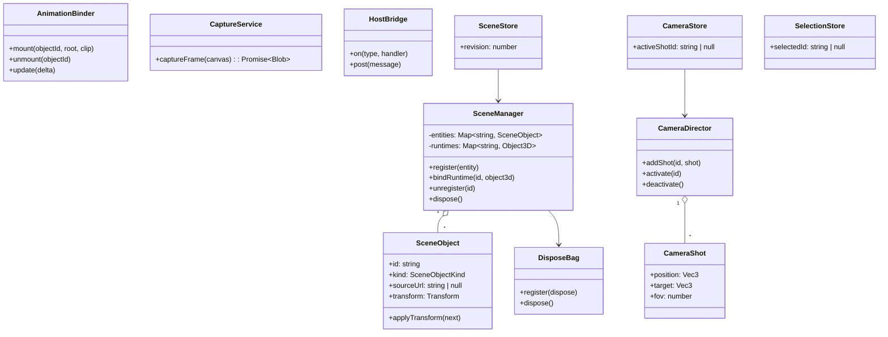

# 阶段一·基础实现 — 任务拆分与类设计

> 范围对齐调研文档第七章「阶段一」:3D 场景画布 / 对象放置(游戏模型)/ 摆位操作 / 游戏动作挂载 / 基础虚拟摄像机 / 预演画面输出 / 无限画布接入。
> 不做:运镜轨迹、时间轴、多机位一致性、姿态精修、灯光(均为阶段二+)。
> 参考实现:`xiaozangao/3d-director-desk`(MIT,仅参考思路,不搬代码)。

## 领域模型

## 模块 × 任务拆分(阶段一)

| # | 任务 | 承载类/模块 | 验收 |
|---|---|---|---|
| 1 | 工程基建 | eslint/ts/prettier/vite/storybook | ✅ 已完成(typecheck/lint/build/storybook 全绿) |
| 2 | 3D 场景画布 | `ui/DirectorDesk` + `SceneManager` | 网格/灯光/轨道相机;frameloop=demand;卸载零泄漏 |
| 3 | 对象放置(游戏模型) | `loaders/ModelImporter`(新)+ `SceneObject` | FBX/GLB/OBJ 导入入库;blob URL,禁 base64;大模型走 @dm/3d-viewer 快照缓存 |
| 4 | 摆位操作 | `transform/TransformGizmoController`(新) | 移动/旋转/缩放 gizmo;拖拽结束才写实体;多选站位 |
| 5 | 游戏动作挂载 | `AnimationBinder` + `animation/AnimationLibrary`(新) | GLB 动作 clip 挂到同构骨骼模型;播放/停止;Mixer 走渲染循环 |
| 6 | 基础虚拟摄像机 | `CameraDirector` + `CameraShot` | 机位增删、角度/景别参数、导演/机位双视角切换 |
| 7 | 预演画面输出 | `CaptureService` | 截图导出 PNG(帧内取样);录屏属增强,可后置 |
| 8 | 无限画布接入 | `bridge/HostBridge` + Monet 插件壳节点 | 协议握手 ready/import-model/capture-produced;Monet 侧建薄壳节点 |

## 依赖规则

- 2 → 3/4/5/6/7 的前置(场景容器先立)
- 3 是 5 的前置(动作挂在模型上)
- 8 最后做,依赖 2+3+7 的对外协议稳定

## 性能验收基线(每任务完成时核对)

- 静态场景静置 0 渲染帧(React DevTools + rAF 计数)
- 加载/卸载 50 次模型,内存回落(dispose 纪律)
- 动画播放期 `AnimationBinder.update` 零分配(模块级临时变量复用)
