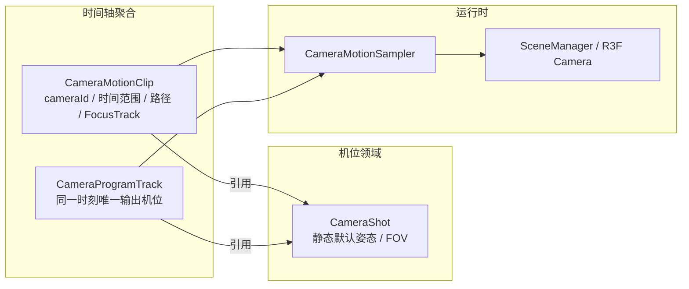
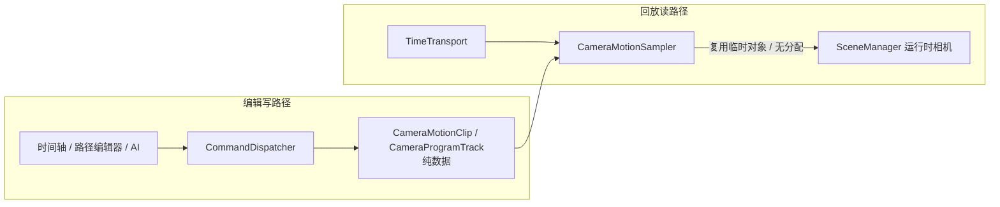
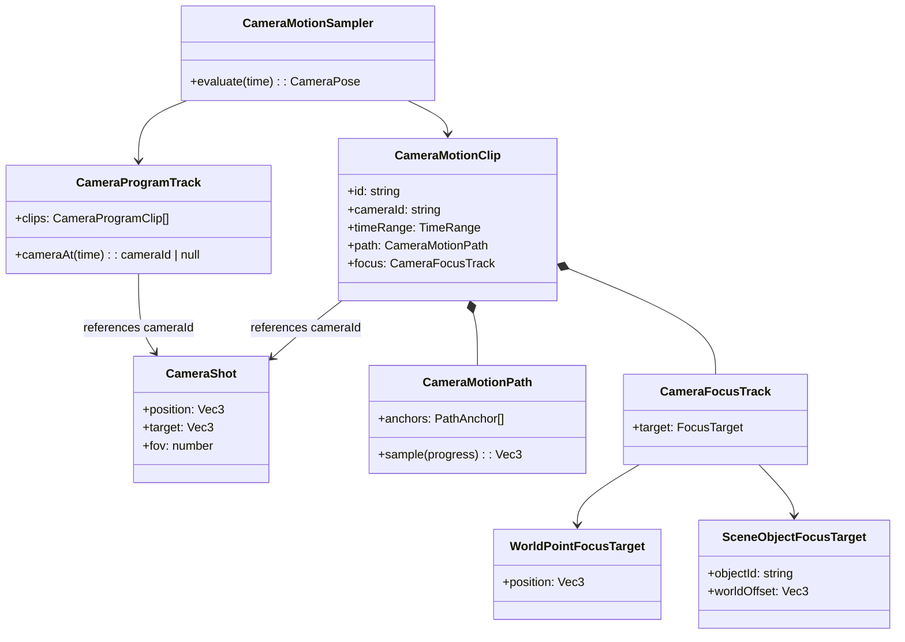

# 阶段二·导剪功能 — 任务拆分与类设计

> 前置阅读:[阶段一设计](./phase1-design.md) 与 [AGENTS.md](../AGENTS.md) 红线。
> 执行入口:[`docs/exec2/`](./exec2/README.md)(每任务独立可执行,含验收人签字位)。

## 范围（导剪）

做：机位、运镜与时间轴的分离编排；单一 Program 输出；自由编辑视口；Bézier 运镜路径；默认世界点或场景对象的注视绑定；灯光氛围；姿态精修。

不做：目标关键帧、速度曲线编辑器、镜头转场、多机位宫格、并行 Program/Preview 监看、AI 生成分镜、导出/协作、动作重定向。后续镜头能力与依赖记录在 [`exec2/04-camera-future.md`](./exec2/04-camera-future.md)。

运镜的交互层（编辑期预览、时间轴片段编排、镜头关键帧、语义预设）提案见 [`camera-motion-authoring.md`](./camera-motion-authoring.md)。

## 运镜架构决策

- **机位领域**：`CameraShot` 是可复用机位的静态默认姿态与镜头参数，具有稳定 ID，不保存时间轴数据。
- **时序领域**：`CameraMotionClip` 引用一个 `cameraId`，在自身时间范围内持有路径、进度曲线与 `CameraFocusTrack`；当前 focus 可为世界点或场景对象绑定，未来关键帧只扩展 track 内部，不改变 clip 边界。
- **输出领域**：`CameraProgramTrack` 在任一时间最多选择一个 `cameraId` 作为 Program 输出。其他机位以当前时间直接求值，切入时不依赖历史帧状态。
- **编辑器领域**：自由视口、选中态、路径辅助物和未来 Preview Monitor 都是每 `DirectorDesk` 实例的局部 UI 或运行时状态，绝不写入作品文档。

### 关键架构决策：回放不污染数据

时间轴编辑经 `DirectorCommand` 进入可序列化的领域对象；播放采样是帧级只读计算，禁止逐帧进命令层或写 MobX。

- `CameraMotionSampler` 是唯一可在播放/seek 中写 Three 相机的组件；禁止写 `CameraStore`、历史栈或任何 observable。
- 停止时恢复自由编辑视口；暂停与 seek 保留当前 Program 画面。
- 所有输入坐标、时间、FOV、曲线控制点与机位引用先经命令 `validate()`；AI 只能获得纯数据查询结果与结构化失败。

## 领域模型

## 分批交付

| 批次 | 承载类/模块 | 验收 |
| --- | --- | --- |
| 1 | `CameraMotionClip` / `CameraMotionPath` / `CameraMotionStore` / motion commands | 多机位路径可序列化、命令发现与结构化校验、删除机位保持引用完整 |
| 2 | `CameraProgramTrack` / `CameraMotionSampler` / `PlaybackCoordinator` | 单一 Program 输出；全部覆盖当前时间的运镜独立求值；停止恢复自由视口 |
| 3 | `TimelinePanel` / `ShotPanel` / `MotionPathPreview` | 参考图的镜头行、片段区、标尺、青色轨迹与路径编辑入口；helper 不进截图 |

## 性能验收基线

- 暂停态静置 0 渲染帧；播放期采样无对象、数组、Three 数学对象分配。
- 轨迹几何仅在不可变路径引用变化时重建，旧 `BufferGeometry` 必须释放。
- Program 只渲染一台输出相机；非输出机位只进行标量姿态求值，禁止额外 RenderTarget。
- 200 个关键点拖动保持二分或直接区间采样，禁止场景树遍历。
