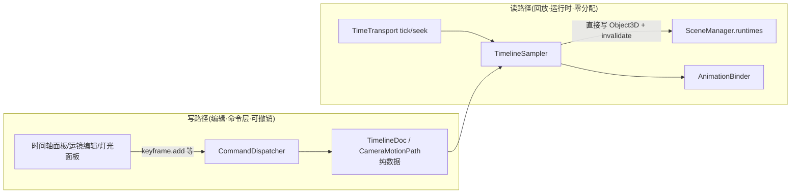

# 阶段二·导剪功能 — 任务拆分与类设计

> 前置阅读:[阶段一设计](./phase1-design.md) 与 [AGENTS.md](../AGENTS.md) 红线。
> 执行入口:[`docs/exec2/`](./exec2/README.md)(每任务独立可执行,含验收人签字位)。

## 范围(对齐调研文档「阶段二」)

做:运镜与轨迹、时间轴编排、多机位一致性、灯光氛围、姿态精修。
不做:AI 喂图(阶段三)、导出/协作(阶段四)、动作重定向(专项,接 @dm/3d-viewer)。

## 阶段一预埋兑现核对

| 预埋 | 兑现点 |
| --- | --- |
| `TimeTransport` 统一时钟(tick/seek/subscribe) | 时间轴唯一 playhead;音频/运镜/走位共吃 |
| `AnimationBinder.setTime` | 直接成为采样器渲染路径的一部分 |
| `CameraShot` 静态值对象 | 运镜引入兄弟类型 `CameraMotionPath`,不动存量 API |
| `SceneObjectKind` 可扩展 | 加 `"light"` 成员,`KIND_CONTENT` 查表天然兼容 |
| 可序列化纪律 | `TimelineDoc`/`CameraMotionPath`/姿态快照全纯数据,阶段四文档模型直接收编 |
| 命令层 + 逆命令撤销 | 编辑类命令(keyframe/light/pose)自动获得撤销;**回放不产生命令**(见下) |

## 关键架构决策:回放不污染数据(读路径与写路径分离)

阶段一的红线是"一切写操作走命令层"。时间轴引入一个必须显式处理的新范畴:**播放采样是 60fps 的运行时求值,不是编辑**——若逐帧走命令层,撤销栈会被回放淹没,性能也不允许。



- 纪律:**播放/seek 只写运行时引用,永不回写实体**;停止(stop)后场景恢复实体数据姿态——与 gizmo transient 拖拽同一思想(数据与运行时分离)。
- 采样器是命令层之外唯一合法的运行时写方,且它不写 MobX。

## 领域模型

```mermaid
classDiagram
    class TimelineDoc {
        +tracks: TimelineTrack[]
        +duration: number
    }
    class TimelineTrack {
        +id, targetId, kind
        +keyframes: Keyframe[]
    }
    class Keyframe {
        +id, time, value, easing
    }
    class TimelineStore {
        +revision
        +addKey / moveKey / removeKey / setDuration
    }
    class TimelineSampler {
        <<领域服务>>
        +evaluate(timeSeconds)
    }
    class CameraMotionPath {
        <<值对象>>
        +id, keys: {time, shot: CameraShot}[]
    }
    class MotionPathPreview {
        <<R3F>>
        轨迹线(userData.helper,截图摘除)
    }
    class ContinuityChecker {
        <<领域服务>>
        +check(shots, doc): Issue[]
    }
    class PoseSnapshot {
        <<值对象>>
        +boneName → quaternion 纯数据表
    }

    TimelineDoc "1" o-- "*" TimelineTrack
    TimelineTrack "1" o-- "*" Keyframe
    TimelineStore --> TimelineDoc
    TimelineSampler --> TimelineDoc
    TimelineSampler ..> TimeTransport : subscribe
    CameraMotionPath ..> CameraShot : 关键帧值
```

## 模块 × 任务拆分(阶段二)

| # | 任务 | 承载类/模块 | 验收要点 |
| --- | --- | --- | --- |
| 1 | 时间轴编排 | `TimelineDoc`/`TimelineStore`/`TimelineSampler` + 时间轴面板 | 关键帧 CRUD、拖动定位、播放回放不污染实体、撤销可用 |
| 2 | 运镜与轨迹 | `CameraMotionPath` + 轨迹预览 + 运镜采样 | 机位关键帧连成轨迹;播放时相机沿轨迹推拉摇移;轨迹线截图可摘除 |
| 3 | 灯光氛围 | `kind="light"` 实体 + 灯光面板 | 平行光/点光/聚光 CRUD;参数入命令层;灯光标记不入截图 |
| 4 | 多机位一致性 | `ContinuityChecker` + 诊断面板 | 180° 轴线越轴检测;跨镜头对象位移突变提示;结构化 issues |
| 5 | 姿态与动作精修 | `PoseSnapshot` + 骨骼级 gizmo | 选中骨骼微调旋转;姿态快照可存取;与动作播放可叠加(加法层) |

## 依赖规则

- 任务 1 是 2/5 的前置(轨迹与姿态都挂时间轴);3/4 与 1 无依赖,可并行
- 2 依赖 1(轨迹在时间上采样);5 依赖 1(姿态快照挂在时间轴上做衔接)

## 性能验收基线(每任务完成时核对)

- 暂停态静置 0 渲染帧;播放期 `TimelineSampler.evaluate` 零分配(模块级临时对象复用)
- 时间轴 200 关键帧拖动不卡(采样 O(每轨道二分查找))
- 灯光 ≥8 盏时帧率 ≥55;截图辅助物纪律不破(轨迹线/灯光标记 userData.helper)
