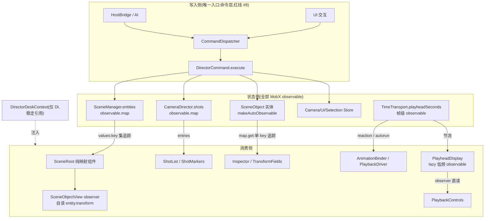

# 状态管理规范(MobX 单轨)

> 禁令落点是 `AGENTS.md` 红线 #11,本文档是细则与正误对照。违反即返工。

官方依据(对齐基准,冲突时以本文档为准——本文档只收紧,不放松):

- [React integration](https://mobx.js.org/react-integration.html) — observer/直读/晚解引用
- [React optimizations](https://mobx.js.org/react-optimizations.html) — 列表组件、key、function props
- [Collection utilities](https://mobx.js.org/collection-utilities.html) — values/entries/get 的追踪粒度
- [Creating lazy observables](https://mobx.js.org/lazy-observables.html) — onBecomeObserved/onBecomeUnobserved

## 数据流(唯一形态)



## 反模式(禁) ↔ 标准写法(正)

### 1. 版本号计数器 + void 锚定

```tsx
// 禁:手搓版本号驱动重渲
void scene.revision;
const entities = scene.manager.list();

// 正:observable 集合,observer 渲染期直读,追踪由 MobX 自动建立
const entities = scene.manager.list(); // list() 内部 values(observable.map),追踪 key 集
```

### 2. useState 镜像 observable

```tsx
// 禁:observable 已可被 observer 追踪,镜像是双事实源
const [saved, setSaved] = useState(() => camera.lastDirectorPose !== null);
useEffect(() => {
    /* rAF 手动同步 */
}, [camera, camera.activeShotId]);

// 正:直读
const canSaveCurrentView = camera.lastDirectorPose !== null;
```

### 3. 渲染外快照缓存集合

```tsx
// 禁:snapshot + reconcile 把实体表镜像进 React state
const [entries, setEntries] = useState(() => snapshotEntries(scene.manager.list()));
useEffect(() => { setEntries(reconcile(...)); }, [revision]);

// 正:纯映射组件渲染期 values(entities).map(...),子组件 observer 自读字段
```

### 4. 自建 pub/sub

```ts
// 禁:listeners/emit/subscribe 与 MobX 双轨并行
private readonly listeners = new Set<(t: number) => void>();
subscribe(listener) { ... }

// 正:字段进 observable,消费方 reaction/autorun
this.transportDisposer = reaction(() => transport.time, (t) => this.setTime(t));
```

## useState 白名单(此外一律视为坏味道)

仅限**局部瞬时 UI 态**:输入框草稿(`TransformFields` 的 `inputValue`)、开关/选中页签、Snackbar 提示、Storybook 演示态、异步句柄(`ModelContent` 的加载 handle)。官方背书:局部 UI 态用 useState 可保留 Suspense 能力。

## 高频 observable 纪律

帧级写入的 observable(如 `TimeTransport.time`)**禁止 observer 组件渲染期直读**(会导致逐帧重渲)。消费只许三种形态:

1. 引擎/渲染循环:`reaction`/`autorun`(如 `AnimationBinder`、`PlaybackDriver`);
2. R3F 帧回调:`useFrame` 内读;
3. UI 显示:经 lazy 低频派生(`ui/PlayheadDisplay`,12Hz 节流)后 observer 直读。

## 惰性副作用纪律

"仅在被观察时才需维持"的副作用(定时器、订阅、昂贵派生)一律经 `onBecomeObserved`/`onBecomeUnobserved` 挂卸,disposer 进所属 store 的 `dispose`/`DeskLifecycleGuard`;禁止在构造函数里启动只服务读侧的常驻定时器/订阅。**观察者常驻的 observable(如播放期时钟)禁挂 lazy**——永远不会触发 unobserved,是纯装饰。

## 集合消费纪律

- 列表渲染:`values(map)` / `entries(map)`——返回数组可直接 `.map()`,只追踪 key 集与 value 引用替换,不追踪 value 内部字段;
- 按 id 直查:`map.get(id)`(key 级追踪);需追踪"尚未存在"的 key 时用 `get(map, id)`;
- 禁 `[...map.values()]` 手搓展开;禁把集合内容快照进 React state;
- 冻结值对象(如 `CameraShot`)不进 observable,编辑 = 整对象替换,map value 引用替换即触发列表刷新。

## React 渲染纪律

- `observer` 一律具名 function(DevTools 显示名 + eslint react-hooks 生效),从 `mobx-react-lite` 导入;
- `observer` 已含 `memo`,勿重复包裹;
- 传引用、晚解引用:子组件收 `entity` 自读 `entity.transform`,不收快照值;
- 列表渲染独立组件,只 map 集合、不掺其他渲染;
- 禁 index 作 key(实体都有稳定 id);
- 向非 observer 第三方组件(MUI)传 observable 值:解引用为原始值,或 function props(`getName={() => person.name}`),或 `<Observer>` 内联包裹;
- effect 需要响应 observable 时用 `useEffect(() => autorun/reaction(...), [])`,disposer 作 cleanup 返回;依赖数组不为 observable 字段服务。

## props 边界纪律(值型状态禁下传)

**组件一律从 `useDirectorDeskStores()` 自取状态,禁止把状态当 props 一层层传。**

props 只允许承载三类东西:

| 允许               | 例子                              | 理由                                                    |
| ------------------ | --------------------------------- | ------------------------------------------------------- |
| 身份 id            | `shotId` / `objectId` / `section` | 子组件据此自己 `get(id)`,是「传引用晚解引用」的落地形态 |
| 回调               | `onCommit` / `onClose` / `report` | 行为注入,不是状态                                       |
| DOM ref / children | `modelInputRef` / `children`      | React 结构,与 MobX 无关                                 |

禁止下传的是**值型状态**:数字、布尔、数组、快照对象——`duration`、`playhead`、`objectCount`、
`programClips`、`actionId`、`fov`、`shot` 全部由子组件自取。

两条硬理由:

1. **正确性**:值型 props 把子组件的重渲染绑到父组件的读集合上,`observer` 的细粒度追踪当场失效;
2. **性能**:父组件一旦读了帧级 observable(如 playhead)再下传,整棵子树跟着它的频率重建。
   实测教训——`TimelineConsole` 曾在顶层读 `playheadDisplay.value` 再传给 `MiniTimeline`,
   于是每 12Hz 重建全部片段与关键帧节点;拆出只读 playhead 的 `MiniPlayhead` / `TimecodeReadout`
   后,重渲染面收敛到一个 2px 的盒子。

唯一例外是**无领域身份的叶子控件**(`ShotNumberField`、`LightIntensityControl` 这类通用数值输入):
它们没有可自取的身份,值必须由上一层 observer 解引用后传入。判据是——
能用 id 换到状态的,一律自取;换不到的,才允许收值。

## Context 定位

`createContext` 唯一合法用途:`DirectorDeskContext` 注入每实例 stores(红线 #5 禁全局单例)。value 必须是**稳定引用**(`useState(() => createDirectorDeskStores())`),context 里禁止放变化状态——响应式永远走 observable,不走 context 扩散。禁 mobx-react 遗留 `Provider`/`inject`。

## 命令载荷纯数据

命令 payload 必须可 JSON/structuredClone 往返(红线 #6/#8)。observable 值进载荷前显式 `toJS(...)`(见 `command/commands.ts` 的 `invert`)。

## 阶段二/四预埋(lazy 应用清单)

- 时间轴逐轨派生数据(波形、关键帧缩略):行可见即观察,`onBecomeObserved` 启动计算,滚出视口即停;
- AI 面(`docs/ai-control.md`)场景快照派生:宿主桥观察时才序列化,不观察零开销。
