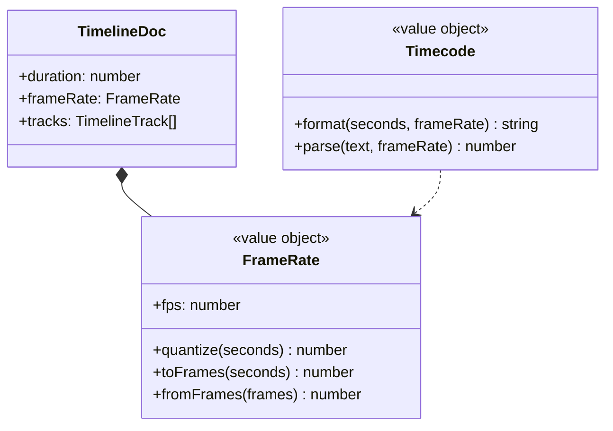
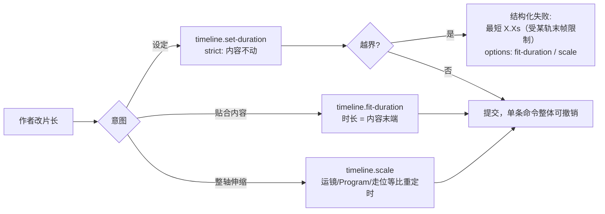
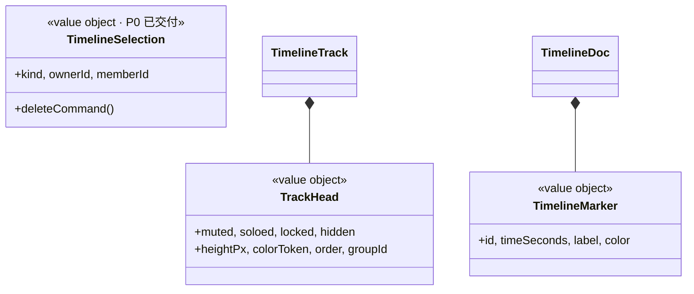
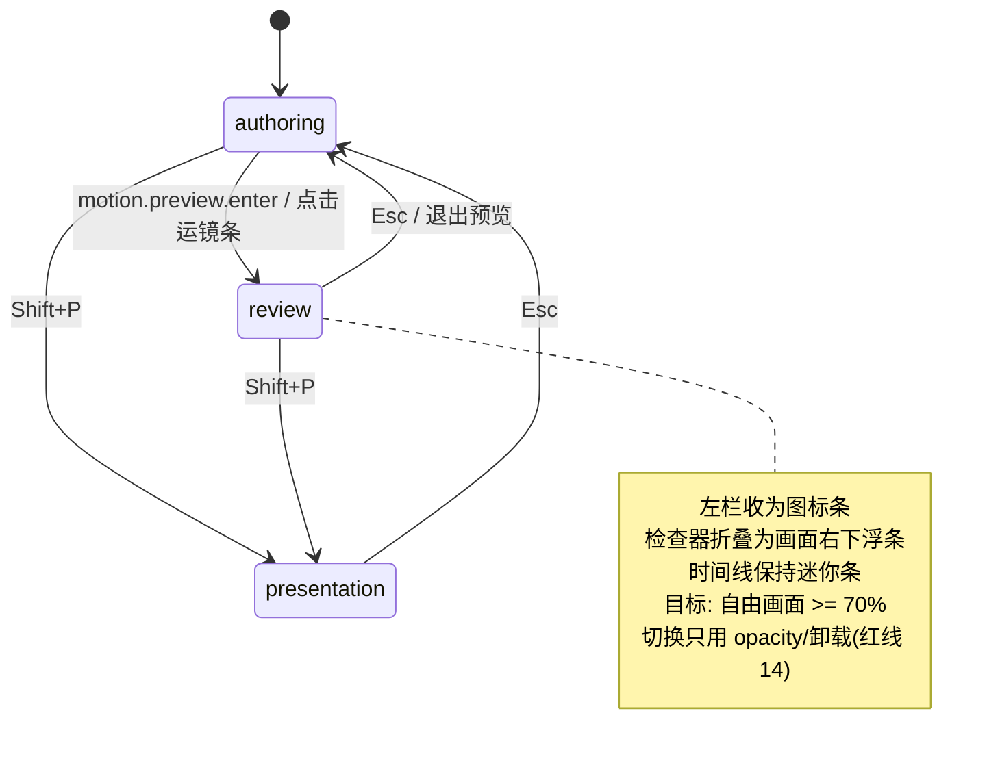

# 时间轴成熟度路线图（P0 已交付，P1–P4 待办）

本文记录时间轴模块从「能用」走向「成熟编排面板」的完整缺口清单与分期计划。
P0 已随本 MR 交付，其余分期在此固化决策，避免后续重新讨论。

## 定位：编排型时间轴，不是剪辑型

先定性，否则会照抄错对象。

```mermaid
flowchart LR
    subgraph NLE["剪辑型 (Premiere/Resolve)"]
        N1["素材内容固定<br/>核心动作: 裁/接/波纹/滚动"]
    end
    subgraph SEQ["编排型 (Sequencer/AE/Blender NLA)"]
        S1["内容由参数生成<br/>核心动作: 关键帧/重定时/曲线/轨道分层"]
    end
    subgraph THIS["3D 导演台"]
        T1["运镜 = 程序化轨迹<br/>走位 = 关键帧曲线<br/>Program = 成片排布"]
    end
    SEQ ==对标== THIS
    NLE -.仅借鉴导航与键位.-> THIS
```

**结论**：主对标 Unreal Sequencer + After Effects，导航与键位习惯借 DaVinci Resolve；
剪辑型特有的三点编辑、插入/覆盖、波纹删除一律不抄——本产品没有「素材长度固定」这个前提。

---

## P0：已交付（本 MR）

| 项           | 结果                                                                                                           |
| ------------ | -------------------------------------------------------------------------------------------------------------- |
| 段条边缘命中 | 段条与关键帧菱形分层为两条 lane，首末帧不再盖住 resize 把手；三类段条两端命中皆为把手                          |
| 重定时可达   | 拖运镜条边缘 = `motion.set-clip-range`；拖走位条边缘 = `timeline.retime-track`（整轨等比）                     |
| 选中态收口   | 新增 `TimelineSelection` 值对象 + `TimelineSelectionStore`，替换掉三份并行真相                                 |
| 快捷键归并   | `walk-key` + `motion-key` → `timeline-selection`；Esc 清选、Delete 删除，与按钮同一条命令路径                  |
| 缓动词汇     | `CAMERA_MOTION_EASING` 与 `TIMELINE_EASING` 合并为 `motion/EasingCurve`，中文 `EASING_LABEL`                   |
| 导航         | 滚轮改 NLE 惯例（裸滚轮滚动 / ⌘·Ctrl 缩放 / Shift 平移）、缩放到全长与选中、播放头翻页跟随、总览轨窗口范围指示 |

---

## P1：时间基准（已交付）

**为什么排第一**：现在时间是裸浮点。一次拖拽产出 `7.623604465709729` 这样的关键帧时刻，
`PREVIEW_FRAME_RATE = 30` 硬编码在 `TimelineConsole` 的时间码函数里，键盘步长是 `0.1s`。
没有帧栅格 ⇒ 同样的操作两次结果不同、导出对不齐、无法与外部工程交换。
**这是业余与专业的第一条分界线，且越晚做，脏数据越多。**



范围：

1. `FrameRate` 值对象进 `TimelineDoc`（项目属性，默认 30，支持 24/25/30/60），可 JSON 往返。
2. **一切命令入口统一量化到帧**：`timeline.move-key`、`timeline.retime-track`、
   `motion.set-clip-range`、`motion.move-key`、`transport.seek` 落点全部经 `quantize`。
3. `Timecode` 取代 `TimelineConsole` 里的私有时间码函数与硬编码 30。
4. 时间码可输入跳转；键盘步长由 `0.1s` 改为 1 帧，`Shift` 为 1 秒。
5. 吸附候选新增「帧栅格」一档，优先级低于播放头与片段边缘。

验收：任意拖拽落点 `Number.isInteger(frameRate.toFrames(t))` 恒真；同一操作重复两次结果完全一致。

---

## P2：片长、播放范围与裁剪（P2a 已交付；trim 仍未做）

**问题**：片长只有 `duration` 一层，且 `timeline.set-duration` 只会拒绝——
实测缩短时长返回「时间轴时长不能截断已有关键帧或机位片段」，作者只能手动挪走每个片段。
同时导出恒为 `0~duration` 全长（工具栏提示即「导出 Program 输出轨(0~10s)」），无法只导一段。



范围：

1. **三层拆分**：`duration`（工程时长）/ `PlaybackRange`（in-out）/ `TimelineViewport`（视图窗口，已有）。
2. 领域服务 `TimelineContentSpan.fromDocument(timeline, motion)` → `{ endSeconds, blockingItems }`；
   时长输入框的 `min` 与提示文案直接取它，作者在被拒之前就知道下界与卡点。
3. 新增聚合命令 `timeline.fit-duration` 与 `timeline.scale`（整轴等比重定时，一次 `invert` 全量回滚）。
   **禁止**在 UI 层用多次 dispatch 串联（撤销碎裂、AI 不可见）。
4. 拒绝时返回结构化 `options`，UI 与 AI 共用同一条「下一步」建议。
5. 导出、循环、预览范围一律复用 `PlaybackRange`；`I` / `O` 设入出点。
6. 片段 `trim`：`CameraMotionClip` 增加 source 区间（`inProgress` / `outProgress`），
   实现「只播轨迹的一段而不变速」。**在此之前不做 trim**——没有 source 区间的 trim 是假功能。

---

## P3：组织能力（P3a 已交付；TrackHead 与多选未做）

场景一多（10 个对象 = 10 条走位轨）现在就无法工作：轨道零能力、无多选、无复制、无标注。



范围：

1. `TrackHead`：mute / solo / lock / hide / 行高 / 颜色 / 排序 / 分组。
   **solo 与 mute 是排查「到底是谁在动」的唯一手段**，优先级最高。
2. 多选 + 框选 + 批量平移（`TimelineSelection` 由单项扩展为集合，`deleteCommand()` 升级为批命令）。
3. 复制 / 粘贴关键帧与片段（`⌘C` / `⌘V`，粘贴落点 = 播放头）。
4. `TimelineMarker`：章节与注释锚点，同时作为 AI 编排的语义锚。
5. 右键上下文菜单（与 AI 能力表同源，不另建一份动作清单）。
6. 冲突可视化：命令层已有 `program-overlapping-clip` issue，时间轴上要能看见「这两段撞了」。
7. 吸附可视化与开关：`snapEnabled` 目前**零调用方**（死代码入口），补 UI 与 `S` 键，吸附命中要有指示线。

---

## P4：呈现与快捷键补全（已交付）

### 4.1 壳层三态

实测 1440×900 下进入运镜预览：左栏 288、右检查器 288、时间线 264、顶部药丸 48，
自由画面仅 **800×540 ≈ 33%**。



- `WorkbenchLayoutStore.presentationMode: boolean` 清洁替换为 `shellMode: "authoring" | "review" | "presentation"`。
- `review` 下检查器只留「退出预览 / 缓动 / 删除片段」，其余**卸载**（不是 `opacity: 0` 留在树里）。
- 另给 `Tab` = 任意状态临时全隐/恢复壳层。
- 画面补成片安全框（复用 `ShotFrameOverlay`）。

### 4.2 快捷键补全（新增 `timeline` 作用域，**已交付**）

**归属规则（防串的核心，不是靠优先级碰运气）**：`timeline` 作用域**只在指针停在时间线控制台内时激活**；
同一条件下 `useFlyNavigation` 整体让位（其 `onKeyDown` 首行即 `if (stores.layout.isTimelinePointerOver) return`）。
于是 `Space` / `S` 这类与飞行导航共用的物理键，任一时刻**只有一方**响应。
第二层防串：时间轴上被聚焦的段条/菱形自己消费方向键与 `Enter`/`Space`，处理后 `stopPropagation()`，
window 上的注册表因此收不到同一次按键——「挪段条」与「挪播放头」永不同时发生。

| 键               | 作用                                                                          | scope              | 状态                                                                                         |
| ---------------- | ----------------------------------------------------------------------------- | ------------------ | -------------------------------------------------------------------------------------------- |
| `Space`          | 播放/暂停                                                                     | timeline           | **已交付**                                                                                   |
| `←` `→`          | 播放头 ±1 帧（读工程帧率）                                                    | timeline           | **已交付**                                                                                   |
| `Shift+←/→`      | 播放头 ±1 秒                                                                  | timeline           | **已交付**                                                                                   |
| `Home` / `End`   | 播放头回起点 / 到终点（经播放范围钳位）                                       | global             | **已交付**，取景全部让位到 `Shift+F`                                                         |
| `,` `.`          | 上/下一个时间锚点（片段两端 + 关键帧 + 标记，取自 `TimelineLayout` 全长投影） | timeline           | **已交付**                                                                                   |
| `I` / `O`        | 在播放头设入点 / 出点                                                         | timeline           | **已交付**                                                                                   |
| `Shift+Z`        | 缩放到全长                                                                    | timeline           | **已交付**                                                                                   |
| `=` `-`          | 以播放头为锚缩放                                                              | timeline           | **已交付**                                                                                   |
| `S`              | 吸附开关                                                                      | timeline           | **已交付**                                                                                   |
| `T`              | 展开/收起时间线                                                               | global             | **已交付**                                                                                   |
| `Tab`            | 临时全隐/恢复壳层                                                             | global             | P4a 已交付                                                                                   |
| `Esc` / `Delete` | 清选 / 删除时间轴选中项                                                       | timeline-selection | P0 已交付                                                                                    |
| `Z`              | 缩放到选中                                                                    | —                  | **刻意不绑**：裸 `Z` 是 gizmo 的轴约束键，同键双义正是「串」的来源；缩放到选中保留为面板按钮 |
| `⌘C` / `⌘V`      | 复制 / 粘贴选中                                                               | timeline-selection | 待做（依赖 P3b 的多选）                                                                      |

另需修一处隐式耦合：退出运镜预览目前靠 `lens` 作用域的 Esc 顺带触发
`setViewMode(DIRECTOR)` 内部清 `previewClipId`；应显式化为 `preview` 作用域 → `motion.preview.exit`。

---

## 明确不做（本轮范围外，附理由）

| 项                                   | 决策                 | 理由                                                                                                                                     |
| ------------------------------------ | -------------------- | ---------------------------------------------------------------------------------------------------------------------------------------- |
| 音频轨（配乐/对白/波形）             | 不做，但**预留结构** | 牵出解码、波形绘制、导出混流三条链路；`TimelineLayout` 的行投影按 `TrackKind` 注册表分派，将来新增 `AudioRow` 只需注册一项，不改 UI 结构 |
| 曲线编辑器（Graph Editor）           | 不做，但**留演进口** | `MotionKey` 已有切线手柄（3D 中可拖）；先把缓动从「两个按钮」升级为可扩展的缓动预设值对象，避免接图形编辑器时推倒重来                    |
| 轨道虚拟化                           | 不做                 | 轨道行已是「独立 observer + 按 id 自取」，行数上百时再加窗口化不需要改数据流                                                             |
| 剪辑型三点编辑 / 插入覆盖 / 波纹删除 | 不做                 | 编排型时间轴无「素材长度固定」前提，抄过来是伪需求                                                                                       |

## 已锁定的口径（勿重新讨论）

1. 拖段条中段 = 平移，拖两端 = **整段重定时**（不是裁剪）；trim 需要 source 区间，归 P2。
2. `Home` / `End` 判给时间轴（回起点 / 到终点），取景全部让位到 `Shift+F`。
3. 预览态 = 检查器折叠为浮条（不是全隐），另给 `Tab` 作为纯净键。
4. 滚轮：裸滚轮滚动、⌘/Ctrl 缩放、Shift 平移。
5. 走位整轨的删除**不绑 Delete**：破坏力远大于一枚帧，轨级删除留在检查器的显式按钮。
