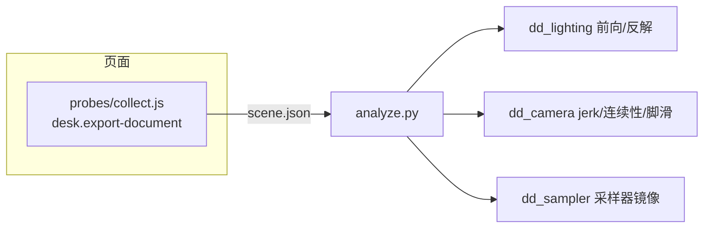

# 导演台离线分析(第一梯队)

采集与分析分边界:页内探针只读、只导出;所有数学在 Python 侧,不渲染、不依赖浏览器。

## 边界



- `dd_sampler.py` 逐行镜像 `MotionTrajectory` / `TimelineSampler` / `CameraMotionClip` / `SubjectFrameResolver`,同一工程 JSON 的走位与运镜求值与运行时逐点一致。
- `dd_lighting.py` 复刻 three.js punctual light 衰减,前向算照度剖面,`lsq_linear` 反解强度。
- `dd_camera.py` 做相机 jerk / 角速度 / 景别,180°/30° 连续性,脚滑(步频相位 vs 弧长)。

## 用法

```bash
# 环境(仓库根)
uv venv .venv-analysis && uv pip install --python .venv-analysis/bin/python numpy scipy

# 分析
.venv-analysis/bin/python skills/director-desk/analysis/analyze.py scene.json
```

页内采集(playground 或宿主):

```js
await tab.evaluate(await Bun.file("skills/director-desk/probes/collect.js").text());
const json = await tab.evaluate(`window.__collect()`); // 即 analyze.py 的输入
```

## 为什么离线

判定只有与运行时同一求值规则才可证伪。`dd_sampler` 是镜像不是近似:用通用样条会测出运行时不存在的顿点。镜像之后,相机 jerk、动作轴、照度剖面都能在不动浏览器的情况下得到可复现的数字。
